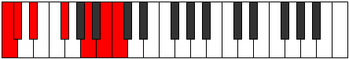

# Mode Gocrimic

## Links

- [Documentation](index.md)
- [Scales Index](Scales.md)
- [Modes Index](Modes.md)
- [Chords Index](Chords.md)

## Parent Scale

[Thagimic](ScaleThagimic.md)

## Number

[2635](https://ianring.com/musictheory/scales/2635)

## Interval Pattern

1, 2, 3, 3, 2, 1

## Chord Pattern

i⁰, iii⁰, iv⁰, iv, v⁰, VI

## Perfection

- 2 Perfect notes
- 4 Perfect notes

## Perfection Profile

[false false false true false true]

## Permutations

| Tonic | Notes | Signature | Illustration | Audio |
|-------|-------|-----------|--------------|-------|
| [C](ModeCNaturalGocrimic.md) | **C**, **Db**, **Eb**, F#, **G##**, A##, **C** | C |  | [midi](https://github.com/edipermadi/music/blob/main/docs/ModeCNaturalGocrimic.mid?raw=true) |
| [C#](ModeCSharpGocrimic.md) | **C#**, **D**, **E**, F##, **G###**, A###, **C#** | C |  | [midi](https://github.com/edipermadi/music/blob/main/docs/ModeCSharpGocrimic.mid?raw=true) |
| [Db](ModeDFlatGocrimic.md) | **Db**, **Ebb**, **Fb**, G, **A#**, B#, **Db** | C |  | [midi](https://github.com/edipermadi/music/blob/main/docs/ModeDFlatGocrimic.mid?raw=true) |
| [D](ModeDNaturalGocrimic.md) | **D**, **Eb**, **F**, G#, **A##**, B##, **D** | C |  | [midi](https://github.com/edipermadi/music/blob/main/docs/ModeDNaturalGocrimic.mid?raw=true) |
| [D#](ModeDSharpGocrimic.md) | **D#**, **E**, **F#**, G##, **A###**, B###, **D#** | C |  | [midi](https://github.com/edipermadi/music/blob/main/docs/ModeDSharpGocrimic.mid?raw=true) |
| [Eb](ModeEFlatGocrimic.md) | **Eb**, **Fb**, **Gb**, A, **B#**, C##, **Eb** | C |  | [midi](https://github.com/edipermadi/music/blob/main/docs/ModeEFlatGocrimic.mid?raw=true) |
| [E](ModeENaturalGocrimic.md) | **E**, **F**, **G**, A#, **B##**, C###, **E** | C |  | [midi](https://github.com/edipermadi/music/blob/main/docs/ModeENaturalGocrimic.mid?raw=true) |
| [F](ModeFNaturalGocrimic.md) | **F**, **Gb**, **Ab**, B, **C##**, D##, **F** | C |  | [midi](https://github.com/edipermadi/music/blob/main/docs/ModeFNaturalGocrimic.mid?raw=true) |
| [F#](ModeFSharpGocrimic.md) | **F#**, **G**, **A**, B#, **C###**, D###, **F#** | C |  | [midi](https://github.com/edipermadi/music/blob/main/docs/ModeFSharpGocrimic.mid?raw=true) |
| [Gb](ModeGFlatGocrimic.md) | **Gb**, **Abb**, **Bbb**, C, **D#**, E#, **Gb** | C |  | [midi](https://github.com/edipermadi/music/blob/main/docs/ModeGFlatGocrimic.mid?raw=true) |
| [G](ModeGNaturalGocrimic.md) | **G**, **Ab**, **Bb**, C#, **D##**, E##, **G** | C |  | [midi](https://github.com/edipermadi/music/blob/main/docs/ModeGNaturalGocrimic.mid?raw=true) |
| [G#](ModeGSharpGocrimic.md) | **G#**, **A**, **B**, C##, **D###**, E###, **G#** | C |  | [midi](https://github.com/edipermadi/music/blob/main/docs/ModeGSharpGocrimic.mid?raw=true) |
| [Ab](ModeAFlatGocrimic.md) | **Ab**, **Bbb**, **Cb**, D, **E#**, F##, **Ab** | C |  | [midi](https://github.com/edipermadi/music/blob/main/docs/ModeAFlatGocrimic.mid?raw=true) |
| [A](ModeANaturalGocrimic.md) | **A**, **Bb**, **C**, D#, **E##**, F###, **A** | C |  | [midi](https://github.com/edipermadi/music/blob/main/docs/ModeANaturalGocrimic.mid?raw=true) |
| [A#](ModeASharpGocrimic.md) | **A#**, **B**, **C#**, D##, **E###**, Cbbb, **A#** | C |  | [midi](https://github.com/edipermadi/music/blob/main/docs/ModeASharpGocrimic.mid?raw=true) |
| [Bb](ModeBFlatGocrimic.md) | **Bb**, **Cb**, **Db**, E, **F##**, G##, **Bb** | C |  | [midi](https://github.com/edipermadi/music/blob/main/docs/ModeBFlatGocrimic.mid?raw=true) |
| [B](ModeBNaturalGocrimic.md) | **B**, **C**, **D**, E#, **F###**, G###, **B** | C |  | [midi](https://github.com/edipermadi/music/blob/main/docs/ModeBNaturalGocrimic.mid?raw=true) |
