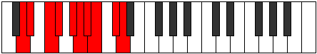
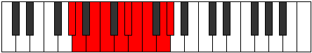

# Mode Gocrygic

## Links

- [Documentation](README.md)
- [Scales Index](Scales.md)
- [Modes Index](Modes.md)
- [Chords Index](Chords.md)

## Parent Scale

[Aeolorygic](ScaleAeolorygic.md)

## Number

[3035](https://ianring.com/musictheory/scales/3035)

## Transposition

1, 2, 1, 2, 1, 1, 1, 2, 1

## Chord Pattern

i⁰, ii⁰, ii⁰, viii⁰

## Perfection

- 7 Perfect notes
- 2 Perfect notes

## Perfection Profile

[true true false true true false true true true]

## Permutations

| Tonic | Notes | Signature | Illustration | Audio |
|-------|-------|-----------|--------------|-------|
| [C](ModeCNaturalGocrygic.md) | C, C#, **D#**, E, F#, **G**, G#, A, B, C | C |  | [midi](https://github.com/edipermadi/music/blob/main/docs/ModeCNaturalGocrygic.mid?raw=true) |
| [C#](ModeCSharpGocrygic.md) | C#, D, **E**, F, G, **G#**, A, A#, C, C# | C |  | [midi](https://github.com/edipermadi/music/blob/main/docs/ModeCSharpGocrygic.mid?raw=true) |
| [Db](ModeDFlatGocrygic.md) | Db, D, **E**, F, G, **Ab**, A, Bb, C, Db | C |  | [midi](https://github.com/edipermadi/music/blob/main/docs/ModeDFlatGocrygic.mid?raw=true) |
| [D](ModeDNaturalGocrygic.md) | D, D#, **F**, F#, G#, **A**, A#, B, C#, D | C |  | [midi](https://github.com/edipermadi/music/blob/main/docs/ModeDNaturalGocrygic.mid?raw=true) |
| [D#](ModeDSharpGocrygic.md) | D#, E, **F#**, G, A, **A#**, B, C, D, D# | C |  | [midi](https://github.com/edipermadi/music/blob/main/docs/ModeDSharpGocrygic.mid?raw=true) |
| [Eb](ModeEFlatGocrygic.md) | Eb, E, **Gb**, G, A, **Bb**, B, C, D, Eb | C |  | [midi](https://github.com/edipermadi/music/blob/main/docs/ModeEFlatGocrygic.mid?raw=true) |
| [E](ModeENaturalGocrygic.md) | E, F, **G**, G#, A#, **B**, C, C#, D#, E | C |  | [midi](https://github.com/edipermadi/music/blob/main/docs/ModeENaturalGocrygic.mid?raw=true) |
| [F](ModeFNaturalGocrygic.md) | F, F#, **G#**, A, B, **C**, C#, D, E, F | C |  | [midi](https://github.com/edipermadi/music/blob/main/docs/ModeFNaturalGocrygic.mid?raw=true) |
| [F#](ModeFSharpGocrygic.md) | F#, G, **A**, A#, C, **C#**, D, D#, F, F# | C |  | [midi](https://github.com/edipermadi/music/blob/main/docs/ModeFSharpGocrygic.mid?raw=true) |
| [Gb](ModeGFlatGocrygic.md) | Gb, G, **A**, Bb, C, **Db**, D, Eb, F, Gb | C |  | [midi](https://github.com/edipermadi/music/blob/main/docs/ModeGFlatGocrygic.mid?raw=true) |
| [G](ModeGNaturalGocrygic.md) | G, G#, **A#**, B, C#, **D**, D#, E, F#, G | C |  | [midi](https://github.com/edipermadi/music/blob/main/docs/ModeGNaturalGocrygic.mid?raw=true) |
| [G#](ModeGSharpGocrygic.md) | G#, A, **B**, C, D, **D#**, E, F, G, G# | C |  | [midi](https://github.com/edipermadi/music/blob/main/docs/ModeGSharpGocrygic.mid?raw=true) |
| [Ab](ModeAFlatGocrygic.md) | Ab, A, **B**, C, D, **Eb**, E, F, G, Ab | C |  | [midi](https://github.com/edipermadi/music/blob/main/docs/ModeAFlatGocrygic.mid?raw=true) |
| [A](ModeANaturalGocrygic.md) | A, A#, **C**, C#, D#, **E**, F, F#, G#, A | C |  | [midi](https://github.com/edipermadi/music/blob/main/docs/ModeANaturalGocrygic.mid?raw=true) |
| [A#](ModeASharpGocrygic.md) | A#, B, **C#**, D, E, **F**, F#, G, A, A# | C |  | [midi](https://github.com/edipermadi/music/blob/main/docs/ModeASharpGocrygic.mid?raw=true) |
| [Bb](ModeBFlatGocrygic.md) | Bb, B, **Db**, D, E, **F**, Gb, G, A, Bb | C |  | [midi](https://github.com/edipermadi/music/blob/main/docs/ModeBFlatGocrygic.mid?raw=true) |
| [B](ModeBNaturalGocrygic.md) | B, C, **D**, D#, F, **F#**, G, G#, A#, B | C |  | [midi](https://github.com/edipermadi/music/blob/main/docs/ModeBNaturalGocrygic.mid?raw=true) |
