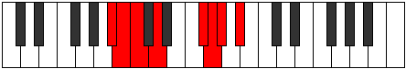

# Mode Godian

## Links

- [Documentation](index.md)
- [Scales Index](Scales.md)
- [Modes Index](Modes.md)
- [Chords Index](Chords.md)

## Parent Scale

[Katacrian](ScaleKatacrian.md)

## Number

[1815](https://ianring.com/musictheory/scales/1815)

## Perfection

- 3 Perfect notes
- 4 Perfect notes

## Perfection Profile

[false true true false false true false]

## Permutations

| Tonic | Notes | Signature | Illustration | Audio |
|-------|-------|-----------|--------------|-------|
| [C](ModeCNaturalGodian.md) | **C**, Db, Ebb, **Fb**, **G#**, A, **Bb**, **C** | C |  | [midi](ModeCNaturalGodian.mid) [ogg](ModeCNaturalGodian.ogg) |
| [C#](ModeCSharpGodian.md) | **C#**, D, Eb, **F**, **G##**, A#, **B**, **C#** | C |  | [midi](ModeCSharpGodian.mid) [ogg](ModeCSharpGodian.ogg) |
| [Db](ModeDFlatGodian.md) | **Db**, Ebb, Fbb, **Gbb**, **A**, Bb, **Cb**, **Db** | C |  | [midi](ModeDFlatGodian.mid) [ogg](ModeDFlatGodian.ogg) |
| [D](ModeDNaturalGodian.md) | **D**, Eb, Fb, **Gb**, **A#**, B, **C**, **D** | C |  | [midi](ModeDNaturalGodian.mid) [ogg](ModeDNaturalGodian.ogg) |
| [D#](ModeDSharpGodian.md) | **D#**, E, F, **G**, **A##**, B#, **C#**, **D#** | C |  | [midi](ModeDSharpGodian.mid) [ogg](ModeDSharpGodian.ogg) |
| [Eb](ModeEFlatGodian.md) | **Eb**, Fb, Gbb, **Abb**, **B**, C, **Db**, **Eb** | C |  | [midi](ModeEFlatGodian.mid) [ogg](ModeEFlatGodian.ogg) |
| [E](ModeENaturalGodian.md) | **E**, F, Gb, **Ab**, **B#**, C#, **D**, **E** | C |  | [midi](ModeENaturalGodian.mid) [ogg](ModeENaturalGodian.ogg) |
| [F](ModeFNaturalGodian.md) | **F**, Gb, Abb, **Bbb**, **C#**, D, **Eb**, **F** | C |  | [midi](ModeFNaturalGodian.mid) [ogg](ModeFNaturalGodian.ogg) |
| [F#](ModeFSharpGodian.md) | **F#**, G, Ab, **Bb**, **C##**, D#, **E**, **F#** | C |  | [midi](ModeFSharpGodian.mid) [ogg](ModeFSharpGodian.ogg) |
| [Gb](ModeGFlatGodian.md) | **Gb**, Abb, Bbbb, **Cbb**, **D**, Eb, **Fb**, **Gb** | C |  | [midi](ModeGFlatGodian.mid) [ogg](ModeGFlatGodian.ogg) |
| [G](ModeGNaturalGodian.md) | **G**, Ab, Bbb, **Cb**, **D#**, E, **F**, **G** | C |  | [midi](ModeGNaturalGodian.mid) [ogg](ModeGNaturalGodian.ogg) |
| [G#](ModeGSharpGodian.md) | **G#**, A, Bb, **C**, **D##**, E#, **F#**, **G#** | C |  | [midi](ModeGSharpGodian.mid) [ogg](ModeGSharpGodian.ogg) |
| [Ab](ModeAFlatGodian.md) | **Ab**, Bbb, Cbb, **Dbb**, **E**, F, **Gb**, **Ab** | C |  | [midi](ModeAFlatGodian.mid) [ogg](ModeAFlatGodian.ogg) |
| [A](ModeANaturalGodian.md) | **A**, Bb, Cb, **Db**, **E#**, F#, **G**, **A** | C |  | [midi](ModeANaturalGodian.mid) [ogg](ModeANaturalGodian.ogg) |
| [A#](ModeASharpGodian.md) | **A#**, B, C, **D**, **E##**, F##, **G#**, **A#** | C |  | [midi](ModeASharpGodian.mid) [ogg](ModeASharpGodian.ogg) |
| [Bb](ModeBFlatGodian.md) | **Bb**, Cb, Dbb, **Ebb**, **F#**, G, **Ab**, **Bb** | C |  | [midi](ModeBFlatGodian.mid) [ogg](ModeBFlatGodian.ogg) |
| [B](ModeBNaturalGodian.md) | **B**, C, Db, **Eb**, **F##**, G#, **A**, **B** | C |  | [midi](ModeBNaturalGodian.mid) [ogg](ModeBNaturalGodian.ogg) |
