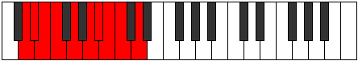

# Mode Godygic

## Links

- [Documentation](index.md)
- [Scales Index](Scales.md)
- [Modes Index](Modes.md)
- [Chords Index](Chords.md)

## Parent Scale

[Aerycrygic](ScaleAerycrygic.md)

## Number

[1967](https://ianring.com/musictheory/scales/1967)

## Perfection

- 8 Perfect notes
- 1 Perfect notes

## Perfection Profile

[true true true true true true true false true]

## Permutations

| Tonic | Notes | Signature | Illustration | Audio |
|-------|-------|-----------|--------------|-------|
| [C](ModeCNaturalGodygic.md) | C, C#, D, D#, F, G, G#, **A**, A#, C | C |  | [midi](ModeCNaturalGodygic.mid) [ogg](ModeCNaturalGodygic.ogg) |
| [C#](ModeCSharpGodygic.md) | C#, D, D#, E, F#, G#, A, **A#**, B, C# | C |  | [midi](ModeCSharpGodygic.mid) [ogg](ModeCSharpGodygic.ogg) |
| [Db](ModeDFlatGodygic.md) | Db, D, Eb, E, Gb, Ab, A, **Bb**, B, Db | C |  | [midi](ModeDFlatGodygic.mid) [ogg](ModeDFlatGodygic.ogg) |
| [D](ModeDNaturalGodygic.md) | D, D#, E, F, G, A, A#, **B**, C, D | C |  | [midi](ModeDNaturalGodygic.mid) [ogg](ModeDNaturalGodygic.ogg) |
| [D#](ModeDSharpGodygic.md) | D#, E, F, F#, G#, A#, B, **C**, C#, D# | C |  | [midi](ModeDSharpGodygic.mid) [ogg](ModeDSharpGodygic.ogg) |
| [Eb](ModeEFlatGodygic.md) | Eb, E, F, Gb, Ab, Bb, B, **C**, Db, Eb | C |  | [midi](ModeEFlatGodygic.mid) [ogg](ModeEFlatGodygic.ogg) |
| [E](ModeENaturalGodygic.md) | E, F, F#, G, A, B, C, **C#**, D, E | C |  | [midi](ModeENaturalGodygic.mid) [ogg](ModeENaturalGodygic.ogg) |
| [F](ModeFNaturalGodygic.md) | F, F#, G, G#, A#, C, C#, **D**, D#, F | C |  | [midi](ModeFNaturalGodygic.mid) [ogg](ModeFNaturalGodygic.ogg) |
| [F#](ModeFSharpGodygic.md) | F#, G, G#, A, B, C#, D, **D#**, E, F# | C |  | [midi](ModeFSharpGodygic.mid) [ogg](ModeFSharpGodygic.ogg) |
| [Gb](ModeGFlatGodygic.md) | Gb, G, Ab, A, B, Db, D, **Eb**, E, Gb | C |  | [midi](ModeGFlatGodygic.mid) [ogg](ModeGFlatGodygic.ogg) |
| [G](ModeGNaturalGodygic.md) | G, G#, A, A#, C, D, D#, **E**, F, G | C |  | [midi](ModeGNaturalGodygic.mid) [ogg](ModeGNaturalGodygic.ogg) |
| [G#](ModeGSharpGodygic.md) | G#, A, A#, B, C#, D#, E, **F**, F#, G# | C |  | [midi](ModeGSharpGodygic.mid) [ogg](ModeGSharpGodygic.ogg) |
| [Ab](ModeAFlatGodygic.md) | Ab, A, Bb, B, Db, Eb, E, **F**, Gb, Ab | C |  | [midi](ModeAFlatGodygic.mid) [ogg](ModeAFlatGodygic.ogg) |
| [A](ModeANaturalGodygic.md) | A, A#, B, C, D, E, F, **F#**, G, A | C |  | [midi](ModeANaturalGodygic.mid) [ogg](ModeANaturalGodygic.ogg) |
| [A#](ModeASharpGodygic.md) | A#, B, C, C#, D#, F, F#, **G**, G#, A# | C |  | [midi](ModeASharpGodygic.mid) [ogg](ModeASharpGodygic.ogg) |
| [Bb](ModeBFlatGodygic.md) | Bb, B, C, Db, Eb, F, Gb, **G**, Ab, Bb | C |  | [midi](ModeBFlatGodygic.mid) [ogg](ModeBFlatGodygic.ogg) |
| [B](ModeBNaturalGodygic.md) | B, C, C#, D, E, F#, G, **G#**, A, B | C |  | [midi](ModeBNaturalGodygic.mid) [ogg](ModeBNaturalGodygic.ogg) |
