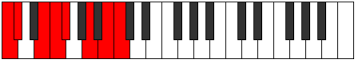
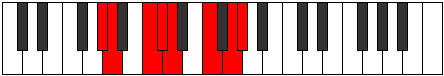

# Mode Gogian

## Links

- [Documentation](index.md)
- [Scales Index](Scales.md)
- [Modes Index](Modes.md)
- [Chords Index](Chords.md)

## Parent Scale

[Epathian](ScaleEpathian.md)

## Number

[2675](https://ianring.com/musictheory/scales/2675)

## Perfection

- 5 Perfect notes
- 2 Perfect notes

## Perfection Profile

[false false true true true true true]

## Permutations

| Tonic | Notes | Signature | Illustration | Audio |
|-------|-------|-----------|--------------|-------|
| [C](ModeCNaturalGogian.md) | **C**, **Db**, E, F, Gb, A, B, **C** | C |  | [midi](ModeCNaturalGogian.mid) [ogg](ModeCNaturalGogian.ogg) |
| [C#](ModeCSharpGogian.md) | **C#**, **D**, E#, F#, G, A#, B#, **C#** | C |  | [midi](ModeCSharpGogian.mid) [ogg](ModeCSharpGogian.ogg) |
| [Db](ModeDFlatGogian.md) | **Db**, **Ebb**, F, Gb, Abb, Bb, C, **Db** | C |  | [midi](ModeDFlatGogian.mid) [ogg](ModeDFlatGogian.ogg) |
| [D](ModeDNaturalGogian.md) | **D**, **Eb**, F#, G, Ab, B, C#, **D** | C |  | [midi](ModeDNaturalGogian.mid) [ogg](ModeDNaturalGogian.ogg) |
| [D#](ModeDSharpGogian.md) | **D#**, **E**, F##, G#, A, B#, C##, **D#** | C |  | [midi](ModeDSharpGogian.mid) [ogg](ModeDSharpGogian.ogg) |
| [Eb](ModeEFlatGogian.md) | **Eb**, **Fb**, G, Ab, Bbb, C, D, **Eb** | C |  | [midi](ModeEFlatGogian.mid) [ogg](ModeEFlatGogian.ogg) |
| [E](ModeENaturalGogian.md) | **E**, **F**, G#, A, Bb, C#, D#, **E** | C |  | [midi](ModeENaturalGogian.mid) [ogg](ModeENaturalGogian.ogg) |
| [F](ModeFNaturalGogian.md) | **F**, **Gb**, A, Bb, Cb, D, E, **F** | C |  | [midi](ModeFNaturalGogian.mid) [ogg](ModeFNaturalGogian.ogg) |
| [F#](ModeFSharpGogian.md) | **F#**, **G**, A#, B, C, D#, E#, **F#** | C |  | [midi](ModeFSharpGogian.mid) [ogg](ModeFSharpGogian.ogg) |
| [Gb](ModeGFlatGogian.md) | **Gb**, **Abb**, Bb, Cb, Dbb, Eb, F, **Gb** | C |  | [midi](ModeGFlatGogian.mid) [ogg](ModeGFlatGogian.ogg) |
| [G](ModeGNaturalGogian.md) | **G**, **Ab**, B, C, Db, E, F#, **G** | C |  | [midi](ModeGNaturalGogian.mid) [ogg](ModeGNaturalGogian.ogg) |
| [G#](ModeGSharpGogian.md) | **G#**, **A**, B#, C#, D, E#, F##, **G#** | C |  | [midi](ModeGSharpGogian.mid) [ogg](ModeGSharpGogian.ogg) |
| [Ab](ModeAFlatGogian.md) | **Ab**, **Bbb**, C, Db, Ebb, F, G, **Ab** | C |  | [midi](ModeAFlatGogian.mid) [ogg](ModeAFlatGogian.ogg) |
| [A](ModeANaturalGogian.md) | **A**, **Bb**, C#, D, Eb, F#, G#, **A** | C |  | [midi](ModeANaturalGogian.mid) [ogg](ModeANaturalGogian.ogg) |
| [A#](ModeASharpGogian.md) | **A#**, **B**, C##, D#, E, F##, G##, **A#** | C |  | [midi](ModeASharpGogian.mid) [ogg](ModeASharpGogian.ogg) |
| [Bb](ModeBFlatGogian.md) | **Bb**, **Cb**, D, Eb, Fb, G, A, **Bb** | C |  | [midi](ModeBFlatGogian.mid) [ogg](ModeBFlatGogian.ogg) |
| [B](ModeBNaturalGogian.md) | **B**, **C**, D#, E, F, G#, A#, **B** | C |  | [midi](ModeBNaturalGogian.mid) [ogg](ModeBNaturalGogian.ogg) |
