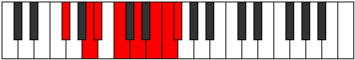

# Mode Golian

## Links

- [Documentation](index.md)
- [Scales Index](Scales.md)
- [Modes Index](Modes.md)
- [Chords Index](Chords.md)

## Parent Scale

[Golian](ScaleGolian.md)

## Number

[3417](https://ianring.com/musictheory/scales/3417)

## Perfection

- 4 Perfect notes
- 3 Perfect notes

## Perfection Profile

[false true true false true false true]

## Permutations

| Tonic | Notes | Signature | Illustration | Audio |
|-------|-------|-----------|--------------|-------|
| [C](ModeCNaturalGolian.md) | **C**, D#, E, **F#**, G#, **A#**, B, **C** | C |  | [midi](ModeCNaturalGolian.mid) [ogg](ModeCNaturalGolian.ogg) |
| [C#](ModeCSharpGolian.md) | **C#**, D##, E#, **F##**, G##, **A##**, B#, **C#** | C |  | [midi](ModeCSharpGolian.mid) [ogg](ModeCSharpGolian.ogg) |
| [Db](ModeDFlatGolian.md) | **Db**, E, F, **G**, A, **B**, C, **Db** | C |  | [midi](ModeDFlatGolian.mid) [ogg](ModeDFlatGolian.ogg) |
| [D](ModeDNaturalGolian.md) | **D**, E#, F#, **G#**, A#, **B#**, C#, **D** | C |  | [midi](ModeDNaturalGolian.mid) [ogg](ModeDNaturalGolian.ogg) |
| [D#](ModeDSharpGolian.md) | **D#**, E##, F##, **G##**, A##, **B##**, C##, **D#** | C |  | [midi](ModeDSharpGolian.mid) [ogg](ModeDSharpGolian.ogg) |
| [Eb](ModeEFlatGolian.md) | **Eb**, F#, G, **A**, B, **C#**, D, **Eb** | C |  | [midi](ModeEFlatGolian.mid) [ogg](ModeEFlatGolian.ogg) |
| [E](ModeENaturalGolian.md) | **E**, F##, G#, **A#**, B#, **C##**, D#, **E** | C |  | [midi](ModeENaturalGolian.mid) [ogg](ModeENaturalGolian.ogg) |
| [F](ModeFNaturalGolian.md) | **F**, G#, A, **B**, C#, **D#**, E, **F** | C |  | [midi](ModeFNaturalGolian.mid) [ogg](ModeFNaturalGolian.ogg) |
| [F#](ModeFSharpGolian.md) | **F#**, G##, A#, **B#**, C##, **D##**, E#, **F#** | C |  | [midi](ModeFSharpGolian.mid) [ogg](ModeFSharpGolian.ogg) |
| [Gb](ModeGFlatGolian.md) | **Gb**, A, Bb, **C**, D, **E**, F, **Gb** | C |  | [midi](ModeGFlatGolian.mid) [ogg](ModeGFlatGolian.ogg) |
| [G](ModeGNaturalGolian.md) | **G**, A#, B, **C#**, D#, **E#**, F#, **G** | C |  | [midi](ModeGNaturalGolian.mid) [ogg](ModeGNaturalGolian.ogg) |
| [G#](ModeGSharpGolian.md) | **G#**, A##, B#, **C##**, D##, **E##**, F##, **G#** | C |  | [midi](ModeGSharpGolian.mid) [ogg](ModeGSharpGolian.ogg) |
| [Ab](ModeAFlatGolian.md) | **Ab**, B, C, **D**, E, **F#**, G, **Ab** | C |  | [midi](ModeAFlatGolian.mid) [ogg](ModeAFlatGolian.ogg) |
| [A](ModeANaturalGolian.md) | **A**, B#, C#, **D#**, E#, **F##**, G#, **A** | C |  | [midi](ModeANaturalGolian.mid) [ogg](ModeANaturalGolian.ogg) |
| [A#](ModeASharpGolian.md) | **A#**, B##, C##, **D##**, E##, **F###**, G##, **A#** | C |  | [midi](ModeASharpGolian.mid) [ogg](ModeASharpGolian.ogg) |
| [Bb](ModeBFlatGolian.md) | **Bb**, C#, D, **E**, F#, **G#**, A, **Bb** | C |  | [midi](ModeBFlatGolian.mid) [ogg](ModeBFlatGolian.ogg) |
| [B](ModeBNaturalGolian.md) | **B**, C##, D#, **E#**, F##, **G##**, A#, **B** | C |  | [midi](ModeBNaturalGolian.mid) [ogg](ModeBNaturalGolian.ogg) |
