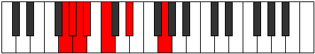
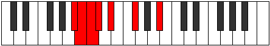

# Mode Golimic

## Links

- [Documentation](README.md)
- [Scales Index](Scales.md)
- [Modes Index](Modes.md)
- [Chords Index](Chords.md)

## Parent Scale

[Kytrimic](ScaleKytrimic.md)

## Number

[303](https://ianring.com/musictheory/scales/303)

## Transposition

1, 1, 1, 2, 3, 4

## Chord Pattern

## Perfection

- 3 Perfect notes
- 3 Perfect notes

## Perfection Profile

[false true false false true true]

## Permutations

| Tonic | Notes | Signature | Illustration | Audio |
|-------|-------|-----------|--------------|-------|
| [C](ModeCNaturalGolimic.md) | **C**, Db, **Ebb**, **Fbb**, Gbb, Ab, **C** | C |  | [midi](https://github.com/edipermadi/music/blob/main/docs/ModeCNaturalGolimic.mid?raw=true) |
| [C#](ModeCSharpGolimic.md) | **C#**, D, **Eb**, **Fb**, Gb, A, **C#** | C |  | [midi](https://github.com/edipermadi/music/blob/main/docs/ModeCSharpGolimic.mid?raw=true) |
| [Db](ModeDFlatGolimic.md) | **Db**, Ebb, **Fbb**, **Gbbb**, Abbb, Bbb, **Db** | C |  | [midi](https://github.com/edipermadi/music/blob/main/docs/ModeDFlatGolimic.mid?raw=true) |
| [D](ModeDNaturalGolimic.md) | **D**, Eb, **Fb**, **Gbb**, Abb, Bb, **D** | C |  | [midi](https://github.com/edipermadi/music/blob/main/docs/ModeDNaturalGolimic.mid?raw=true) |
| [D#](ModeDSharpGolimic.md) | **D#**, E, **F**, **Gb**, Ab, B, **D#** | C |  | [midi](https://github.com/edipermadi/music/blob/main/docs/ModeDSharpGolimic.mid?raw=true) |
| [Eb](ModeEFlatGolimic.md) | **Eb**, Fb, **Gbb**, **Abbb**, Bbbb, Cb, **Eb** | C |  | [midi](https://github.com/edipermadi/music/blob/main/docs/ModeEFlatGolimic.mid?raw=true) |
| [E](ModeENaturalGolimic.md) | **E**, F, **Gb**, **Abb**, Bbb, C, **E** | C |  | [midi](https://github.com/edipermadi/music/blob/main/docs/ModeENaturalGolimic.mid?raw=true) |
| [F](ModeFNaturalGolimic.md) | **F**, Gb, **Abb**, **Bbbb**, Cbb, Db, **F** | C |  | [midi](https://github.com/edipermadi/music/blob/main/docs/ModeFNaturalGolimic.mid?raw=true) |
| [F#](ModeFSharpGolimic.md) | **F#**, G, **Ab**, **Bbb**, Cb, D, **F#** | C |  | [midi](https://github.com/edipermadi/music/blob/main/docs/ModeFSharpGolimic.mid?raw=true) |
| [Gb](ModeGFlatGolimic.md) | **Gb**, Abb, **Bbbb**, **Cbbb**, Dbbb, Ebb, **Gb** | C |  | [midi](https://github.com/edipermadi/music/blob/main/docs/ModeGFlatGolimic.mid?raw=true) |
| [G](ModeGNaturalGolimic.md) | **G**, Ab, **Bbb**, **Cbb**, Dbb, Eb, **G** | C |  | [midi](https://github.com/edipermadi/music/blob/main/docs/ModeGNaturalGolimic.mid?raw=true) |
| [G#](ModeGSharpGolimic.md) | **G#**, A, **Bb**, **Cb**, Db, E, **G#** | C |  | [midi](https://github.com/edipermadi/music/blob/main/docs/ModeGSharpGolimic.mid?raw=true) |
| [Ab](ModeAFlatGolimic.md) | **Ab**, Bbb, **Cbb**, **Dbbb**, Ebbb, Fb, **Ab** | C |  | [midi](https://github.com/edipermadi/music/blob/main/docs/ModeAFlatGolimic.mid?raw=true) |
| [A](ModeANaturalGolimic.md) | **A**, Bb, **Cb**, **Dbb**, Ebb, F, **A** | C |  | [midi](https://github.com/edipermadi/music/blob/main/docs/ModeANaturalGolimic.mid?raw=true) |
| [A#](ModeASharpGolimic.md) | **A#**, B, **C**, **Db**, Eb, F#, **A#** | C |  | [midi](https://github.com/edipermadi/music/blob/main/docs/ModeASharpGolimic.mid?raw=true) |
| [Bb](ModeBFlatGolimic.md) | **Bb**, Cb, **Dbb**, **Ebbb**, Fbb, Gb, **Bb** | C |  | [midi](https://github.com/edipermadi/music/blob/main/docs/ModeBFlatGolimic.mid?raw=true) |
| [B](ModeBNaturalGolimic.md) | **B**, C, **Db**, **Ebb**, Fb, G, **B** | C |  | [midi](https://github.com/edipermadi/music/blob/main/docs/ModeBNaturalGolimic.mid?raw=true) |
