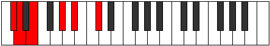
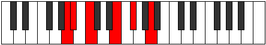

# Mode Golitonic

## Links

- [Documentation](README.md)
- [Scales Index](Scales.md)
- [Modes Index](Modes.md)
- [Chords Index](Chords.md)

## Parent Scale

[Phronitonic](ScalePhronitonic.md)

## Number

[651](https://ianring.com/musictheory/scales/651)

## Interval Pattern

1, 2, 4, 2, 3

## Chord Pattern

## Perfection

- 1 Perfect notes
- 4 Perfect notes

## Perfection Profile

[true false false false false]

## Permutations

| Tonic | Notes | Signature | Illustration | Audio |
|-------|-------|-----------|--------------|-------|
| [C](ModeCNaturalGolitonic.md) | C, **C#**, **D#**, **G**, **A**, C | C |  | [midi](https://github.com/edipermadi/music/blob/main/docs/ModeCNaturalGolitonic.mid?raw=true) |
| [C#](ModeCSharpGolitonic.md) | C#, **D**, **E**, **G#**, **A#**, C# | C |  | [midi](https://github.com/edipermadi/music/blob/main/docs/ModeCSharpGolitonic.mid?raw=true) |
| [Db](ModeDFlatGolitonic.md) | Db, **D**, **E**, **Ab**, **Bb**, Db | C |  | [midi](https://github.com/edipermadi/music/blob/main/docs/ModeDFlatGolitonic.mid?raw=true) |
| [D](ModeDNaturalGolitonic.md) | D, **D#**, **F**, **A**, **B**, D | C |  | [midi](https://github.com/edipermadi/music/blob/main/docs/ModeDNaturalGolitonic.mid?raw=true) |
| [D#](ModeDSharpGolitonic.md) | D#, **E**, **F#**, **A#**, **C**, D# | C |  | [midi](https://github.com/edipermadi/music/blob/main/docs/ModeDSharpGolitonic.mid?raw=true) |
| [Eb](ModeEFlatGolitonic.md) | Eb, **E**, **Gb**, **Bb**, **C**, Eb | C |  | [midi](https://github.com/edipermadi/music/blob/main/docs/ModeEFlatGolitonic.mid?raw=true) |
| [E](ModeENaturalGolitonic.md) | E, **F**, **G**, **B**, **C#**, E | C |  | [midi](https://github.com/edipermadi/music/blob/main/docs/ModeENaturalGolitonic.mid?raw=true) |
| [F](ModeFNaturalGolitonic.md) | F, **F#**, **G#**, **C**, **D**, F | C |  | [midi](https://github.com/edipermadi/music/blob/main/docs/ModeFNaturalGolitonic.mid?raw=true) |
| [F#](ModeFSharpGolitonic.md) | F#, **G**, **A**, **C#**, **D#**, F# | C |  | [midi](https://github.com/edipermadi/music/blob/main/docs/ModeFSharpGolitonic.mid?raw=true) |
| [Gb](ModeGFlatGolitonic.md) | Gb, **G**, **A**, **Db**, **Eb**, Gb | C |  | [midi](https://github.com/edipermadi/music/blob/main/docs/ModeGFlatGolitonic.mid?raw=true) |
| [G](ModeGNaturalGolitonic.md) | G, **G#**, **A#**, **D**, **E**, G | C |  | [midi](https://github.com/edipermadi/music/blob/main/docs/ModeGNaturalGolitonic.mid?raw=true) |
| [G#](ModeGSharpGolitonic.md) | G#, **A**, **B**, **D#**, **F**, G# | C |  | [midi](https://github.com/edipermadi/music/blob/main/docs/ModeGSharpGolitonic.mid?raw=true) |
| [Ab](ModeAFlatGolitonic.md) | Ab, **A**, **B**, **Eb**, **F**, Ab | C |  | [midi](https://github.com/edipermadi/music/blob/main/docs/ModeAFlatGolitonic.mid?raw=true) |
| [A](ModeANaturalGolitonic.md) | A, **A#**, **C**, **E**, **F#**, A | C |  | [midi](https://github.com/edipermadi/music/blob/main/docs/ModeANaturalGolitonic.mid?raw=true) |
| [A#](ModeASharpGolitonic.md) | A#, **B**, **C#**, **F**, **G**, A# | C |  | [midi](https://github.com/edipermadi/music/blob/main/docs/ModeASharpGolitonic.mid?raw=true) |
| [Bb](ModeBFlatGolitonic.md) | Bb, **B**, **Db**, **F**, **G**, Bb | C |  | [midi](https://github.com/edipermadi/music/blob/main/docs/ModeBFlatGolitonic.mid?raw=true) |
| [B](ModeBNaturalGolitonic.md) | B, **C**, **D**, **F#**, **G#**, B | C |  | [midi](https://github.com/edipermadi/music/blob/main/docs/ModeBNaturalGolitonic.mid?raw=true) |
