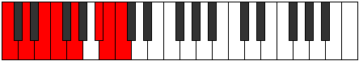

# Mode Gonian

## Links

- [Documentation](index.md)
- [Scales Index](Scales.md)
- [Modes Index](Modes.md)
- [Chords Index](Chords.md)

## Parent Scale

[Ionycrian](ScaleIonycrian.md)

## Number

[3253](https://ianring.com/musictheory/scales/3253)

## Perfection

- 5 Perfect notes
- 2 Perfect notes

## Perfection Profile

[true false true true true true false]

## Permutations

| Tonic | Notes | Signature | Illustration | Audio |
|-------|-------|-----------|--------------|-------|
| [C](ModeCNaturalGonian.md) | C, **D**, E, F, G, A#, **B**, C | C |  | [midi](ModeCNaturalGonian.mid) [ogg](ModeCNaturalGonian.ogg) |
| [C#](ModeCSharpGonian.md) | C#, **D#**, E#, F#, G#, A##, **B#**, C# | C |  | [midi](ModeCSharpGonian.mid) [ogg](ModeCSharpGonian.ogg) |
| [Db](ModeDFlatGonian.md) | Db, **Eb**, F, Gb, Ab, B, **C**, Db | C |  | [midi](ModeDFlatGonian.mid) [ogg](ModeDFlatGonian.ogg) |
| [D](ModeDNaturalGonian.md) | D, **E**, F#, G, A, B#, **C#**, D | C |  | [midi](ModeDNaturalGonian.mid) [ogg](ModeDNaturalGonian.ogg) |
| [D#](ModeDSharpGonian.md) | D#, **E#**, F##, G#, A#, B##, **C##**, D# | C |  | [midi](ModeDSharpGonian.mid) [ogg](ModeDSharpGonian.ogg) |
| [Eb](ModeEFlatGonian.md) | Eb, **F**, G, Ab, Bb, C#, **D**, Eb | C |  | [midi](ModeEFlatGonian.mid) [ogg](ModeEFlatGonian.ogg) |
| [E](ModeENaturalGonian.md) | E, **F#**, G#, A, B, C##, **D#**, E | C |  | [midi](ModeENaturalGonian.mid) [ogg](ModeENaturalGonian.ogg) |
| [F](ModeFNaturalGonian.md) | F, **G**, A, Bb, C, D#, **E**, F | C |  | [midi](ModeFNaturalGonian.mid) [ogg](ModeFNaturalGonian.ogg) |
| [F#](ModeFSharpGonian.md) | F#, **G#**, A#, B, C#, D##, **E#**, F# | C |  | [midi](ModeFSharpGonian.mid) [ogg](ModeFSharpGonian.ogg) |
| [Gb](ModeGFlatGonian.md) | Gb, **Ab**, Bb, Cb, Db, E, **F**, Gb | C |  | [midi](ModeGFlatGonian.mid) [ogg](ModeGFlatGonian.ogg) |
| [G](ModeGNaturalGonian.md) | G, **A**, B, C, D, E#, **F#**, G | C |  | [midi](ModeGNaturalGonian.mid) [ogg](ModeGNaturalGonian.ogg) |
| [G#](ModeGSharpGonian.md) | G#, **A#**, B#, C#, D#, E##, **F##**, G# | C |  | [midi](ModeGSharpGonian.mid) [ogg](ModeGSharpGonian.ogg) |
| [Ab](ModeAFlatGonian.md) | Ab, **Bb**, C, Db, Eb, F#, **G**, Ab | C |  | [midi](ModeAFlatGonian.mid) [ogg](ModeAFlatGonian.ogg) |
| [A](ModeANaturalGonian.md) | A, **B**, C#, D, E, F##, **G#**, A | C |  | [midi](ModeANaturalGonian.mid) [ogg](ModeANaturalGonian.ogg) |
| [A#](ModeASharpGonian.md) | A#, **B#**, C##, D#, E#, F###, **G##**, A# | C |  | [midi](ModeASharpGonian.mid) [ogg](ModeASharpGonian.ogg) |
| [Bb](ModeBFlatGonian.md) | Bb, **C**, D, Eb, F, G#, **A**, Bb | C |  | [midi](ModeBFlatGonian.mid) [ogg](ModeBFlatGonian.ogg) |
| [B](ModeBNaturalGonian.md) | B, **C#**, D#, E, F#, G##, **A#**, B | C |  | [midi](ModeBNaturalGonian.mid) [ogg](ModeBNaturalGonian.ogg) |
