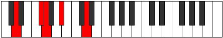
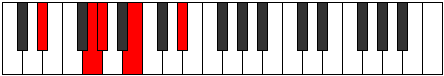
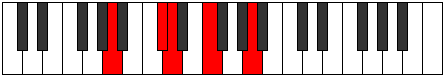
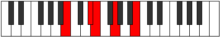

# Mode Gonic

## Links

- [Documentation](index.md)
- [Scales Index](Scales.md)
- [Modes Index](Modes.md)
- [Chords Index](Chords.md)

## Parent Scale

[Aeoloric](ScaleAeoloric.md)

## Number

[305](https://ianring.com/musictheory/scales/305)

## Interval Pattern

4, 1, 3, 4

## Chord Pattern

I⁺, II⁺, iii, IV⁺

## Perfection

- 1 Perfect notes
- 3 Perfect notes

## Perfection Profile

[false false true false]

## Permutations

| Tonic | Notes | Signature | Illustration | Audio |
|-------|-------|-----------|--------------|-------|
| [C](ModeCNaturalGonic.md) | **C**, **E**, F, **G#**, **C** | C |  | [midi](https://github.com/edipermadi/music/blob/main/docs/ModeCNaturalGonic.mid?raw=true) |
| [C#](ModeCSharpGonic.md) | **C#**, **F**, F#, **A**, **C#** | C |  | [midi](https://github.com/edipermadi/music/blob/main/docs/ModeCSharpGonic.mid?raw=true) |
| [Db](ModeDFlatGonic.md) | **Db**, **F**, Gb, **A**, **Db** | C |  | [midi](https://github.com/edipermadi/music/blob/main/docs/ModeDFlatGonic.mid?raw=true) |
| [D](ModeDNaturalGonic.md) | **D**, **F#**, G, **A#**, **D** | C |  | [midi](https://github.com/edipermadi/music/blob/main/docs/ModeDNaturalGonic.mid?raw=true) |
| [D#](ModeDSharpGonic.md) | **D#**, **G**, G#, **B**, **D#** | C |  | [midi](https://github.com/edipermadi/music/blob/main/docs/ModeDSharpGonic.mid?raw=true) |
| [Eb](ModeEFlatGonic.md) | **Eb**, **G**, Ab, **B**, **Eb** | C |  | [midi](https://github.com/edipermadi/music/blob/main/docs/ModeEFlatGonic.mid?raw=true) |
| [E](ModeENaturalGonic.md) | **E**, **G#**, A, **C**, **E** | C |  | [midi](https://github.com/edipermadi/music/blob/main/docs/ModeENaturalGonic.mid?raw=true) |
| [F](ModeFNaturalGonic.md) | **F**, **A**, A#, **C#**, **F** | C |  | [midi](https://github.com/edipermadi/music/blob/main/docs/ModeFNaturalGonic.mid?raw=true) |
| [F#](ModeFSharpGonic.md) | **F#**, **A#**, B, **D**, **F#** | C |  | [midi](https://github.com/edipermadi/music/blob/main/docs/ModeFSharpGonic.mid?raw=true) |
| [Gb](ModeGFlatGonic.md) | **Gb**, **Bb**, B, **D**, **Gb** | C |  | [midi](https://github.com/edipermadi/music/blob/main/docs/ModeGFlatGonic.mid?raw=true) |
| [G](ModeGNaturalGonic.md) | **G**, **B**, C, **D#**, **G** | C |  | [midi](https://github.com/edipermadi/music/blob/main/docs/ModeGNaturalGonic.mid?raw=true) |
| [G#](ModeGSharpGonic.md) | **G#**, **C**, C#, **E**, **G#** | C |  | [midi](https://github.com/edipermadi/music/blob/main/docs/ModeGSharpGonic.mid?raw=true) |
| [Ab](ModeAFlatGonic.md) | **Ab**, **C**, Db, **E**, **Ab** | C |  | [midi](https://github.com/edipermadi/music/blob/main/docs/ModeAFlatGonic.mid?raw=true) |
| [A](ModeANaturalGonic.md) | **A**, **C#**, D, **F**, **A** | C |  | [midi](https://github.com/edipermadi/music/blob/main/docs/ModeANaturalGonic.mid?raw=true) |
| [A#](ModeASharpGonic.md) | **A#**, **D**, D#, **F#**, **A#** | C |  | [midi](https://github.com/edipermadi/music/blob/main/docs/ModeASharpGonic.mid?raw=true) |
| [Bb](ModeBFlatGonic.md) | **Bb**, **D**, Eb, **Gb**, **Bb** | C |  | [midi](https://github.com/edipermadi/music/blob/main/docs/ModeBFlatGonic.mid?raw=true) |
| [B](ModeBNaturalGonic.md) | **B**, **D#**, E, **G**, **B** | C |  | [midi](https://github.com/edipermadi/music/blob/main/docs/ModeBNaturalGonic.mid?raw=true) |
