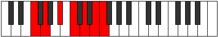

# Mode Gonimic

## Links

- [Documentation](index.md)
- [Scales Index](Scales.md)
- [Modes Index](Modes.md)
- [Chords Index](Chords.md)

## Parent Scale

[Darmic](ScaleDarmic.md)

## Number

[2725](https://ianring.com/musictheory/scales/2725)

## Perfection

- 4 Perfect notes
- 2 Perfect notes

## Perfection Profile

[true true true true false false]

## Permutations

| Tonic | Notes | Signature | Illustration | Audio |
|-------|-------|-----------|--------------|-------|
| [C](ModeCNaturalGonimic.md) | C, D, E#, F##, **G##**, **A##**, C | C |  | [midi](ModeCNaturalGonimic.mid) [ogg](ModeCNaturalGonimic.ogg) |
| [C#](ModeCSharpGonimic.md) | C#, D#, E##, F###, **G###**, **A###**, C# | C |  | [midi](ModeCSharpGonimic.mid) [ogg](ModeCSharpGonimic.ogg) |
| [Db](ModeDFlatGonimic.md) | Db, Eb, F#, G#, **A#**, **B#**, Db | C |  | [midi](ModeDFlatGonimic.mid) [ogg](ModeDFlatGonimic.ogg) |
| [D](ModeDNaturalGonimic.md) | D, E, F##, G##, **A##**, **B##**, D | C |  | [midi](ModeDNaturalGonimic.mid) [ogg](ModeDNaturalGonimic.ogg) |
| [D#](ModeDSharpGonimic.md) | D#, E#, F###, G###, **A###**, **B###**, D# | C |  | [midi](ModeDSharpGonimic.mid) [ogg](ModeDSharpGonimic.ogg) |
| [Eb](ModeEFlatGonimic.md) | Eb, F, G#, A#, **B#**, **C##**, Eb | C |  | [midi](ModeEFlatGonimic.mid) [ogg](ModeEFlatGonimic.ogg) |
| [E](ModeENaturalGonimic.md) | E, F#, G##, A##, **B##**, **C###**, E | C |  | [midi](ModeENaturalGonimic.mid) [ogg](ModeENaturalGonimic.ogg) |
| [F](ModeFNaturalGonimic.md) | F, G, A#, B#, **C##**, **D##**, F | C |  | [midi](ModeFNaturalGonimic.mid) [ogg](ModeFNaturalGonimic.ogg) |
| [F#](ModeFSharpGonimic.md) | F#, G#, A##, B##, **C###**, **D###**, F# | C |  | [midi](ModeFSharpGonimic.mid) [ogg](ModeFSharpGonimic.ogg) |
| [Gb](ModeGFlatGonimic.md) | Gb, Ab, B, C#, **D#**, **E#**, Gb | C |  | [midi](ModeGFlatGonimic.mid) [ogg](ModeGFlatGonimic.ogg) |
| [G](ModeGNaturalGonimic.md) | G, A, B#, C##, **D##**, **E##**, G | C |  | [midi](ModeGNaturalGonimic.mid) [ogg](ModeGNaturalGonimic.ogg) |
| [G#](ModeGSharpGonimic.md) | G#, A#, B##, C###, **D###**, **E###**, G# | C |  | [midi](ModeGSharpGonimic.mid) [ogg](ModeGSharpGonimic.ogg) |
| [Ab](ModeAFlatGonimic.md) | Ab, Bb, C#, D#, **E#**, **F##**, Ab | C |  | [midi](ModeAFlatGonimic.mid) [ogg](ModeAFlatGonimic.ogg) |
| [A](ModeANaturalGonimic.md) | A, B, C##, D##, **E##**, **F###**, A | C |  | [midi](ModeANaturalGonimic.mid) [ogg](ModeANaturalGonimic.ogg) |
| [A#](ModeASharpGonimic.md) | A#, B#, C###, D###, **E###**, **Cbbb**, A# | C |  | [midi](ModeASharpGonimic.mid) [ogg](ModeASharpGonimic.ogg) |
| [Bb](ModeBFlatGonimic.md) | Bb, C, D#, E#, **F##**, **G##**, Bb | C |  | [midi](ModeBFlatGonimic.mid) [ogg](ModeBFlatGonimic.ogg) |
| [B](ModeBNaturalGonimic.md) | B, C#, D##, E##, **F###**, **G###**, B | C |  | [midi](ModeBNaturalGonimic.mid) [ogg](ModeBNaturalGonimic.ogg) |
