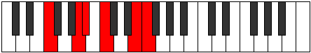
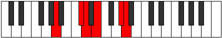
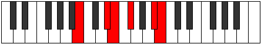

# Mode Gonitonic

## Links

- [Documentation](index.md)
- [Scales Index](Scales.md)
- [Modes Index](Modes.md)
- [Chords Index](Chords.md)

## Parent Scale

[Phraditonic](ScalePhraditonic.md)

## Number

[2225](https://ianring.com/musictheory/scales/2225)

## Perfection

- 3 Perfect notes
- 2 Perfect notes

## Perfection Profile

[true true true false false]

## Permutations

| Tonic | Notes | Signature | Illustration | Audio |
|-------|-------|-----------|--------------|-------|
| [C](ModeCNaturalGonitonic.md) | C, E, F, **G**, **B**, C | C |  | [midi](ModeCNaturalGonitonic.mid) [ogg](ModeCNaturalGonitonic.ogg) |
| [C#](ModeCSharpGonitonic.md) | C#, F, F#, **G#**, **C**, C# | C |  | [midi](ModeCSharpGonitonic.mid) [ogg](ModeCSharpGonitonic.ogg) |
| [Db](ModeDFlatGonitonic.md) | Db, F, Gb, **Ab**, **C**, Db | C |  | [midi](ModeDFlatGonitonic.mid) [ogg](ModeDFlatGonitonic.ogg) |
| [D](ModeDNaturalGonitonic.md) | D, F#, G, **A**, **C#**, D | C |  | [midi](ModeDNaturalGonitonic.mid) [ogg](ModeDNaturalGonitonic.ogg) |
| [D#](ModeDSharpGonitonic.md) | D#, G, G#, **A#**, **D**, D# | C |  | [midi](ModeDSharpGonitonic.mid) [ogg](ModeDSharpGonitonic.ogg) |
| [Eb](ModeEFlatGonitonic.md) | Eb, G, Ab, **Bb**, **D**, Eb | C |  | [midi](ModeEFlatGonitonic.mid) [ogg](ModeEFlatGonitonic.ogg) |
| [E](ModeENaturalGonitonic.md) | E, G#, A, **B**, **D#**, E | C |  | [midi](ModeENaturalGonitonic.mid) [ogg](ModeENaturalGonitonic.ogg) |
| [F](ModeFNaturalGonitonic.md) | F, A, A#, **C**, **E**, F | C |  | [midi](ModeFNaturalGonitonic.mid) [ogg](ModeFNaturalGonitonic.ogg) |
| [F#](ModeFSharpGonitonic.md) | F#, A#, B, **C#**, **F**, F# | C |  | [midi](ModeFSharpGonitonic.mid) [ogg](ModeFSharpGonitonic.ogg) |
| [Gb](ModeGFlatGonitonic.md) | Gb, Bb, B, **Db**, **F**, Gb | C |  | [midi](ModeGFlatGonitonic.mid) [ogg](ModeGFlatGonitonic.ogg) |
| [G](ModeGNaturalGonitonic.md) | G, B, C, **D**, **F#**, G | C |  | [midi](ModeGNaturalGonitonic.mid) [ogg](ModeGNaturalGonitonic.ogg) |
| [G#](ModeGSharpGonitonic.md) | G#, C, C#, **D#**, **G**, G# | C |  | [midi](ModeGSharpGonitonic.mid) [ogg](ModeGSharpGonitonic.ogg) |
| [Ab](ModeAFlatGonitonic.md) | Ab, C, Db, **Eb**, **G**, Ab | C |  | [midi](ModeAFlatGonitonic.mid) [ogg](ModeAFlatGonitonic.ogg) |
| [A](ModeANaturalGonitonic.md) | A, C#, D, **E**, **G#**, A | C |  | [midi](ModeANaturalGonitonic.mid) [ogg](ModeANaturalGonitonic.ogg) |
| [A#](ModeASharpGonitonic.md) | A#, D, D#, **F**, **A**, A# | C |  | [midi](ModeASharpGonitonic.mid) [ogg](ModeASharpGonitonic.ogg) |
| [Bb](ModeBFlatGonitonic.md) | Bb, D, Eb, **F**, **A**, Bb | C |  | [midi](ModeBFlatGonitonic.mid) [ogg](ModeBFlatGonitonic.ogg) |
| [B](ModeBNaturalGonitonic.md) | B, D#, E, **F#**, **A#**, B | C |  | [midi](ModeBNaturalGonitonic.mid) [ogg](ModeBNaturalGonitonic.ogg) |
