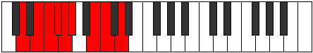

# Mode Gonyllic

## Links

- [Documentation](README.md)
- [Scales Index](Scales.md)
- [Modes Index](Modes.md)
- [Chords Index](Chords.md)

## Parent Scale

[Aeolothyllic](ScaleAeolothyllic.md)

## Number

[1661](https://ianring.com/musictheory/scales/1661)

## Interval Pattern

2, 1, 1, 1, 1, 3, 1, 2

## Chord Pattern

iii⁰b3, iv⁰b3, V, VI⁺, vii⁰, VIIIb5

## Perfection

- 5 Perfect notes
- 3 Perfect notes

## Perfection Profile

[false true true false true false true true]

## Permutations

| Tonic | Notes | Signature | Illustration | Audio |
|-------|-------|-----------|--------------|-------|
| [C](ModeCNaturalGonyllic.md) | **C**, D, D#, **E**, F, **F#**, A, A#, **C** | C |  | [midi](https://github.com/edipermadi/music/blob/main/docs/ModeCNaturalGonyllic.mid?raw=true) |
| [C#](ModeCSharpGonyllic.md) | **C#**, D#, E, **F**, F#, **G**, A#, B, **C#** | C |  | [midi](https://github.com/edipermadi/music/blob/main/docs/ModeCSharpGonyllic.mid?raw=true) |
| [Db](ModeDFlatGonyllic.md) | **Db**, Eb, E, **F**, Gb, **G**, Bb, B, **Db** | C |  | [midi](https://github.com/edipermadi/music/blob/main/docs/ModeDFlatGonyllic.mid?raw=true) |
| [D](ModeDNaturalGonyllic.md) | **D**, E, F, **F#**, G, **G#**, B, C, **D** | C |  | [midi](https://github.com/edipermadi/music/blob/main/docs/ModeDNaturalGonyllic.mid?raw=true) |
| [D#](ModeDSharpGonyllic.md) | **D#**, F, F#, **G**, G#, **A**, C, C#, **D#** | C |  | [midi](https://github.com/edipermadi/music/blob/main/docs/ModeDSharpGonyllic.mid?raw=true) |
| [Eb](ModeEFlatGonyllic.md) | **Eb**, F, Gb, **G**, Ab, **A**, C, Db, **Eb** | C |  | [midi](https://github.com/edipermadi/music/blob/main/docs/ModeEFlatGonyllic.mid?raw=true) |
| [E](ModeENaturalGonyllic.md) | **E**, F#, G, **G#**, A, **A#**, C#, D, **E** | C |  | [midi](https://github.com/edipermadi/music/blob/main/docs/ModeENaturalGonyllic.mid?raw=true) |
| [F](ModeFNaturalGonyllic.md) | **F**, G, G#, **A**, A#, **B**, D, D#, **F** | C |  | [midi](https://github.com/edipermadi/music/blob/main/docs/ModeFNaturalGonyllic.mid?raw=true) |
| [F#](ModeFSharpGonyllic.md) | **F#**, G#, A, **A#**, B, **C**, D#, E, **F#** | C |  | [midi](https://github.com/edipermadi/music/blob/main/docs/ModeFSharpGonyllic.mid?raw=true) |
| [Gb](ModeGFlatGonyllic.md) | **Gb**, Ab, A, **Bb**, B, **C**, Eb, E, **Gb** | C |  | [midi](https://github.com/edipermadi/music/blob/main/docs/ModeGFlatGonyllic.mid?raw=true) |
| [G](ModeGNaturalGonyllic.md) | **G**, A, A#, **B**, C, **C#**, E, F, **G** | C |  | [midi](https://github.com/edipermadi/music/blob/main/docs/ModeGNaturalGonyllic.mid?raw=true) |
| [G#](ModeGSharpGonyllic.md) | **G#**, A#, B, **C**, C#, **D**, F, F#, **G#** | C |  | [midi](https://github.com/edipermadi/music/blob/main/docs/ModeGSharpGonyllic.mid?raw=true) |
| [Ab](ModeAFlatGonyllic.md) | **Ab**, Bb, B, **C**, Db, **D**, F, Gb, **Ab** | C |  | [midi](https://github.com/edipermadi/music/blob/main/docs/ModeAFlatGonyllic.mid?raw=true) |
| [A](ModeANaturalGonyllic.md) | **A**, B, C, **C#**, D, **D#**, F#, G, **A** | C |  | [midi](https://github.com/edipermadi/music/blob/main/docs/ModeANaturalGonyllic.mid?raw=true) |
| [A#](ModeASharpGonyllic.md) | **A#**, C, C#, **D**, D#, **E**, G, G#, **A#** | C |  | [midi](https://github.com/edipermadi/music/blob/main/docs/ModeASharpGonyllic.mid?raw=true) |
| [Bb](ModeBFlatGonyllic.md) | **Bb**, C, Db, **D**, Eb, **E**, G, Ab, **Bb** | C |  | [midi](https://github.com/edipermadi/music/blob/main/docs/ModeBFlatGonyllic.mid?raw=true) |
| [B](ModeBNaturalGonyllic.md) | **B**, C#, D, **D#**, E, **F**, G#, A, **B** | C |  | [midi](https://github.com/edipermadi/music/blob/main/docs/ModeBNaturalGonyllic.mid?raw=true) |
