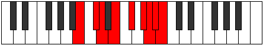

# Mode Goptyllic

## Links

- [Documentation](index.md)
- [Scales Index](Scales.md)
- [Modes Index](Modes.md)
- [Chords Index](Chords.md)

## Parent Scale

[Ionocryllic](ScaleIonocryllic.md)

## Number

[3757](https://ianring.com/musictheory/scales/3757)

## Perfection

- 6 Perfect notes
- 2 Perfect notes

## Perfection Profile

[true true true true true false true false]

## Permutations

| Tonic | Notes | Signature | Illustration | Audio |
|-------|-------|-----------|--------------|-------|
| [C](ModeCNaturalGoptyllic.md) | C, D, D#, F, G, **A**, A#, **B**, C | C |  | [midi](ModeCNaturalGoptyllic.mid) [ogg](ModeCNaturalGoptyllic.ogg) |
| [C#](ModeCSharpGoptyllic.md) | C#, D#, E, F#, G#, **A#**, B, **C**, C# | C |  | [midi](ModeCSharpGoptyllic.mid) [ogg](ModeCSharpGoptyllic.ogg) |
| [Db](ModeDFlatGoptyllic.md) | Db, Eb, E, Gb, Ab, **Bb**, B, **C**, Db | C |  | [midi](ModeDFlatGoptyllic.mid) [ogg](ModeDFlatGoptyllic.ogg) |
| [D](ModeDNaturalGoptyllic.md) | D, E, F, G, A, **B**, C, **C#**, D | C |  | [midi](ModeDNaturalGoptyllic.mid) [ogg](ModeDNaturalGoptyllic.ogg) |
| [D#](ModeDSharpGoptyllic.md) | D#, F, F#, G#, A#, **C**, C#, **D**, D# | C |  | [midi](ModeDSharpGoptyllic.mid) [ogg](ModeDSharpGoptyllic.ogg) |
| [Eb](ModeEFlatGoptyllic.md) | Eb, F, Gb, Ab, Bb, **C**, Db, **D**, Eb | C |  | [midi](ModeEFlatGoptyllic.mid) [ogg](ModeEFlatGoptyllic.ogg) |
| [E](ModeENaturalGoptyllic.md) | E, F#, G, A, B, **C#**, D, **D#**, E | C |  | [midi](ModeENaturalGoptyllic.mid) [ogg](ModeENaturalGoptyllic.ogg) |
| [F](ModeFNaturalGoptyllic.md) | F, G, G#, A#, C, **D**, D#, **E**, F | C |  | [midi](ModeFNaturalGoptyllic.mid) [ogg](ModeFNaturalGoptyllic.ogg) |
| [F#](ModeFSharpGoptyllic.md) | F#, G#, A, B, C#, **D#**, E, **F**, F# | C |  | [midi](ModeFSharpGoptyllic.mid) [ogg](ModeFSharpGoptyllic.ogg) |
| [Gb](ModeGFlatGoptyllic.md) | Gb, Ab, A, B, Db, **Eb**, E, **F**, Gb | C |  | [midi](ModeGFlatGoptyllic.mid) [ogg](ModeGFlatGoptyllic.ogg) |
| [G](ModeGNaturalGoptyllic.md) | G, A, A#, C, D, **E**, F, **F#**, G | C |  | [midi](ModeGNaturalGoptyllic.mid) [ogg](ModeGNaturalGoptyllic.ogg) |
| [G#](ModeGSharpGoptyllic.md) | G#, A#, B, C#, D#, **F**, F#, **G**, G# | C |  | [midi](ModeGSharpGoptyllic.mid) [ogg](ModeGSharpGoptyllic.ogg) |
| [Ab](ModeAFlatGoptyllic.md) | Ab, Bb, B, Db, Eb, **F**, Gb, **G**, Ab | C |  | [midi](ModeAFlatGoptyllic.mid) [ogg](ModeAFlatGoptyllic.ogg) |
| [A](ModeANaturalGoptyllic.md) | A, B, C, D, E, **F#**, G, **G#**, A | C |  | [midi](ModeANaturalGoptyllic.mid) [ogg](ModeANaturalGoptyllic.ogg) |
| [A#](ModeASharpGoptyllic.md) | A#, C, C#, D#, F, **G**, G#, **A**, A# | C |  | [midi](ModeASharpGoptyllic.mid) [ogg](ModeASharpGoptyllic.ogg) |
| [Bb](ModeBFlatGoptyllic.md) | Bb, C, Db, Eb, F, **G**, Ab, **A**, Bb | C |  | [midi](ModeBFlatGoptyllic.mid) [ogg](ModeBFlatGoptyllic.ogg) |
| [B](ModeBNaturalGoptyllic.md) | B, C#, D, E, F#, **G#**, A, **A#**, B | C |  | [midi](ModeBNaturalGoptyllic.mid) [ogg](ModeBNaturalGoptyllic.ogg) |
