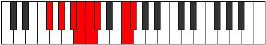

# Mode Gorian

## Links

- [Documentation](index.md)
- [Scales Index](Scales.md)
- [Modes Index](Modes.md)
- [Chords Index](Chords.md)

## Parent Scale

[Ionythian](ScaleIonythian.md)

## Number

[2293](https://ianring.com/musictheory/scales/2293)

## Perfection

- 5 Perfect notes
- 2 Perfect notes

## Perfection Profile

[true false true true false true true]

## Permutations

| Tonic | Notes | Signature | Illustration | Audio |
|-------|-------|-----------|--------------|-------|
| [C](ModeCNaturalGorian.md) | C, **D**, E, F, **Gb**, Abb, B, C | C |  | [midi](ModeCNaturalGorian.mid) [ogg](ModeCNaturalGorian.ogg) |
| [C#](ModeCSharpGorian.md) | C#, **D#**, E#, F#, **G**, Ab, B#, C# | C |  | [midi](ModeCSharpGorian.mid) [ogg](ModeCSharpGorian.ogg) |
| [Db](ModeDFlatGorian.md) | Db, **Eb**, F, Gb, **Abb**, Bbbb, C, Db | C |  | [midi](ModeDFlatGorian.mid) [ogg](ModeDFlatGorian.ogg) |
| [D](ModeDNaturalGorian.md) | D, **E**, F#, G, **Ab**, Bbb, C#, D | C |  | [midi](ModeDNaturalGorian.mid) [ogg](ModeDNaturalGorian.ogg) |
| [D#](ModeDSharpGorian.md) | D#, **E#**, F##, G#, **A**, Bb, C##, D# | C |  | [midi](ModeDSharpGorian.mid) [ogg](ModeDSharpGorian.ogg) |
| [Eb](ModeEFlatGorian.md) | Eb, **F**, G, Ab, **Bbb**, Cbb, D, Eb | C |  | [midi](ModeEFlatGorian.mid) [ogg](ModeEFlatGorian.ogg) |
| [E](ModeENaturalGorian.md) | E, **F#**, G#, A, **Bb**, Cb, D#, E | C |  | [midi](ModeENaturalGorian.mid) [ogg](ModeENaturalGorian.ogg) |
| [F](ModeFNaturalGorian.md) | F, **G**, A, Bb, **Cb**, Dbb, E, F | C |  | [midi](ModeFNaturalGorian.mid) [ogg](ModeFNaturalGorian.ogg) |
| [F#](ModeFSharpGorian.md) | F#, **G#**, A#, B, **C**, Db, E#, F# | C |  | [midi](ModeFSharpGorian.mid) [ogg](ModeFSharpGorian.ogg) |
| [Gb](ModeGFlatGorian.md) | Gb, **Ab**, Bb, Cb, **Dbb**, Ebbb, F, Gb | C |  | [midi](ModeGFlatGorian.mid) [ogg](ModeGFlatGorian.ogg) |
| [G](ModeGNaturalGorian.md) | G, **A**, B, C, **Db**, Ebb, F#, G | C |  | [midi](ModeGNaturalGorian.mid) [ogg](ModeGNaturalGorian.ogg) |
| [G#](ModeGSharpGorian.md) | G#, **A#**, B#, C#, **D**, Eb, F##, G# | C |  | [midi](ModeGSharpGorian.mid) [ogg](ModeGSharpGorian.ogg) |
| [Ab](ModeAFlatGorian.md) | Ab, **Bb**, C, Db, **Ebb**, Fbb, G, Ab | C |  | [midi](ModeAFlatGorian.mid) [ogg](ModeAFlatGorian.ogg) |
| [A](ModeANaturalGorian.md) | A, **B**, C#, D, **Eb**, Fb, G#, A | C |  | [midi](ModeANaturalGorian.mid) [ogg](ModeANaturalGorian.ogg) |
| [A#](ModeASharpGorian.md) | A#, **B#**, C##, D#, **E**, F, G##, A# | C |  | [midi](ModeASharpGorian.mid) [ogg](ModeASharpGorian.ogg) |
| [Bb](ModeBFlatGorian.md) | Bb, **C**, D, Eb, **Fb**, Gbb, A, Bb | C |  | [midi](ModeBFlatGorian.mid) [ogg](ModeBFlatGorian.ogg) |
| [B](ModeBNaturalGorian.md) | B, **C#**, D#, E, **F**, Gb, A#, B | C |  | [midi](ModeBNaturalGorian.mid) [ogg](ModeBNaturalGorian.ogg) |
