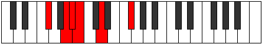

# Mode Goritonic

## Links

- [Documentation](index.md)
- [Scales Index](Scales.md)
- [Modes Index](Modes.md)
- [Chords Index](Chords.md)

## Parent Scale

[Aeolyritonic](ScaleAeolyritonic.md)

## Number

[313](https://ianring.com/musictheory/scales/313)

## Perfection

- 2 Perfect notes
- 3 Perfect notes

## Interval Pattern

3, 1, 1, 3, 4

## Perfection Profile

[false false false true true]

## Permutations

| Tonic | Notes | Signature | Illustration | Audio |
|-------|-------|-----------|--------------|-------|
| [C](ModeCNaturalGoritonic.md) | **C**, **D#**, **E**, F, G#, **C** | C |  | [midi](https://github.com/edipermadi/music/blob/main/docs/ModeCNaturalGoritonic.mid?raw=true) |
| [C#](ModeCSharpGoritonic.md) | **C#**, **E**, **F**, F#, A, **C#** | C |  | [midi](https://github.com/edipermadi/music/blob/main/docs/ModeCSharpGoritonic.mid?raw=true) |
| [Db](ModeDFlatGoritonic.md) | **Db**, **E**, **F**, Gb, A, **Db** | C |  | [midi](https://github.com/edipermadi/music/blob/main/docs/ModeDFlatGoritonic.mid?raw=true) |
| [D](ModeDNaturalGoritonic.md) | **D**, **F**, **F#**, G, A#, **D** | C |  | [midi](https://github.com/edipermadi/music/blob/main/docs/ModeDNaturalGoritonic.mid?raw=true) |
| [D#](ModeDSharpGoritonic.md) | **D#**, **F#**, **G**, G#, B, **D#** | C |  | [midi](https://github.com/edipermadi/music/blob/main/docs/ModeDSharpGoritonic.mid?raw=true) |
| [Eb](ModeEFlatGoritonic.md) | **Eb**, **Gb**, **G**, Ab, B, **Eb** | C |  | [midi](https://github.com/edipermadi/music/blob/main/docs/ModeEFlatGoritonic.mid?raw=true) |
| [E](ModeENaturalGoritonic.md) | **E**, **G**, **G#**, A, C, **E** | C |  | [midi](https://github.com/edipermadi/music/blob/main/docs/ModeENaturalGoritonic.mid?raw=true) |
| [F](ModeFNaturalGoritonic.md) | **F**, **G#**, **A**, A#, C#, **F** | C |  | [midi](https://github.com/edipermadi/music/blob/main/docs/ModeFNaturalGoritonic.mid?raw=true) |
| [F#](ModeFSharpGoritonic.md) | **F#**, **A**, **A#**, B, D, **F#** | C |  | [midi](https://github.com/edipermadi/music/blob/main/docs/ModeFSharpGoritonic.mid?raw=true) |
| [Gb](ModeGFlatGoritonic.md) | **Gb**, **A**, **Bb**, B, D, **Gb** | C |  | [midi](https://github.com/edipermadi/music/blob/main/docs/ModeGFlatGoritonic.mid?raw=true) |
| [G](ModeGNaturalGoritonic.md) | **G**, **A#**, **B**, C, D#, **G** | C |  | [midi](https://github.com/edipermadi/music/blob/main/docs/ModeGNaturalGoritonic.mid?raw=true) |
| [G#](ModeGSharpGoritonic.md) | **G#**, **B**, **C**, C#, E, **G#** | C |  | [midi](https://github.com/edipermadi/music/blob/main/docs/ModeGSharpGoritonic.mid?raw=true) |
| [Ab](ModeAFlatGoritonic.md) | **Ab**, **B**, **C**, Db, E, **Ab** | C |  | [midi](https://github.com/edipermadi/music/blob/main/docs/ModeAFlatGoritonic.mid?raw=true) |
| [A](ModeANaturalGoritonic.md) | **A**, **C**, **C#**, D, F, **A** | C |  | [midi](https://github.com/edipermadi/music/blob/main/docs/ModeANaturalGoritonic.mid?raw=true) |
| [A#](ModeASharpGoritonic.md) | **A#**, **C#**, **D**, D#, F#, **A#** | C |  | [midi](https://github.com/edipermadi/music/blob/main/docs/ModeASharpGoritonic.mid?raw=true) |
| [Bb](ModeBFlatGoritonic.md) | **Bb**, **Db**, **D**, Eb, Gb, **Bb** | C |  | [midi](https://github.com/edipermadi/music/blob/main/docs/ModeBFlatGoritonic.mid?raw=true) |
| [B](ModeBNaturalGoritonic.md) | **B**, **D**, **D#**, E, G, **B** | C |  | [midi](https://github.com/edipermadi/music/blob/main/docs/ModeBNaturalGoritonic.mid?raw=true) |
