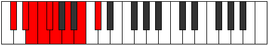

# Mode Goryllic

## Links

- [Documentation](index.md)
- [Scales Index](Scales.md)
- [Modes Index](Modes.md)
- [Chords Index](Chords.md)

## Parent Scale

[Thyryllic](ScaleThyryllic.md)

## Number

[1405](https://ianring.com/musictheory/scales/1405)

## Perfection

- 4 Perfect notes
- 4 Perfect notes

## Perfection Profile

[false false true false true false true true]

## Permutations

| Tonic | Notes | Signature | Illustration | Audio |
|-------|-------|-----------|--------------|-------|
| [C](ModeCNaturalGoryllic.md) | **C**, **D**, D#, **E**, F, **F#**, G#, A#, **C** | C |  | [midi](ModeCNaturalGoryllic.mid) [ogg](ModeCNaturalGoryllic.ogg) |
| [C#](ModeCSharpGoryllic.md) | **C#**, **D#**, E, **F**, F#, **G**, A, B, **C#** | C |  | [midi](ModeCSharpGoryllic.mid) [ogg](ModeCSharpGoryllic.ogg) |
| [Db](ModeDFlatGoryllic.md) | **Db**, **Eb**, E, **F**, Gb, **G**, A, B, **Db** | C |  | [midi](ModeDFlatGoryllic.mid) [ogg](ModeDFlatGoryllic.ogg) |
| [D](ModeDNaturalGoryllic.md) | **D**, **E**, F, **F#**, G, **G#**, A#, C, **D** | C |  | [midi](ModeDNaturalGoryllic.mid) [ogg](ModeDNaturalGoryllic.ogg) |
| [D#](ModeDSharpGoryllic.md) | **D#**, **F**, F#, **G**, G#, **A**, B, C#, **D#** | C |  | [midi](ModeDSharpGoryllic.mid) [ogg](ModeDSharpGoryllic.ogg) |
| [Eb](ModeEFlatGoryllic.md) | **Eb**, **F**, Gb, **G**, Ab, **A**, B, Db, **Eb** | C |  | [midi](ModeEFlatGoryllic.mid) [ogg](ModeEFlatGoryllic.ogg) |
| [E](ModeENaturalGoryllic.md) | **E**, **F#**, G, **G#**, A, **A#**, C, D, **E** | C |  | [midi](ModeENaturalGoryllic.mid) [ogg](ModeENaturalGoryllic.ogg) |
| [F](ModeFNaturalGoryllic.md) | **F**, **G**, G#, **A**, A#, **B**, C#, D#, **F** | C |  | [midi](ModeFNaturalGoryllic.mid) [ogg](ModeFNaturalGoryllic.ogg) |
| [F#](ModeFSharpGoryllic.md) | **F#**, **G#**, A, **A#**, B, **C**, D, E, **F#** | C |  | [midi](ModeFSharpGoryllic.mid) [ogg](ModeFSharpGoryllic.ogg) |
| [Gb](ModeGFlatGoryllic.md) | **Gb**, **Ab**, A, **Bb**, B, **C**, D, E, **Gb** | C |  | [midi](ModeGFlatGoryllic.mid) [ogg](ModeGFlatGoryllic.ogg) |
| [G](ModeGNaturalGoryllic.md) | **G**, **A**, A#, **B**, C, **C#**, D#, F, **G** | C |  | [midi](ModeGNaturalGoryllic.mid) [ogg](ModeGNaturalGoryllic.ogg) |
| [G#](ModeGSharpGoryllic.md) | **G#**, **A#**, B, **C**, C#, **D**, E, F#, **G#** | C |  | [midi](ModeGSharpGoryllic.mid) [ogg](ModeGSharpGoryllic.ogg) |
| [Ab](ModeAFlatGoryllic.md) | **Ab**, **Bb**, B, **C**, Db, **D**, E, Gb, **Ab** | C |  | [midi](ModeAFlatGoryllic.mid) [ogg](ModeAFlatGoryllic.ogg) |
| [A](ModeANaturalGoryllic.md) | **A**, **B**, C, **C#**, D, **D#**, F, G, **A** | C |  | [midi](ModeANaturalGoryllic.mid) [ogg](ModeANaturalGoryllic.ogg) |
| [A#](ModeASharpGoryllic.md) | **A#**, **C**, C#, **D**, D#, **E**, F#, G#, **A#** | C |  | [midi](ModeASharpGoryllic.mid) [ogg](ModeASharpGoryllic.ogg) |
| [Bb](ModeBFlatGoryllic.md) | **Bb**, **C**, Db, **D**, Eb, **E**, Gb, Ab, **Bb** | C |  | [midi](ModeBFlatGoryllic.mid) [ogg](ModeBFlatGoryllic.ogg) |
| [B](ModeBNaturalGoryllic.md) | **B**, **C#**, D, **D#**, E, **F**, G, A, **B** | C |  | [midi](ModeBNaturalGoryllic.mid) [ogg](ModeBNaturalGoryllic.ogg) |
