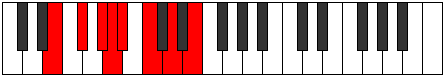

# Mode Gothian

## Links

- [Documentation](index.md)
- [Scales Index](Scales.md)
- [Modes Index](Modes.md)
- [Chords Index](Chords.md)

## Parent Scale

[Aeolynian](ScaleAeolynian.md)

## Number

[1397](https://ianring.com/musictheory/scales/1397)

## Perfection

- 2 Perfect notes
- 5 Perfect notes

## Perfection Profile

[false false false true false false true]

## Permutations

| Tonic | Notes | Signature | Illustration | Audio |
|-------|-------|-----------|--------------|-------|
| [C](ModeCNaturalGothian.md) | **C**, **D**, **E**, F, **Gb**, **Ab**, Bb, **C** | C |  | [midi](ModeCNaturalGothian.mid) [ogg](ModeCNaturalGothian.ogg) |
| [C#](ModeCSharpGothian.md) | **C#**, **D#**, **E#**, F#, **G**, **A**, B, **C#** | C |  | [midi](ModeCSharpGothian.mid) [ogg](ModeCSharpGothian.ogg) |
| [Db](ModeDFlatGothian.md) | **Db**, **Eb**, **F**, Gb, **Abb**, **Bbb**, Cb, **Db** | C |  | [midi](ModeDFlatGothian.mid) [ogg](ModeDFlatGothian.ogg) |
| [D](ModeDNaturalGothian.md) | **D**, **E**, **F#**, G, **Ab**, **Bb**, C, **D** | C |  | [midi](ModeDNaturalGothian.mid) [ogg](ModeDNaturalGothian.ogg) |
| [D#](ModeDSharpGothian.md) | **D#**, **E#**, **F##**, G#, **A**, **B**, C#, **D#** | C |  | [midi](ModeDSharpGothian.mid) [ogg](ModeDSharpGothian.ogg) |
| [Eb](ModeEFlatGothian.md) | **Eb**, **F**, **G**, Ab, **Bbb**, **Cb**, Db, **Eb** | C |  | [midi](ModeEFlatGothian.mid) [ogg](ModeEFlatGothian.ogg) |
| [E](ModeENaturalGothian.md) | **E**, **F#**, **G#**, A, **Bb**, **C**, D, **E** | C |  | [midi](ModeENaturalGothian.mid) [ogg](ModeENaturalGothian.ogg) |
| [F](ModeFNaturalGothian.md) | **F**, **G**, **A**, Bb, **Cb**, **Db**, Eb, **F** | C |  | [midi](ModeFNaturalGothian.mid) [ogg](ModeFNaturalGothian.ogg) |
| [F#](ModeFSharpGothian.md) | **F#**, **G#**, **A#**, B, **C**, **D**, E, **F#** | C |  | [midi](ModeFSharpGothian.mid) [ogg](ModeFSharpGothian.ogg) |
| [Gb](ModeGFlatGothian.md) | **Gb**, **Ab**, **Bb**, Cb, **Dbb**, **Ebb**, Fb, **Gb** | C |  | [midi](ModeGFlatGothian.mid) [ogg](ModeGFlatGothian.ogg) |
| [G](ModeGNaturalGothian.md) | **G**, **A**, **B**, C, **Db**, **Eb**, F, **G** | C |  | [midi](ModeGNaturalGothian.mid) [ogg](ModeGNaturalGothian.ogg) |
| [G#](ModeGSharpGothian.md) | **G#**, **A#**, **B#**, C#, **D**, **E**, F#, **G#** | C |  | [midi](ModeGSharpGothian.mid) [ogg](ModeGSharpGothian.ogg) |
| [Ab](ModeAFlatGothian.md) | **Ab**, **Bb**, **C**, Db, **Ebb**, **Fb**, Gb, **Ab** | C |  | [midi](ModeAFlatGothian.mid) [ogg](ModeAFlatGothian.ogg) |
| [A](ModeANaturalGothian.md) | **A**, **B**, **C#**, D, **Eb**, **F**, G, **A** | C |  | [midi](ModeANaturalGothian.mid) [ogg](ModeANaturalGothian.ogg) |
| [A#](ModeASharpGothian.md) | **A#**, **B#**, **C##**, D#, **E**, **F#**, G#, **A#** | C |  | [midi](ModeASharpGothian.mid) [ogg](ModeASharpGothian.ogg) |
| [Bb](ModeBFlatGothian.md) | **Bb**, **C**, **D**, Eb, **Fb**, **Gb**, Ab, **Bb** | C |  | [midi](ModeBFlatGothian.mid) [ogg](ModeBFlatGothian.ogg) |
| [B](ModeBNaturalGothian.md) | **B**, **C#**, **D#**, E, **F**, **G**, A, **B** | C |  | [midi](ModeBNaturalGothian.mid) [ogg](ModeBNaturalGothian.ogg) |
