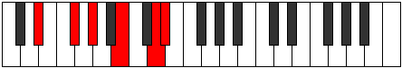

# Mode Gothitonic

## Links

- [Documentation](index.md)
- [Scales Index](Scales.md)
- [Modes Index](Modes.md)
- [Chords Index](Chords.md)

## Parent Scale

[Lyditonic](ScaleLyditonic.md)

## Number

[2345](https://ianring.com/musictheory/scales/2345)

## Perfection

- 2 Perfect notes
- 3 Perfect notes

## Perfection Profile

[false false true true false]

## Permutations

| Tonic | Notes | Signature | Illustration | Audio |
|-------|-------|-----------|--------------|-------|
| [C](ModeCNaturalGothitonic.md) | **C**, **D#**, F, G#, **B**, **C** | C |  | [midi](https://github.com/edipermadi/music/blob/main/docs/ModeCNaturalGothitonic.mid?raw=true) |
| [C#](ModeCSharpGothitonic.md) | **C#**, **E**, F#, A, **C**, **C#** | C |  | [midi](https://github.com/edipermadi/music/blob/main/docs/ModeCSharpGothitonic.mid?raw=true) |
| [Db](ModeDFlatGothitonic.md) | **Db**, **E**, Gb, A, **C**, **Db** | C |  | [midi](https://github.com/edipermadi/music/blob/main/docs/ModeDFlatGothitonic.mid?raw=true) |
| [D](ModeDNaturalGothitonic.md) | **D**, **F**, G, A#, **C#**, **D** | C |  | [midi](https://github.com/edipermadi/music/blob/main/docs/ModeDNaturalGothitonic.mid?raw=true) |
| [D#](ModeDSharpGothitonic.md) | **D#**, **F#**, G#, B, **D**, **D#** | C |  | [midi](https://github.com/edipermadi/music/blob/main/docs/ModeDSharpGothitonic.mid?raw=true) |
| [Eb](ModeEFlatGothitonic.md) | **Eb**, **Gb**, Ab, B, **D**, **Eb** | C |  | [midi](https://github.com/edipermadi/music/blob/main/docs/ModeEFlatGothitonic.mid?raw=true) |
| [E](ModeENaturalGothitonic.md) | **E**, **G**, A, C, **D#**, **E** | C |  | [midi](https://github.com/edipermadi/music/blob/main/docs/ModeENaturalGothitonic.mid?raw=true) |
| [F](ModeFNaturalGothitonic.md) | **F**, **G#**, A#, C#, **E**, **F** | C |  | [midi](https://github.com/edipermadi/music/blob/main/docs/ModeFNaturalGothitonic.mid?raw=true) |
| [F#](ModeFSharpGothitonic.md) | **F#**, **A**, B, D, **F**, **F#** | C |  | [midi](https://github.com/edipermadi/music/blob/main/docs/ModeFSharpGothitonic.mid?raw=true) |
| [Gb](ModeGFlatGothitonic.md) | **Gb**, **A**, B, D, **F**, **Gb** | C |  | [midi](https://github.com/edipermadi/music/blob/main/docs/ModeGFlatGothitonic.mid?raw=true) |
| [G](ModeGNaturalGothitonic.md) | **G**, **A#**, C, D#, **F#**, **G** | C |  | [midi](https://github.com/edipermadi/music/blob/main/docs/ModeGNaturalGothitonic.mid?raw=true) |
| [G#](ModeGSharpGothitonic.md) | **G#**, **B**, C#, E, **G**, **G#** | C |  | [midi](https://github.com/edipermadi/music/blob/main/docs/ModeGSharpGothitonic.mid?raw=true) |
| [Ab](ModeAFlatGothitonic.md) | **Ab**, **B**, Db, E, **G**, **Ab** | C |  | [midi](https://github.com/edipermadi/music/blob/main/docs/ModeAFlatGothitonic.mid?raw=true) |
| [A](ModeANaturalGothitonic.md) | **A**, **C**, D, F, **G#**, **A** | C |  | [midi](https://github.com/edipermadi/music/blob/main/docs/ModeANaturalGothitonic.mid?raw=true) |
| [A#](ModeASharpGothitonic.md) | **A#**, **C#**, D#, F#, **A**, **A#** | C |  | [midi](https://github.com/edipermadi/music/blob/main/docs/ModeASharpGothitonic.mid?raw=true) |
| [Bb](ModeBFlatGothitonic.md) | **Bb**, **Db**, Eb, Gb, **A**, **Bb** | C |  | [midi](https://github.com/edipermadi/music/blob/main/docs/ModeBFlatGothitonic.mid?raw=true) |
| [B](ModeBNaturalGothitonic.md) | **B**, **D**, E, G, **A#**, **B** | C |  | [midi](https://github.com/edipermadi/music/blob/main/docs/ModeBNaturalGothitonic.mid?raw=true) |
