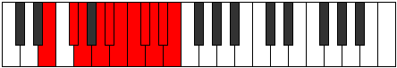

# Mode Gothyllian

## Links

- [Documentation](index.md)
- [Scales Index](Scales.md)
- [Modes Index](Modes.md)
- [Chords Index](Chords.md)

## Parent Scale

[Gothyllian](ScaleGothyllian.md)

## Number

[4077](https://ianring.com/musictheory/scales/4077)

## Perfection

- 8 Perfect notes
- 2 Perfect notes

## Interval Pattern

2, 1, 2, 1, 1, 1, 1, 1, 1, 1

## Perfection Profile

[true true true true false true true false true true]

## Permutations

| Tonic | Notes | Signature | Illustration | Audio |
|-------|-------|-----------|--------------|-------|
| [C](ModeCNaturalGothyllian.md) | C, D, D#, F, **F#**, G, G#, **A**, A#, B, C | C |  | [midi](https://github.com/edipermadi/music/blob/main/docs/ModeCNaturalGothyllian.mid?raw=true) |
| [C#](ModeCSharpGothyllian.md) | C#, D#, E, F#, **G**, G#, A, **A#**, B, C, C# | C |  | [midi](https://github.com/edipermadi/music/blob/main/docs/ModeCSharpGothyllian.mid?raw=true) |
| [Db](ModeDFlatGothyllian.md) | Db, Eb, E, Gb, **G**, Ab, A, **Bb**, B, C, Db | C |  | [midi](https://github.com/edipermadi/music/blob/main/docs/ModeDFlatGothyllian.mid?raw=true) |
| [D](ModeDNaturalGothyllian.md) | D, E, F, G, **G#**, A, A#, **B**, C, C#, D | C |  | [midi](https://github.com/edipermadi/music/blob/main/docs/ModeDNaturalGothyllian.mid?raw=true) |
| [D#](ModeDSharpGothyllian.md) | D#, F, F#, G#, **A**, A#, B, **C**, C#, D, D# | C |  | [midi](https://github.com/edipermadi/music/blob/main/docs/ModeDSharpGothyllian.mid?raw=true) |
| [Eb](ModeEFlatGothyllian.md) | Eb, F, Gb, Ab, **A**, Bb, B, **C**, Db, D, Eb | C |  | [midi](https://github.com/edipermadi/music/blob/main/docs/ModeEFlatGothyllian.mid?raw=true) |
| [E](ModeENaturalGothyllian.md) | E, F#, G, A, **A#**, B, C, **C#**, D, D#, E | C |  | [midi](https://github.com/edipermadi/music/blob/main/docs/ModeENaturalGothyllian.mid?raw=true) |
| [F](ModeFNaturalGothyllian.md) | F, G, G#, A#, **B**, C, C#, **D**, D#, E, F | C |  | [midi](https://github.com/edipermadi/music/blob/main/docs/ModeFNaturalGothyllian.mid?raw=true) |
| [F#](ModeFSharpGothyllian.md) | F#, G#, A, B, **C**, C#, D, **D#**, E, F, F# | C |  | [midi](https://github.com/edipermadi/music/blob/main/docs/ModeFSharpGothyllian.mid?raw=true) |
| [Gb](ModeGFlatGothyllian.md) | Gb, Ab, A, B, **C**, Db, D, **Eb**, E, F, Gb | C |  | [midi](https://github.com/edipermadi/music/blob/main/docs/ModeGFlatGothyllian.mid?raw=true) |
| [G](ModeGNaturalGothyllian.md) | G, A, A#, C, **C#**, D, D#, **E**, F, F#, G | C |  | [midi](https://github.com/edipermadi/music/blob/main/docs/ModeGNaturalGothyllian.mid?raw=true) |
| [G#](ModeGSharpGothyllian.md) | G#, A#, B, C#, **D**, D#, E, **F**, F#, G, G# | C |  | [midi](https://github.com/edipermadi/music/blob/main/docs/ModeGSharpGothyllian.mid?raw=true) |
| [Ab](ModeAFlatGothyllian.md) | Ab, Bb, B, Db, **D**, Eb, E, **F**, Gb, G, Ab | C |  | [midi](https://github.com/edipermadi/music/blob/main/docs/ModeAFlatGothyllian.mid?raw=true) |
| [A](ModeANaturalGothyllian.md) | A, B, C, D, **D#**, E, F, **F#**, G, G#, A | C |  | [midi](https://github.com/edipermadi/music/blob/main/docs/ModeANaturalGothyllian.mid?raw=true) |
| [A#](ModeASharpGothyllian.md) | A#, C, C#, D#, **E**, F, F#, **G**, G#, A, A# | C |  | [midi](https://github.com/edipermadi/music/blob/main/docs/ModeASharpGothyllian.mid?raw=true) |
| [Bb](ModeBFlatGothyllian.md) | Bb, C, Db, Eb, **E**, F, Gb, **G**, Ab, A, Bb | C |  | [midi](https://github.com/edipermadi/music/blob/main/docs/ModeBFlatGothyllian.mid?raw=true) |
| [B](ModeBNaturalGothyllian.md) | B, C#, D, E, **F**, F#, G, **G#**, A, A#, B | C |  | [midi](https://github.com/edipermadi/music/blob/main/docs/ModeBNaturalGothyllian.mid?raw=true) |
