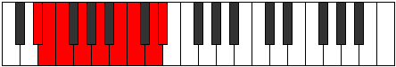

# Mode Gothyllic

## Links

- [Documentation](README.md)
- [Scales Index](Scales.md)
- [Modes Index](Modes.md)
- [Chords Index](Chords.md)

## Parent Scale

[Rocryllic](ScaleRocryllic.md)

## Number

[2903](https://ianring.com/musictheory/scales/2903)

## Luminosity

-1

## Transposition

1, 1, 2, 2, 2, 1, 2, 1

## Chord Pattern

i⁰b3, ii, III, IV, v⁰

## Perfection

- 6 Perfect notes
- 2 Perfect notes

## Perfection Profile

false, true, true, true, true, false, true, true

## Permutations

| Tonic | Notes | Signature | Illustration | Audio |
|-------|-------|-----------|--------------|-------|
| [C](ModeCNaturalGothyllic.md) | **C**, C#, D, E, F#, **G#**, A, B, **C** | C |  | [midi](https://github.com/edipermadi/music/blob/main/docs/ModeCNaturalGothyllic.mid?raw=true) |
| [C#](ModeCSharpGothyllic.md) | **C#**, D, D#, F, G, **A**, A#, C, **C#** | C |  | [midi](https://github.com/edipermadi/music/blob/main/docs/ModeCSharpGothyllic.mid?raw=true) |
| [Db](ModeDFlatGothyllic.md) | **Db**, D, Eb, F, G, **A**, Bb, C, **Db** | C |  | [midi](https://github.com/edipermadi/music/blob/main/docs/ModeDFlatGothyllic.mid?raw=true) |
| [D](ModeDNaturalGothyllic.md) | **D**, D#, E, F#, G#, **A#**, B, C#, **D** | C |  | [midi](https://github.com/edipermadi/music/blob/main/docs/ModeDNaturalGothyllic.mid?raw=true) |
| [D#](ModeDSharpGothyllic.md) | **D#**, E, F, G, A, **B**, C, D, **D#** | C |  | [midi](https://github.com/edipermadi/music/blob/main/docs/ModeDSharpGothyllic.mid?raw=true) |
| [Eb](ModeEFlatGothyllic.md) | **Eb**, E, F, G, A, **B**, C, D, **Eb** | C |  | [midi](https://github.com/edipermadi/music/blob/main/docs/ModeEFlatGothyllic.mid?raw=true) |
| [E](ModeENaturalGothyllic.md) | **E**, F, F#, G#, A#, **C**, C#, D#, **E** | C |  | [midi](https://github.com/edipermadi/music/blob/main/docs/ModeENaturalGothyllic.mid?raw=true) |
| [F](ModeFNaturalGothyllic.md) | **F**, F#, G, A, B, **C#**, D, E, **F** | C |  | [midi](https://github.com/edipermadi/music/blob/main/docs/ModeFNaturalGothyllic.mid?raw=true) |
| [F#](ModeFSharpGothyllic.md) | **F#**, G, G#, A#, C, **D**, D#, F, **F#** | C |  | [midi](https://github.com/edipermadi/music/blob/main/docs/ModeFSharpGothyllic.mid?raw=true) |
| [Gb](ModeGFlatGothyllic.md) | **Gb**, G, Ab, Bb, C, **D**, Eb, F, **Gb** | C |  | [midi](https://github.com/edipermadi/music/blob/main/docs/ModeGFlatGothyllic.mid?raw=true) |
| [G](ModeGNaturalGothyllic.md) | **G**, G#, A, B, C#, **D#**, E, F#, **G** | C |  | [midi](https://github.com/edipermadi/music/blob/main/docs/ModeGNaturalGothyllic.mid?raw=true) |
| [G#](ModeGSharpGothyllic.md) | **G#**, A, A#, C, D, **E**, F, G, **G#** | C |  | [midi](https://github.com/edipermadi/music/blob/main/docs/ModeGSharpGothyllic.mid?raw=true) |
| [Ab](ModeAFlatGothyllic.md) | **Ab**, A, Bb, C, D, **E**, F, G, **Ab** | C |  | [midi](https://github.com/edipermadi/music/blob/main/docs/ModeAFlatGothyllic.mid?raw=true) |
| [A](ModeANaturalGothyllic.md) | **A**, A#, B, C#, D#, **F**, F#, G#, **A** | C |  | [midi](https://github.com/edipermadi/music/blob/main/docs/ModeANaturalGothyllic.mid?raw=true) |
| [A#](ModeASharpGothyllic.md) | **A#**, B, C, D, E, **F#**, G, A, **A#** | C |  | [midi](https://github.com/edipermadi/music/blob/main/docs/ModeASharpGothyllic.mid?raw=true) |
| [Bb](ModeBFlatGothyllic.md) | **Bb**, B, C, D, E, **Gb**, G, A, **Bb** | C |  | [midi](https://github.com/edipermadi/music/blob/main/docs/ModeBFlatGothyllic.mid?raw=true) |
| [B](ModeBNaturalGothyllic.md) | **B**, C, C#, D#, F, **G**, G#, A#, **B** | C |  | [midi](https://github.com/edipermadi/music/blob/main/docs/ModeBNaturalGothyllic.mid?raw=true) |
