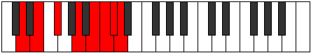

# Mode Gycrian

## Links

- [Documentation](index.md)
- [Scales Index](Scales.md)
- [Modes Index](Modes.md)
- [Chords Index](Chords.md)

## Parent Scale

[Stathian](ScaleStathian.md)

## Number

[3733](https://ianring.com/musictheory/scales/3733)

## Perfection

- 5 Perfect notes
- 2 Perfect notes

## Perfection Profile

[true true true true true false false]

## Permutations

| Tonic | Notes | Signature | Illustration | Audio |
|-------|-------|-----------|--------------|-------|
| [C](ModeCNaturalGycrian.md) | C, D, E, F##, G##, **A#**, **B**, C | C |  | [midi](ModeCNaturalGycrian.mid) [ogg](ModeCNaturalGycrian.ogg) |
| [C#](ModeCSharpGycrian.md) | C#, D#, E#, F###, G###, **A##**, **B#**, C# | C |  | [midi](ModeCSharpGycrian.mid) [ogg](ModeCSharpGycrian.ogg) |
| [Db](ModeDFlatGycrian.md) | Db, Eb, F, G#, A#, **B**, **C**, Db | C |  | [midi](ModeDFlatGycrian.mid) [ogg](ModeDFlatGycrian.ogg) |
| [D](ModeDNaturalGycrian.md) | D, E, F#, G##, A##, **B#**, **C#**, D | C |  | [midi](ModeDNaturalGycrian.mid) [ogg](ModeDNaturalGycrian.ogg) |
| [D#](ModeDSharpGycrian.md) | D#, E#, F##, G###, A###, **B##**, **C##**, D# | C |  | [midi](ModeDSharpGycrian.mid) [ogg](ModeDSharpGycrian.ogg) |
| [Eb](ModeEFlatGycrian.md) | Eb, F, G, A#, B#, **C#**, **D**, Eb | C |  | [midi](ModeEFlatGycrian.mid) [ogg](ModeEFlatGycrian.ogg) |
| [E](ModeENaturalGycrian.md) | E, F#, G#, A##, B##, **C##**, **D#**, E | C |  | [midi](ModeENaturalGycrian.mid) [ogg](ModeENaturalGycrian.ogg) |
| [F](ModeFNaturalGycrian.md) | F, G, A, B#, C##, **D#**, **E**, F | C |  | [midi](ModeFNaturalGycrian.mid) [ogg](ModeFNaturalGycrian.ogg) |
| [F#](ModeFSharpGycrian.md) | F#, G#, A#, B##, C###, **D##**, **E#**, F# | C |  | [midi](ModeFSharpGycrian.mid) [ogg](ModeFSharpGycrian.ogg) |
| [Gb](ModeGFlatGycrian.md) | Gb, Ab, Bb, C#, D#, **E**, **F**, Gb | C |  | [midi](ModeGFlatGycrian.mid) [ogg](ModeGFlatGycrian.ogg) |
| [G](ModeGNaturalGycrian.md) | G, A, B, C##, D##, **E#**, **F#**, G | C |  | [midi](ModeGNaturalGycrian.mid) [ogg](ModeGNaturalGycrian.ogg) |
| [G#](ModeGSharpGycrian.md) | G#, A#, B#, C###, D###, **E##**, **F##**, G# | C |  | [midi](ModeGSharpGycrian.mid) [ogg](ModeGSharpGycrian.ogg) |
| [Ab](ModeAFlatGycrian.md) | Ab, Bb, C, D#, E#, **F#**, **G**, Ab | C |  | [midi](ModeAFlatGycrian.mid) [ogg](ModeAFlatGycrian.ogg) |
| [A](ModeANaturalGycrian.md) | A, B, C#, D##, E##, **F##**, **G#**, A | C |  | [midi](ModeANaturalGycrian.mid) [ogg](ModeANaturalGycrian.ogg) |
| [A#](ModeASharpGycrian.md) | A#, B#, C##, D###, E###, **F###**, **G##**, A# | C |  | [midi](ModeASharpGycrian.mid) [ogg](ModeASharpGycrian.ogg) |
| [Bb](ModeBFlatGycrian.md) | Bb, C, D, E#, F##, **G#**, **A**, Bb | C |  | [midi](ModeBFlatGycrian.mid) [ogg](ModeBFlatGycrian.ogg) |
| [B](ModeBNaturalGycrian.md) | B, C#, D#, E##, F###, **G##**, **A#**, B | C |  | [midi](ModeBNaturalGycrian.mid) [ogg](ModeBNaturalGycrian.ogg) |
