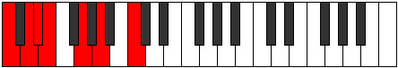

# Mode Gycrimic

## Links

- [Documentation](README.md)
- [Scales Index](Scales.md)
- [Modes Index](Modes.md)
- [Chords Index](Chords.md)

## Parent Scale

[Mixolimic](ScaleMixolimic.md)

## Number

[669](https://ianring.com/musictheory/scales/669)

## Luminosity

6

## Transposition

2, 1, 1, 3, 2, 3

## Chord Pattern

i

## Perfection

- 4 Perfect notes
- 2 Perfect notes

## Perfection Profile

true, true, false, false, true, true

## Permutations

| Tonic | Notes | Signature | Illustration | Audio |
|-------|-------|-----------|--------------|-------|
| [C](ModeCNaturalGycrimic.md) | C, D, **Eb**, **Fb**, G, A, C | C |  | [midi](https://github.com/edipermadi/music/blob/main/docs/ModeCNaturalGycrimic.mid?raw=true) |
| [C#](ModeCSharpGycrimic.md) | C#, D#, **E**, **F**, G#, A#, C# | C |  | [midi](https://github.com/edipermadi/music/blob/main/docs/ModeCSharpGycrimic.mid?raw=true) |
| [Db](ModeDFlatGycrimic.md) | Db, Eb, **Fb**, **Gbb**, Ab, Bb, Db | C |  | [midi](https://github.com/edipermadi/music/blob/main/docs/ModeDFlatGycrimic.mid?raw=true) |
| [D](ModeDNaturalGycrimic.md) | D, E, **F**, **Gb**, A, B, D | C |  | [midi](https://github.com/edipermadi/music/blob/main/docs/ModeDNaturalGycrimic.mid?raw=true) |
| [D#](ModeDSharpGycrimic.md) | D#, E#, **F#**, **G**, A#, B#, D# | C |  | [midi](https://github.com/edipermadi/music/blob/main/docs/ModeDSharpGycrimic.mid?raw=true) |
| [Eb](ModeEFlatGycrimic.md) | Eb, F, **Gb**, **Abb**, Bb, C, Eb | C |  | [midi](https://github.com/edipermadi/music/blob/main/docs/ModeEFlatGycrimic.mid?raw=true) |
| [E](ModeENaturalGycrimic.md) | E, F#, **G**, **Ab**, B, C#, E | C |  | [midi](https://github.com/edipermadi/music/blob/main/docs/ModeENaturalGycrimic.mid?raw=true) |
| [F](ModeFNaturalGycrimic.md) | F, G, **Ab**, **Bbb**, C, D, F | C |  | [midi](https://github.com/edipermadi/music/blob/main/docs/ModeFNaturalGycrimic.mid?raw=true) |
| [F#](ModeFSharpGycrimic.md) | F#, G#, **A**, **Bb**, C#, D#, F# | C |  | [midi](https://github.com/edipermadi/music/blob/main/docs/ModeFSharpGycrimic.mid?raw=true) |
| [Gb](ModeGFlatGycrimic.md) | Gb, Ab, **Bbb**, **Cbb**, Db, Eb, Gb | C |  | [midi](https://github.com/edipermadi/music/blob/main/docs/ModeGFlatGycrimic.mid?raw=true) |
| [G](ModeGNaturalGycrimic.md) | G, A, **Bb**, **Cb**, D, E, G | C |  | [midi](https://github.com/edipermadi/music/blob/main/docs/ModeGNaturalGycrimic.mid?raw=true) |
| [G#](ModeGSharpGycrimic.md) | G#, A#, **B**, **C**, D#, E#, G# | C |  | [midi](https://github.com/edipermadi/music/blob/main/docs/ModeGSharpGycrimic.mid?raw=true) |
| [Ab](ModeAFlatGycrimic.md) | Ab, Bb, **Cb**, **Dbb**, Eb, F, Ab | C |  | [midi](https://github.com/edipermadi/music/blob/main/docs/ModeAFlatGycrimic.mid?raw=true) |
| [A](ModeANaturalGycrimic.md) | A, B, **C**, **Db**, E, F#, A | C |  | [midi](https://github.com/edipermadi/music/blob/main/docs/ModeANaturalGycrimic.mid?raw=true) |
| [A#](ModeASharpGycrimic.md) | A#, B#, **C#**, **D**, E#, F##, A# | C |  | [midi](https://github.com/edipermadi/music/blob/main/docs/ModeASharpGycrimic.mid?raw=true) |
| [Bb](ModeBFlatGycrimic.md) | Bb, C, **Db**, **Ebb**, F, G, Bb | C |  | [midi](https://github.com/edipermadi/music/blob/main/docs/ModeBFlatGycrimic.mid?raw=true) |
| [B](ModeBNaturalGycrimic.md) | B, C#, **D**, **Eb**, F#, G#, B | C |  | [midi](https://github.com/edipermadi/music/blob/main/docs/ModeBNaturalGycrimic.mid?raw=true) |
