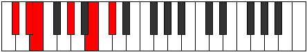
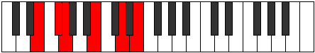

# Mode Gycritonic

## Links

- [Documentation](index.md)
- [Scales Index](Scales.md)
- [Modes Index](Modes.md)
- [Chords Index](Chords.md)

## Parent Scale

[Magitonic](ScaleMagitonic.md)

## Number

[1165](https://ianring.com/musictheory/scales/1165)

## Interval Pattern

2, 1, 4, 3, 2

## Chord Pattern

## Perfection

- 3 Perfect notes
- 2 Perfect notes

## Perfection Profile

[true false true true false]

## Permutations

| Tonic | Notes | Signature | Illustration | Audio |
|-------|-------|-----------|--------------|-------|
| [C](ModeCNaturalGycritonic.md) | C, **D**, D#, G, **A#**, C | C |  | [midi](https://github.com/edipermadi/music/blob/main/docs/ModeCNaturalGycritonic.mid?raw=true) |
| [C#](ModeCSharpGycritonic.md) | C#, **D#**, E, G#, **B**, C# | C |  | [midi](https://github.com/edipermadi/music/blob/main/docs/ModeCSharpGycritonic.mid?raw=true) |
| [Db](ModeDFlatGycritonic.md) | Db, **Eb**, E, Ab, **B**, Db | C |  | [midi](https://github.com/edipermadi/music/blob/main/docs/ModeDFlatGycritonic.mid?raw=true) |
| [D](ModeDNaturalGycritonic.md) | D, **E**, F, A, **C**, D | C |  | [midi](https://github.com/edipermadi/music/blob/main/docs/ModeDNaturalGycritonic.mid?raw=true) |
| [D#](ModeDSharpGycritonic.md) | D#, **F**, F#, A#, **C#**, D# | C |  | [midi](https://github.com/edipermadi/music/blob/main/docs/ModeDSharpGycritonic.mid?raw=true) |
| [Eb](ModeEFlatGycritonic.md) | Eb, **F**, Gb, Bb, **Db**, Eb | C |  | [midi](https://github.com/edipermadi/music/blob/main/docs/ModeEFlatGycritonic.mid?raw=true) |
| [E](ModeENaturalGycritonic.md) | E, **F#**, G, B, **D**, E | C |  | [midi](https://github.com/edipermadi/music/blob/main/docs/ModeENaturalGycritonic.mid?raw=true) |
| [F](ModeFNaturalGycritonic.md) | F, **G**, G#, C, **D#**, F | C |  | [midi](https://github.com/edipermadi/music/blob/main/docs/ModeFNaturalGycritonic.mid?raw=true) |
| [F#](ModeFSharpGycritonic.md) | F#, **G#**, A, C#, **E**, F# | C |  | [midi](https://github.com/edipermadi/music/blob/main/docs/ModeFSharpGycritonic.mid?raw=true) |
| [Gb](ModeGFlatGycritonic.md) | Gb, **Ab**, A, Db, **E**, Gb | C |  | [midi](https://github.com/edipermadi/music/blob/main/docs/ModeGFlatGycritonic.mid?raw=true) |
| [G](ModeGNaturalGycritonic.md) | G, **A**, A#, D, **F**, G | C |  | [midi](https://github.com/edipermadi/music/blob/main/docs/ModeGNaturalGycritonic.mid?raw=true) |
| [G#](ModeGSharpGycritonic.md) | G#, **A#**, B, D#, **F#**, G# | C |  | [midi](https://github.com/edipermadi/music/blob/main/docs/ModeGSharpGycritonic.mid?raw=true) |
| [Ab](ModeAFlatGycritonic.md) | Ab, **Bb**, B, Eb, **Gb**, Ab | C |  | [midi](https://github.com/edipermadi/music/blob/main/docs/ModeAFlatGycritonic.mid?raw=true) |
| [A](ModeANaturalGycritonic.md) | A, **B**, C, E, **G**, A | C |  | [midi](https://github.com/edipermadi/music/blob/main/docs/ModeANaturalGycritonic.mid?raw=true) |
| [A#](ModeASharpGycritonic.md) | A#, **C**, C#, F, **G#**, A# | C |  | [midi](https://github.com/edipermadi/music/blob/main/docs/ModeASharpGycritonic.mid?raw=true) |
| [Bb](ModeBFlatGycritonic.md) | Bb, **C**, Db, F, **Ab**, Bb | C |  | [midi](https://github.com/edipermadi/music/blob/main/docs/ModeBFlatGycritonic.mid?raw=true) |
| [B](ModeBNaturalGycritonic.md) | B, **C#**, D, F#, **A**, B | C |  | [midi](https://github.com/edipermadi/music/blob/main/docs/ModeBNaturalGycritonic.mid?raw=true) |
