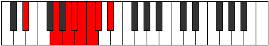
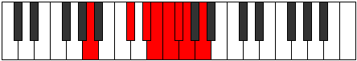

# Mode Gydian

## Links

- [Documentation](README.md)
- [Scales Index](Scales.md)
- [Modes Index](Modes.md)
- [Chords Index](Chords.md)

## Parent Scale

[Gydian](ScaleGydian.md)

## Number

[2001](https://ianring.com/musictheory/scales/2001)

## Transposition

4, 2, 1, 1, 1, 1, 2

## Chord Pattern

## Perfection

- 2 Perfect notes
- 5 Perfect notes

## Perfection Profile

[true false false false false true false]

## Permutations

| Tonic | Notes | Signature | Illustration | Audio |
|-------|-------|-----------|--------------|-------|
| [C](ModeCNaturalGydian.md) | C, **D##**, **E##**, **F##**, **G#**, A, **Bb**, C | C |  | [midi](https://github.com/edipermadi/music/blob/main/docs/ModeCNaturalGydian.mid?raw=true) |
| [C#](ModeCSharpGydian.md) | C#, **D###**, **E###**, **F###**, **G##**, A#, **B**, C# | C |  | [midi](https://github.com/edipermadi/music/blob/main/docs/ModeCSharpGydian.mid?raw=true) |
| [Db](ModeDFlatGydian.md) | Db, **E#**, **F##**, **G#**, **A**, Bb, **Cb**, Db | C |  | [midi](https://github.com/edipermadi/music/blob/main/docs/ModeDFlatGydian.mid?raw=true) |
| [D](ModeDNaturalGydian.md) | D, **E##**, **F###**, **G##**, **A#**, B, **C**, D | C |  | [midi](https://github.com/edipermadi/music/blob/main/docs/ModeDNaturalGydian.mid?raw=true) |
| [D#](ModeDSharpGydian.md) | D#, **E###**, **Cbbb**, **Cbb**, **Dbbb**, Dbb, **Ebbb**, D# | C |  | [midi](https://github.com/edipermadi/music/blob/main/docs/ModeDSharpGydian.mid?raw=true) |
| [Eb](ModeEFlatGydian.md) | Eb, **F##**, **G##**, **A#**, **B**, C, **Db**, Eb | C |  | [midi](https://github.com/edipermadi/music/blob/main/docs/ModeEFlatGydian.mid?raw=true) |
| [E](ModeENaturalGydian.md) | E, **F###**, **G###**, **A##**, **B#**, C#, **D**, E | C |  | [midi](https://github.com/edipermadi/music/blob/main/docs/ModeENaturalGydian.mid?raw=true) |
| [F](ModeFNaturalGydian.md) | F, **G##**, **A##**, **B#**, **C#**, D, **Eb**, F | C |  | [midi](https://github.com/edipermadi/music/blob/main/docs/ModeFNaturalGydian.mid?raw=true) |
| [F#](ModeFSharpGydian.md) | F#, **G###**, **A###**, **B##**, **C##**, D#, **E**, F# | C |  | [midi](https://github.com/edipermadi/music/blob/main/docs/ModeFSharpGydian.mid?raw=true) |
| [Gb](ModeGFlatGydian.md) | Gb, **A#**, **B#**, **C#**, **D**, Eb, **Fb**, Gb | C |  | [midi](https://github.com/edipermadi/music/blob/main/docs/ModeGFlatGydian.mid?raw=true) |
| [G](ModeGNaturalGydian.md) | G, **A##**, **B##**, **C##**, **D#**, E, **F**, G | C |  | [midi](https://github.com/edipermadi/music/blob/main/docs/ModeGNaturalGydian.mid?raw=true) |
| [G#](ModeGSharpGydian.md) | G#, **A###**, **B###**, **C###**, **D##**, E#, **F#**, G# | C |  | [midi](https://github.com/edipermadi/music/blob/main/docs/ModeGSharpGydian.mid?raw=true) |
| [Ab](ModeAFlatGydian.md) | Ab, **B#**, **C##**, **D#**, **E**, F, **Gb**, Ab | C |  | [midi](https://github.com/edipermadi/music/blob/main/docs/ModeAFlatGydian.mid?raw=true) |
| [A](ModeANaturalGydian.md) | A, **B##**, **C###**, **D##**, **E#**, F#, **G**, A | C |  | [midi](https://github.com/edipermadi/music/blob/main/docs/ModeANaturalGydian.mid?raw=true) |
| [A#](ModeASharpGydian.md) | A#, **B###**, **D##**, **E#**, **F#**, G, **Ab**, A# | C |  | [midi](https://github.com/edipermadi/music/blob/main/docs/ModeASharpGydian.mid?raw=true) |
| [Bb](ModeBFlatGydian.md) | Bb, **C##**, **D##**, **E#**, **F#**, G, **Ab**, Bb | C |  | [midi](https://github.com/edipermadi/music/blob/main/docs/ModeBFlatGydian.mid?raw=true) |
| [B](ModeBNaturalGydian.md) | B, **C###**, **D###**, **E##**, **F##**, G#, **A**, B | C |  | [midi](https://github.com/edipermadi/music/blob/main/docs/ModeBNaturalGydian.mid?raw=true) |
