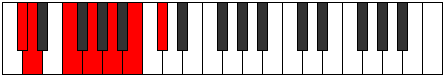
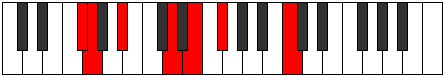
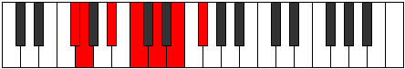
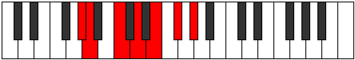
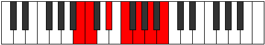

# Mode Gygimic

## Links

- [Documentation](index.md)
- [Scales Index](Scales.md)
- [Modes Index](Modes.md)
- [Chords Index](Chords.md)

## Parent Scale

[Aeragimic](ScaleAeragimic.md)

## Number

[1363](https://ianring.com/musictheory/scales/1363)

## Perfection

- 2 Perfect notes
- 4 Perfect notes

## Perfection Profile

[false true false true false false]

## Permutations

| Tonic | Notes | Signature | Illustration | Audio |
|-------|-------|-----------|--------------|-------|
| [C](ModeCNaturalGygimic.md) | **C**, Db, **E**, F#, **G#**, **A#**, **C** | C |  | [midi](https://github.com/edipermadi/music/blob/main/docs/ModeCNaturalGygimic.mid?raw=true) |
| [C#](ModeCSharpGygimic.md) | **C#**, D, **E#**, F##, **G##**, **A##**, **C#** | C |  | [midi](https://github.com/edipermadi/music/blob/main/docs/ModeCSharpGygimic.mid?raw=true) |
| [Db](ModeDFlatGygimic.md) | **Db**, Ebb, **F**, G, **A**, **B**, **Db** | C |  | [midi](https://github.com/edipermadi/music/blob/main/docs/ModeDFlatGygimic.mid?raw=true) |
| [D](ModeDNaturalGygimic.md) | **D**, Eb, **F#**, G#, **A#**, **B#**, **D** | C |  | [midi](https://github.com/edipermadi/music/blob/main/docs/ModeDNaturalGygimic.mid?raw=true) |
| [D#](ModeDSharpGygimic.md) | **D#**, E, **F##**, G##, **A##**, **B##**, **D#** | C |  | [midi](https://github.com/edipermadi/music/blob/main/docs/ModeDSharpGygimic.mid?raw=true) |
| [Eb](ModeEFlatGygimic.md) | **Eb**, Fb, **G**, A, **B**, **C#**, **Eb** | C |  | [midi](https://github.com/edipermadi/music/blob/main/docs/ModeEFlatGygimic.mid?raw=true) |
| [E](ModeENaturalGygimic.md) | **E**, F, **G#**, A#, **B#**, **C##**, **E** | C |  | [midi](https://github.com/edipermadi/music/blob/main/docs/ModeENaturalGygimic.mid?raw=true) |
| [F](ModeFNaturalGygimic.md) | **F**, Gb, **A**, B, **C#**, **D#**, **F** | C |  | [midi](https://github.com/edipermadi/music/blob/main/docs/ModeFNaturalGygimic.mid?raw=true) |
| [F#](ModeFSharpGygimic.md) | **F#**, G, **A#**, B#, **C##**, **D##**, **F#** | C |  | [midi](https://github.com/edipermadi/music/blob/main/docs/ModeFSharpGygimic.mid?raw=true) |
| [Gb](ModeGFlatGygimic.md) | **Gb**, Abb, **Bb**, C, **D**, **E**, **Gb** | C |  | [midi](https://github.com/edipermadi/music/blob/main/docs/ModeGFlatGygimic.mid?raw=true) |
| [G](ModeGNaturalGygimic.md) | **G**, Ab, **B**, C#, **D#**, **E#**, **G** | C |  | [midi](https://github.com/edipermadi/music/blob/main/docs/ModeGNaturalGygimic.mid?raw=true) |
| [G#](ModeGSharpGygimic.md) | **G#**, A, **B#**, C##, **D##**, **E##**, **G#** | C |  | [midi](https://github.com/edipermadi/music/blob/main/docs/ModeGSharpGygimic.mid?raw=true) |
| [Ab](ModeAFlatGygimic.md) | **Ab**, Bbb, **C**, D, **E**, **F#**, **Ab** | C |  | [midi](https://github.com/edipermadi/music/blob/main/docs/ModeAFlatGygimic.mid?raw=true) |
| [A](ModeANaturalGygimic.md) | **A**, Bb, **C#**, D#, **E#**, **F##**, **A** | C |  | [midi](https://github.com/edipermadi/music/blob/main/docs/ModeANaturalGygimic.mid?raw=true) |
| [A#](ModeASharpGygimic.md) | **A#**, B, **C##**, D##, **E##**, **F###**, **A#** | C |  | [midi](https://github.com/edipermadi/music/blob/main/docs/ModeASharpGygimic.mid?raw=true) |
| [Bb](ModeBFlatGygimic.md) | **Bb**, Cb, **D**, E, **F#**, **G#**, **Bb** | C |  | [midi](https://github.com/edipermadi/music/blob/main/docs/ModeBFlatGygimic.mid?raw=true) |
| [B](ModeBNaturalGygimic.md) | **B**, C, **D#**, E#, **F##**, **G##**, **B** | C |  | [midi](https://github.com/edipermadi/music/blob/main/docs/ModeBNaturalGygimic.mid?raw=true) |
