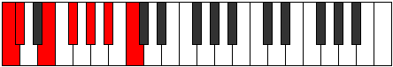
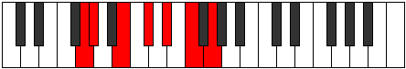

# Mode Gygimic

## Links

- [Documentation](index.md)
- [Scales Index](Scales.md)
- [Modes Index](Modes.md)
- [Chords Index](Chords.md)

## Parent Scale

[Aeragimic](ScaleAeragimic.md)

## Number

[1363](https://ianring.com/musictheory/scales/1363)

## Perfection

- 2 Perfect notes
- 4 Perfect notes

## Perfection Profile

[false true false true false false]

## Permutations

| Tonic | Notes | Signature | Illustration | Audio |
|-------|-------|-----------|--------------|-------|
| [C](ModeCNaturalGygimic.md) | **C**, Db, **E**, F#, **G#**, **A#**, **C** | C |  | [midi](ModeCNaturalGygimic.mid) [ogg](ModeCNaturalGygimic.ogg) |
| [C#](ModeCSharpGygimic.md) | **C#**, D, **E#**, F##, **G##**, **A##**, **C#** | C |  | [midi](ModeCSharpGygimic.mid) [ogg](ModeCSharpGygimic.ogg) |
| [Db](ModeDFlatGygimic.md) | **Db**, Ebb, **F**, G, **A**, **B**, **Db** | C |  | [midi](ModeDFlatGygimic.mid) [ogg](ModeDFlatGygimic.ogg) |
| [D](ModeDNaturalGygimic.md) | **D**, Eb, **F#**, G#, **A#**, **B#**, **D** | C |  | [midi](ModeDNaturalGygimic.mid) [ogg](ModeDNaturalGygimic.ogg) |
| [D#](ModeDSharpGygimic.md) | **D#**, E, **F##**, G##, **A##**, **B##**, **D#** | C |  | [midi](ModeDSharpGygimic.mid) [ogg](ModeDSharpGygimic.ogg) |
| [Eb](ModeEFlatGygimic.md) | **Eb**, Fb, **G**, A, **B**, **C#**, **Eb** | C |  | [midi](ModeEFlatGygimic.mid) [ogg](ModeEFlatGygimic.ogg) |
| [E](ModeENaturalGygimic.md) | **E**, F, **G#**, A#, **B#**, **C##**, **E** | C |  | [midi](ModeENaturalGygimic.mid) [ogg](ModeENaturalGygimic.ogg) |
| [F](ModeFNaturalGygimic.md) | **F**, Gb, **A**, B, **C#**, **D#**, **F** | C |  | [midi](ModeFNaturalGygimic.mid) [ogg](ModeFNaturalGygimic.ogg) |
| [F#](ModeFSharpGygimic.md) | **F#**, G, **A#**, B#, **C##**, **D##**, **F#** | C |  | [midi](ModeFSharpGygimic.mid) [ogg](ModeFSharpGygimic.ogg) |
| [Gb](ModeGFlatGygimic.md) | **Gb**, Abb, **Bb**, C, **D**, **E**, **Gb** | C |  | [midi](ModeGFlatGygimic.mid) [ogg](ModeGFlatGygimic.ogg) |
| [G](ModeGNaturalGygimic.md) | **G**, Ab, **B**, C#, **D#**, **E#**, **G** | C |  | [midi](ModeGNaturalGygimic.mid) [ogg](ModeGNaturalGygimic.ogg) |
| [G#](ModeGSharpGygimic.md) | **G#**, A, **B#**, C##, **D##**, **E##**, **G#** | C |  | [midi](ModeGSharpGygimic.mid) [ogg](ModeGSharpGygimic.ogg) |
| [Ab](ModeAFlatGygimic.md) | **Ab**, Bbb, **C**, D, **E**, **F#**, **Ab** | C |  | [midi](ModeAFlatGygimic.mid) [ogg](ModeAFlatGygimic.ogg) |
| [A](ModeANaturalGygimic.md) | **A**, Bb, **C#**, D#, **E#**, **F##**, **A** | C |  | [midi](ModeANaturalGygimic.mid) [ogg](ModeANaturalGygimic.ogg) |
| [A#](ModeASharpGygimic.md) | **A#**, B, **C##**, D##, **E##**, **F###**, **A#** | C |  | [midi](ModeASharpGygimic.mid) [ogg](ModeASharpGygimic.ogg) |
| [Bb](ModeBFlatGygimic.md) | **Bb**, Cb, **D**, E, **F#**, **G#**, **Bb** | C |  | [midi](ModeBFlatGygimic.mid) [ogg](ModeBFlatGygimic.ogg) |
| [B](ModeBNaturalGygimic.md) | **B**, C, **D#**, E#, **F##**, **G##**, **B** | C |  | [midi](ModeBNaturalGygimic.mid) [ogg](ModeBNaturalGygimic.ogg) |
