# Mode Gylimic

## Links

- [Documentation](README.md)
- [Scales Index](Scales.md)
- [Modes Index](Modes.md)
- [Chords Index](Chords.md)

## Parent Scale

[Kytrimic](ScaleKytrimic.md)

## Number

[3621](https://ianring.com/musictheory/scales/3621)

## Luminosity

4

## Transposition

2, 3, 4, 1, 1, 1

## Chord Pattern

## Perfection

- 3 Perfect notes
- 3 Perfect notes

## Perfection Profile

false, true, true, false, true, false

## Permutations

| Tonic | Notes | Signature | Illustration | Audio |
|-------|-------|-----------|--------------|-------|
| [C](ModeCNaturalGylimic.md) | **C**, D, E#, **Cbbb**, Cbb, **Dbbb**, **C** | C | 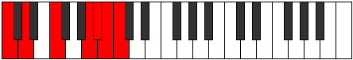 | [midi](https://github.com/edipermadi/music/blob/main/docs/ModeCNaturalGylimic.mid?raw=true) |
| [C#](ModeCSharpGylimic.md) | **C#**, D#, E##, **Cbb**, Dbbb, **Dbb**, **C#** | C |  | [midi](https://github.com/edipermadi/music/blob/main/docs/ModeCSharpGylimic.mid?raw=true) |
| [Db](ModeDFlatGylimic.md) | **Db**, Eb, F#, **G###**, A##, **B#**, **Db** | C |  | [midi](https://github.com/edipermadi/music/blob/main/docs/ModeDFlatGylimic.mid?raw=true) |
| [D](ModeDNaturalGylimic.md) | **D**, E, F##, **Cb**, Dbb, **Ebbb**, **D** | C | 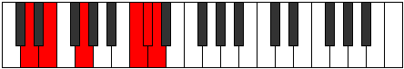 | [midi](https://github.com/edipermadi/music/blob/main/docs/ModeDNaturalGylimic.mid?raw=true) |
| [D#](ModeDSharpGylimic.md) | **D#**, E#, F###, **Dbb**, Ebbb, **Fbbb**, **D#** | C | 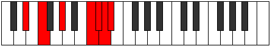 | [midi](https://github.com/edipermadi/music/blob/main/docs/ModeDSharpGylimic.mid?raw=true) |
| [Eb](ModeEFlatGylimic.md) | **Eb**, F, G#, **A###**, B##, **C##**, **Eb** | C | 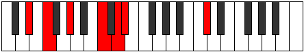 | [midi](https://github.com/edipermadi/music/blob/main/docs/ModeEFlatGylimic.mid?raw=true) |
| [E](ModeENaturalGylimic.md) | **E**, F#, G##, **Db**, Ebb, **Fbb**, **E** | C | 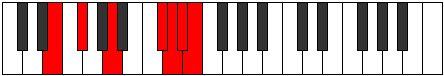 | [midi](https://github.com/edipermadi/music/blob/main/docs/ModeENaturalGylimic.mid?raw=true) |
| [F](ModeFNaturalGylimic.md) | **F**, G, A#, **B###**, C###, **D##**, **F** | C | 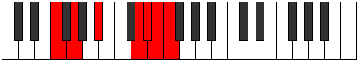 | [midi](https://github.com/edipermadi/music/blob/main/docs/ModeFNaturalGylimic.mid?raw=true) |
| [F#](ModeFSharpGylimic.md) | **F#**, G#, A##, **C###**, D##, **E#**, **F#** | C | 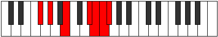 | [midi](https://github.com/edipermadi/music/blob/main/docs/ModeFSharpGylimic.mid?raw=true) |
| [Gb](ModeGFlatGylimic.md) | **Gb**, Ab, B, **C###**, D##, **E#**, **Gb** | C |  | [midi](https://github.com/edipermadi/music/blob/main/docs/ModeGFlatGylimic.mid?raw=true) |
| [G](ModeGNaturalGylimic.md) | **G**, A, B#, **D##**, E#, **F#**, **G** | C | 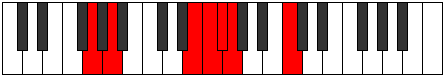 | [midi](https://github.com/edipermadi/music/blob/main/docs/ModeGNaturalGylimic.mid?raw=true) |
| [G#](ModeGSharpGylimic.md) | **G#**, A#, B##, **D###**, E##, **F##**, **G#** | C |  | [midi](https://github.com/edipermadi/music/blob/main/docs/ModeGSharpGylimic.mid?raw=true) |
| [Ab](ModeAFlatGylimic.md) | **Ab**, Bb, C#, **D###**, E##, **F##**, **Ab** | C |  | [midi](https://github.com/edipermadi/music/blob/main/docs/ModeAFlatGylimic.mid?raw=true) |
| [A](ModeANaturalGylimic.md) | **A**, B, C##, **E##**, F##, **G#**, **A** | C | 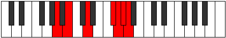 | [midi](https://github.com/edipermadi/music/blob/main/docs/ModeANaturalGylimic.mid?raw=true) |
| [A#](ModeASharpGylimic.md) | **A#**, B#, C###, **E###**, F###, **G##**, **A#** | C | 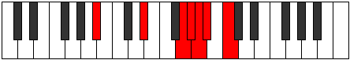 | [midi](https://github.com/edipermadi/music/blob/main/docs/ModeASharpGylimic.mid?raw=true) |
| [Bb](ModeBFlatGylimic.md) | **Bb**, C, D#, **E###**, F###, **G##**, **Bb** | C |  | [midi](https://github.com/edipermadi/music/blob/main/docs/ModeBFlatGylimic.mid?raw=true) |
| [B](ModeBNaturalGylimic.md) | **B**, C#, D##, **F###**, G##, **A#**, **B** | C | 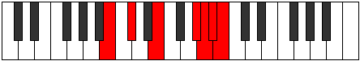 | [midi](https://github.com/edipermadi/music/blob/main/docs/ModeBNaturalGylimic.mid?raw=true) |
