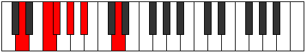
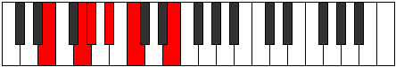
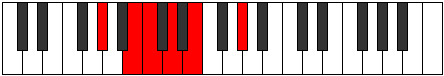
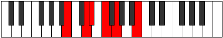

# Mode Gylitonic

## Links

- [Documentation](README.md)
- [Scales Index](Scales.md)
- [Modes Index](Modes.md)
- [Chords Index](Chords.md)

## Parent Scale

[Ryphitonic](ScaleRyphitonic.md)

## Number

[345](https://ianring.com/musictheory/scales/345)

## Transposition

3, 1, 2, 2, 4

## Chord Pattern

I⁺

## Perfection

- 1 Perfect notes
- 4 Perfect notes

## Perfection Profile

false, false, false, false, true

## Permutations

| Tonic | Notes | Signature | Illustration | Audio |
|-------|-------|-----------|--------------|-------|
| [C](ModeCNaturalGylitonic.md) | **C**, **D#**, **E**, **F#**, G#, **C** | C |  | [midi](https://github.com/edipermadi/music/blob/main/docs/ModeCNaturalGylitonic.mid?raw=true) |
| [C#](ModeCSharpGylitonic.md) | **C#**, **E**, **F**, **G**, A, **C#** | C |  | [midi](https://github.com/edipermadi/music/blob/main/docs/ModeCSharpGylitonic.mid?raw=true) |
| [Db](ModeDFlatGylitonic.md) | **Db**, **E**, **F**, **G**, A, **Db** | C |  | [midi](https://github.com/edipermadi/music/blob/main/docs/ModeDFlatGylitonic.mid?raw=true) |
| [D](ModeDNaturalGylitonic.md) | **D**, **F**, **F#**, **G#**, A#, **D** | C |  | [midi](https://github.com/edipermadi/music/blob/main/docs/ModeDNaturalGylitonic.mid?raw=true) |
| [D#](ModeDSharpGylitonic.md) | **D#**, **F#**, **G**, **A**, B, **D#** | C |  | [midi](https://github.com/edipermadi/music/blob/main/docs/ModeDSharpGylitonic.mid?raw=true) |
| [Eb](ModeEFlatGylitonic.md) | **Eb**, **Gb**, **G**, **A**, B, **Eb** | C |  | [midi](https://github.com/edipermadi/music/blob/main/docs/ModeEFlatGylitonic.mid?raw=true) |
| [E](ModeENaturalGylitonic.md) | **E**, **G**, **G#**, **A#**, C, **E** | C |  | [midi](https://github.com/edipermadi/music/blob/main/docs/ModeENaturalGylitonic.mid?raw=true) |
| [F](ModeFNaturalGylitonic.md) | **F**, **G#**, **A**, **B**, C#, **F** | C |  | [midi](https://github.com/edipermadi/music/blob/main/docs/ModeFNaturalGylitonic.mid?raw=true) |
| [F#](ModeFSharpGylitonic.md) | **F#**, **A**, **A#**, **C**, D, **F#** | C |  | [midi](https://github.com/edipermadi/music/blob/main/docs/ModeFSharpGylitonic.mid?raw=true) |
| [Gb](ModeGFlatGylitonic.md) | **Gb**, **A**, **Bb**, **C**, D, **Gb** | C |  | [midi](https://github.com/edipermadi/music/blob/main/docs/ModeGFlatGylitonic.mid?raw=true) |
| [G](ModeGNaturalGylitonic.md) | **G**, **A#**, **B**, **C#**, D#, **G** | C |  | [midi](https://github.com/edipermadi/music/blob/main/docs/ModeGNaturalGylitonic.mid?raw=true) |
| [G#](ModeGSharpGylitonic.md) | **G#**, **B**, **C**, **D**, E, **G#** | C |  | [midi](https://github.com/edipermadi/music/blob/main/docs/ModeGSharpGylitonic.mid?raw=true) |
| [Ab](ModeAFlatGylitonic.md) | **Ab**, **B**, **C**, **D**, E, **Ab** | C |  | [midi](https://github.com/edipermadi/music/blob/main/docs/ModeAFlatGylitonic.mid?raw=true) |
| [A](ModeANaturalGylitonic.md) | **A**, **C**, **C#**, **D#**, F, **A** | C |  | [midi](https://github.com/edipermadi/music/blob/main/docs/ModeANaturalGylitonic.mid?raw=true) |
| [A#](ModeASharpGylitonic.md) | **A#**, **C#**, **D**, **E**, F#, **A#** | C |  | [midi](https://github.com/edipermadi/music/blob/main/docs/ModeASharpGylitonic.mid?raw=true) |
| [Bb](ModeBFlatGylitonic.md) | **Bb**, **Db**, **D**, **E**, Gb, **Bb** | C |  | [midi](https://github.com/edipermadi/music/blob/main/docs/ModeBFlatGylitonic.mid?raw=true) |
| [B](ModeBNaturalGylitonic.md) | **B**, **D**, **D#**, **F**, G, **B** | C |  | [midi](https://github.com/edipermadi/music/blob/main/docs/ModeBNaturalGylitonic.mid?raw=true) |
