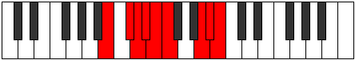

# Mode Gylyllic

## Links

- [Documentation](index.md)
- [Scales Index](Scales.md)
- [Modes Index](Modes.md)
- [Chords Index](Chords.md)

## Parent Scale

[Thagyllic](ScaleThagyllic.md)

## Number

[3197](https://ianring.com/musictheory/scales/3197)

## Perfection

- 5 Perfect notes
- 3 Perfect notes

## Perfection Profile

[false false true true true false true true]

## Permutations

| Tonic | Notes | Signature | Illustration | Audio |
|-------|-------|-----------|--------------|-------|
| [C](ModeCNaturalGylyllic.md) | **C**, **D**, D#, E, F, **F#**, A#, B, **C** | C |  | [midi](ModeCNaturalGylyllic.mid) [ogg](ModeCNaturalGylyllic.ogg) |
| [C#](ModeCSharpGylyllic.md) | **C#**, **D#**, E, F, F#, **G**, B, C, **C#** | C |  | [midi](ModeCSharpGylyllic.mid) [ogg](ModeCSharpGylyllic.ogg) |
| [Db](ModeDFlatGylyllic.md) | **Db**, **Eb**, E, F, Gb, **G**, B, C, **Db** | C |  | [midi](ModeDFlatGylyllic.mid) [ogg](ModeDFlatGylyllic.ogg) |
| [D](ModeDNaturalGylyllic.md) | **D**, **E**, F, F#, G, **G#**, C, C#, **D** | C |  | [midi](ModeDNaturalGylyllic.mid) [ogg](ModeDNaturalGylyllic.ogg) |
| [D#](ModeDSharpGylyllic.md) | **D#**, **F**, F#, G, G#, **A**, C#, D, **D#** | C |  | [midi](ModeDSharpGylyllic.mid) [ogg](ModeDSharpGylyllic.ogg) |
| [Eb](ModeEFlatGylyllic.md) | **Eb**, **F**, Gb, G, Ab, **A**, Db, D, **Eb** | C |  | [midi](ModeEFlatGylyllic.mid) [ogg](ModeEFlatGylyllic.ogg) |
| [E](ModeENaturalGylyllic.md) | **E**, **F#**, G, G#, A, **A#**, D, D#, **E** | C |  | [midi](ModeENaturalGylyllic.mid) [ogg](ModeENaturalGylyllic.ogg) |
| [F](ModeFNaturalGylyllic.md) | **F**, **G**, G#, A, A#, **B**, D#, E, **F** | C |  | [midi](ModeFNaturalGylyllic.mid) [ogg](ModeFNaturalGylyllic.ogg) |
| [F#](ModeFSharpGylyllic.md) | **F#**, **G#**, A, A#, B, **C**, E, F, **F#** | C |  | [midi](ModeFSharpGylyllic.mid) [ogg](ModeFSharpGylyllic.ogg) |
| [Gb](ModeGFlatGylyllic.md) | **Gb**, **Ab**, A, Bb, B, **C**, E, F, **Gb** | C |  | [midi](ModeGFlatGylyllic.mid) [ogg](ModeGFlatGylyllic.ogg) |
| [G](ModeGNaturalGylyllic.md) | **G**, **A**, A#, B, C, **C#**, F, F#, **G** | C |  | [midi](ModeGNaturalGylyllic.mid) [ogg](ModeGNaturalGylyllic.ogg) |
| [G#](ModeGSharpGylyllic.md) | **G#**, **A#**, B, C, C#, **D**, F#, G, **G#** | C |  | [midi](ModeGSharpGylyllic.mid) [ogg](ModeGSharpGylyllic.ogg) |
| [Ab](ModeAFlatGylyllic.md) | **Ab**, **Bb**, B, C, Db, **D**, Gb, G, **Ab** | C |  | [midi](ModeAFlatGylyllic.mid) [ogg](ModeAFlatGylyllic.ogg) |
| [A](ModeANaturalGylyllic.md) | **A**, **B**, C, C#, D, **D#**, G, G#, **A** | C |  | [midi](ModeANaturalGylyllic.mid) [ogg](ModeANaturalGylyllic.ogg) |
| [A#](ModeASharpGylyllic.md) | **A#**, **C**, C#, D, D#, **E**, G#, A, **A#** | C |  | [midi](ModeASharpGylyllic.mid) [ogg](ModeASharpGylyllic.ogg) |
| [Bb](ModeBFlatGylyllic.md) | **Bb**, **C**, Db, D, Eb, **E**, Ab, A, **Bb** | C |  | [midi](ModeBFlatGylyllic.mid) [ogg](ModeBFlatGylyllic.ogg) |
| [B](ModeBNaturalGylyllic.md) | **B**, **C#**, D, D#, E, **F**, A, A#, **B** | C |  | [midi](ModeBNaturalGylyllic.mid) [ogg](ModeBNaturalGylyllic.ogg) |
