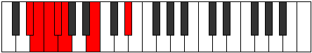
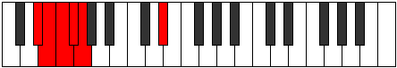
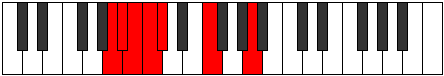

# Mode Gynimic

## Links

- [Documentation](index.md)
- [Scales Index](Scales.md)
- [Modes Index](Modes.md)
- [Chords Index](Chords.md)

## Parent Scale

[Ponimic](ScalePonimic.md)

## Number

[287](https://ianring.com/musictheory/scales/287)

## Perfection

- 2 Perfect notes
- 4 Perfect notes

## Interval Pattern

1, 1, 1, 1, 4, 4

## Perfection Profile

[false true false false false true]

## Permutations

| Tonic | Notes | Signature | Illustration | Audio |
|-------|-------|-----------|--------------|-------|
| [C](ModeCNaturalGynimic.md) | **C**, Db, **Ebb**, **Fbb**, **Gbbb**, Ab, **C** | C |  | [midi](https://github.com/edipermadi/music/blob/main/docs/ModeCNaturalGynimic.mid?raw=true) |
| [C#](ModeCSharpGynimic.md) | **C#**, D, **Eb**, **Fb**, **Gbb**, A, **C#** | C |  | [midi](https://github.com/edipermadi/music/blob/main/docs/ModeCSharpGynimic.mid?raw=true) |
| [Db](ModeDFlatGynimic.md) | **Db**, Ebb, **Fbb**, **Gbbb**, **D###**, Cbbb, **Db** | C |  | [midi](https://github.com/edipermadi/music/blob/main/docs/ModeDFlatGynimic.mid?raw=true) |
| [D](ModeDNaturalGynimic.md) | **D**, Eb, **Fb**, **Gbb**, **Abbb**, Bb, **D** | C |  | [midi](https://github.com/edipermadi/music/blob/main/docs/ModeDNaturalGynimic.mid?raw=true) |
| [D#](ModeDSharpGynimic.md) | **D#**, E, **F**, **Gb**, **Abb**, B, **D#** | C |  | [midi](https://github.com/edipermadi/music/blob/main/docs/ModeDSharpGynimic.mid?raw=true) |
| [Eb](ModeEFlatGynimic.md) | **Eb**, Fb, **Gbb**, **Abbb**, **E###**, Cb, **Eb** | C |  | [midi](https://github.com/edipermadi/music/blob/main/docs/ModeEFlatGynimic.mid?raw=true) |
| [E](ModeENaturalGynimic.md) | **E**, F, **Gb**, **Abb**, **Bbbb**, C, **E** | C |  | [midi](https://github.com/edipermadi/music/blob/main/docs/ModeENaturalGynimic.mid?raw=true) |
| [F](ModeFNaturalGynimic.md) | **F**, Gb, **Abb**, **Bbbb**, **Cbbb**, Db, **F** | C |  | [midi](https://github.com/edipermadi/music/blob/main/docs/ModeFNaturalGynimic.mid?raw=true) |
| [F#](ModeFSharpGynimic.md) | **F#**, G, **Ab**, **Bbb**, **Cbb**, D, **F#** | C |  | [midi](https://github.com/edipermadi/music/blob/main/docs/ModeFSharpGynimic.mid?raw=true) |
| [Gb](ModeGFlatGynimic.md) | **Gb**, Abb, **Bbbb**, **Cbbb**, **Cbb**, D, **Gb** | C |  | [midi](https://github.com/edipermadi/music/blob/main/docs/ModeGFlatGynimic.mid?raw=true) |
| [G](ModeGNaturalGynimic.md) | **G**, Ab, **Bbb**, **Cbb**, **Dbbb**, Eb, **G** | C |  | [midi](https://github.com/edipermadi/music/blob/main/docs/ModeGNaturalGynimic.mid?raw=true) |
| [G#](ModeGSharpGynimic.md) | **G#**, A, **Bb**, **Cb**, **Dbb**, E, **G#** | C |  | [midi](https://github.com/edipermadi/music/blob/main/docs/ModeGSharpGynimic.mid?raw=true) |
| [Ab](ModeAFlatGynimic.md) | **Ab**, Bbb, **Cbb**, **Dbbb**, **Dbb**, E, **Ab** | C |  | [midi](https://github.com/edipermadi/music/blob/main/docs/ModeAFlatGynimic.mid?raw=true) |
| [A](ModeANaturalGynimic.md) | **A**, Bb, **Cb**, **Dbb**, **Ebbb**, F, **A** | C |  | [midi](https://github.com/edipermadi/music/blob/main/docs/ModeANaturalGynimic.mid?raw=true) |
| [A#](ModeASharpGynimic.md) | **A#**, B, **C**, **Db**, **Ebb**, F#, **A#** | C |  | [midi](https://github.com/edipermadi/music/blob/main/docs/ModeASharpGynimic.mid?raw=true) |
| [Bb](ModeBFlatGynimic.md) | **Bb**, Cb, **Dbb**, **Ebbb**, **Fbbb**, Gb, **Bb** | C |  | [midi](https://github.com/edipermadi/music/blob/main/docs/ModeBFlatGynimic.mid?raw=true) |
| [B](ModeBNaturalGynimic.md) | **B**, C, **Db**, **Ebb**, **Fbb**, G, **B** | C |  | [midi](https://github.com/edipermadi/music/blob/main/docs/ModeBNaturalGynimic.mid?raw=true) |
