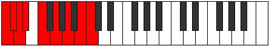

# Mode Gynyllic

## Links

- [Documentation](README.md)
- [Scales Index](Scales.md)
- [Modes Index](Modes.md)
- [Chords Index](Chords.md)

## Parent Scale

[Thyryllic](ScaleThyryllic.md)

## Number

[2735](https://ianring.com/musictheory/scales/2735)

## Transposition

1, 1, 1, 2, 2, 2, 2, 1

## Chord Pattern

ii⁰b3, iii, IV⁺, V, VIb5

## Perfection

- 4 Perfect notes
- 4 Perfect notes

## Perfection Profile

true, false, true, false, true, true, false, false

## Permutations

| Tonic | Notes | Signature | Illustration | Audio |
|-------|-------|-----------|--------------|-------|
| [C](ModeCNaturalGynyllic.md) | C, **C#**, D, **D#**, F, G, **A**, **B**, C | C |  | [midi](https://github.com/edipermadi/music/blob/main/docs/ModeCNaturalGynyllic.mid?raw=true) |
| [C#](ModeCSharpGynyllic.md) | C#, **D**, D#, **E**, F#, G#, **A#**, **C**, C# | C |  | [midi](https://github.com/edipermadi/music/blob/main/docs/ModeCSharpGynyllic.mid?raw=true) |
| [Db](ModeDFlatGynyllic.md) | Db, **D**, Eb, **E**, Gb, Ab, **Bb**, **C**, Db | C |  | [midi](https://github.com/edipermadi/music/blob/main/docs/ModeDFlatGynyllic.mid?raw=true) |
| [D](ModeDNaturalGynyllic.md) | D, **D#**, E, **F**, G, A, **B**, **C#**, D | C |  | [midi](https://github.com/edipermadi/music/blob/main/docs/ModeDNaturalGynyllic.mid?raw=true) |
| [D#](ModeDSharpGynyllic.md) | D#, **E**, F, **F#**, G#, A#, **C**, **D**, D# | C |  | [midi](https://github.com/edipermadi/music/blob/main/docs/ModeDSharpGynyllic.mid?raw=true) |
| [Eb](ModeEFlatGynyllic.md) | Eb, **E**, F, **Gb**, Ab, Bb, **C**, **D**, Eb | C |  | [midi](https://github.com/edipermadi/music/blob/main/docs/ModeEFlatGynyllic.mid?raw=true) |
| [E](ModeENaturalGynyllic.md) | E, **F**, F#, **G**, A, B, **C#**, **D#**, E | C |  | [midi](https://github.com/edipermadi/music/blob/main/docs/ModeENaturalGynyllic.mid?raw=true) |
| [F](ModeFNaturalGynyllic.md) | F, **F#**, G, **G#**, A#, C, **D**, **E**, F | C |  | [midi](https://github.com/edipermadi/music/blob/main/docs/ModeFNaturalGynyllic.mid?raw=true) |
| [F#](ModeFSharpGynyllic.md) | F#, **G**, G#, **A**, B, C#, **D#**, **F**, F# | C |  | [midi](https://github.com/edipermadi/music/blob/main/docs/ModeFSharpGynyllic.mid?raw=true) |
| [Gb](ModeGFlatGynyllic.md) | Gb, **G**, Ab, **A**, B, Db, **Eb**, **F**, Gb | C |  | [midi](https://github.com/edipermadi/music/blob/main/docs/ModeGFlatGynyllic.mid?raw=true) |
| [G](ModeGNaturalGynyllic.md) | G, **G#**, A, **A#**, C, D, **E**, **F#**, G | C |  | [midi](https://github.com/edipermadi/music/blob/main/docs/ModeGNaturalGynyllic.mid?raw=true) |
| [G#](ModeGSharpGynyllic.md) | G#, **A**, A#, **B**, C#, D#, **F**, **G**, G# | C |  | [midi](https://github.com/edipermadi/music/blob/main/docs/ModeGSharpGynyllic.mid?raw=true) |
| [Ab](ModeAFlatGynyllic.md) | Ab, **A**, Bb, **B**, Db, Eb, **F**, **G**, Ab | C |  | [midi](https://github.com/edipermadi/music/blob/main/docs/ModeAFlatGynyllic.mid?raw=true) |
| [A](ModeANaturalGynyllic.md) | A, **A#**, B, **C**, D, E, **F#**, **G#**, A | C |  | [midi](https://github.com/edipermadi/music/blob/main/docs/ModeANaturalGynyllic.mid?raw=true) |
| [A#](ModeASharpGynyllic.md) | A#, **B**, C, **C#**, D#, F, **G**, **A**, A# | C |  | [midi](https://github.com/edipermadi/music/blob/main/docs/ModeASharpGynyllic.mid?raw=true) |
| [Bb](ModeBFlatGynyllic.md) | Bb, **B**, C, **Db**, Eb, F, **G**, **A**, Bb | C |  | [midi](https://github.com/edipermadi/music/blob/main/docs/ModeBFlatGynyllic.mid?raw=true) |
| [B](ModeBNaturalGynyllic.md) | B, **C**, C#, **D**, E, F#, **G#**, **A#**, B | C |  | [midi](https://github.com/edipermadi/music/blob/main/docs/ModeBNaturalGynyllic.mid?raw=true) |
