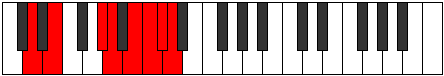

# Mode Gyphian

## Links

- [Documentation](README.md)
- [Scales Index](Scales.md)
- [Modes Index](Modes.md)
- [Chords Index](Chords.md)

## Parent Scale

[Zorian](ScaleZorian.md)

## Number

[3781](https://ianring.com/musictheory/scales/3781)

## Interval Pattern

2, 4, 1, 2, 1, 1, 1

## Chord Pattern

## Perfection

- 4 Perfect notes
- 3 Perfect notes

## Perfection Profile

[true true false true false false true]

## Permutations

| Tonic | Notes | Signature | Illustration | Audio |
|-------|-------|-----------|--------------|-------|
| [C](ModeCNaturalGyphian.md) | C, D, **E##**, F##, **G##**, **A#**, B, C | C |  | [midi](https://github.com/edipermadi/music/blob/main/docs/ModeCNaturalGyphian.mid?raw=true) |
| [C#](ModeCSharpGyphian.md) | C#, D#, **E###**, F###, **G###**, **A##**, B#, C# | C |  | [midi](https://github.com/edipermadi/music/blob/main/docs/ModeCSharpGyphian.mid?raw=true) |
| [Db](ModeDFlatGyphian.md) | Db, Eb, **F##**, G#, **A#**, **B**, C, Db | C |  | [midi](https://github.com/edipermadi/music/blob/main/docs/ModeDFlatGyphian.mid?raw=true) |
| [D](ModeDNaturalGyphian.md) | D, E, **F###**, G##, **A##**, **B#**, C#, D | C |  | [midi](https://github.com/edipermadi/music/blob/main/docs/ModeDNaturalGyphian.mid?raw=true) |
| [D#](ModeDSharpGyphian.md) | D#, E#, **Cbbb**, Cbb, **Dbb**, **Ebbb**, Fbbb, D# | C |  | [midi](https://github.com/edipermadi/music/blob/main/docs/ModeDSharpGyphian.mid?raw=true) |
| [Eb](ModeEFlatGyphian.md) | Eb, F, **G##**, A#, **B#**, **C#**, D, Eb | C |  | [midi](https://github.com/edipermadi/music/blob/main/docs/ModeEFlatGyphian.mid?raw=true) |
| [E](ModeENaturalGyphian.md) | E, F#, **G###**, A##, **B##**, **C##**, D#, E | C |  | [midi](https://github.com/edipermadi/music/blob/main/docs/ModeENaturalGyphian.mid?raw=true) |
| [F](ModeFNaturalGyphian.md) | F, G, **A##**, B#, **C##**, **D#**, E, F | C |  | [midi](https://github.com/edipermadi/music/blob/main/docs/ModeFNaturalGyphian.mid?raw=true) |
| [F#](ModeFSharpGyphian.md) | F#, G#, **A###**, B##, **C###**, **D##**, E#, F# | C |  | [midi](https://github.com/edipermadi/music/blob/main/docs/ModeFSharpGyphian.mid?raw=true) |
| [Gb](ModeGFlatGyphian.md) | Gb, Ab, **B#**, C#, **D#**, **E**, F, Gb | C |  | [midi](https://github.com/edipermadi/music/blob/main/docs/ModeGFlatGyphian.mid?raw=true) |
| [G](ModeGNaturalGyphian.md) | G, A, **B##**, C##, **D##**, **E#**, F#, G | C |  | [midi](https://github.com/edipermadi/music/blob/main/docs/ModeGNaturalGyphian.mid?raw=true) |
| [G#](ModeGSharpGyphian.md) | G#, A#, **B###**, C###, **D###**, **E##**, F##, G# | C |  | [midi](https://github.com/edipermadi/music/blob/main/docs/ModeGSharpGyphian.mid?raw=true) |
| [Ab](ModeAFlatGyphian.md) | Ab, Bb, **C##**, D#, **E#**, **F#**, G, Ab | C |  | [midi](https://github.com/edipermadi/music/blob/main/docs/ModeAFlatGyphian.mid?raw=true) |
| [A](ModeANaturalGyphian.md) | A, B, **C###**, D##, **E##**, **F##**, G#, A | C |  | [midi](https://github.com/edipermadi/music/blob/main/docs/ModeANaturalGyphian.mid?raw=true) |
| [A#](ModeASharpGyphian.md) | A#, B#, **D##**, E#, **F##**, **G#**, A, A# | C |  | [midi](https://github.com/edipermadi/music/blob/main/docs/ModeASharpGyphian.mid?raw=true) |
| [Bb](ModeBFlatGyphian.md) | Bb, C, **D##**, E#, **F##**, **G#**, A, Bb | C |  | [midi](https://github.com/edipermadi/music/blob/main/docs/ModeBFlatGyphian.mid?raw=true) |
| [B](ModeBNaturalGyphian.md) | B, C#, **D###**, E##, **F###**, **G##**, A#, B | C |  | [midi](https://github.com/edipermadi/music/blob/main/docs/ModeBNaturalGyphian.mid?raw=true) |
