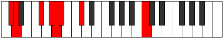
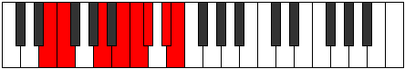
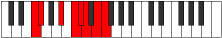
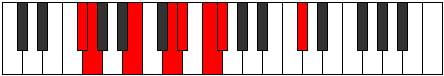
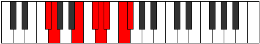
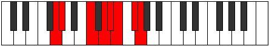
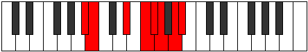

# Mode Gyptian

## Links

- [Documentation](README.md)
- [Scales Index](Scales.md)
- [Modes Index](Modes.md)
- [Chords Index](Chords.md)

## Parent Scale

[Katogian](ScaleKatogian.md)

## Number

[2979](https://ianring.com/musictheory/scales/2979)

## Transposition

1, 4, 2, 1, 1, 2, 1

## Chord Pattern

iii⁰

## Perfection

- 3 Perfect notes
- 4 Perfect notes

## Perfection Profile

[true true true false false false false]

## Permutations

| Tonic | Notes | Signature | Illustration | Audio |
|-------|-------|-----------|--------------|-------|
| [C](ModeCNaturalGyptian.md) | C, Db, E#, **F##**, **G#**, **A**, **B**, C | C |  | [midi](https://github.com/edipermadi/music/blob/main/docs/ModeCNaturalGyptian.mid?raw=true) |
| [C#](ModeCSharpGyptian.md) | C#, D, E##, **F###**, **G##**, **A#**, **B#**, C# | C |  | [midi](https://github.com/edipermadi/music/blob/main/docs/ModeCSharpGyptian.mid?raw=true) |
| [Db](ModeDFlatGyptian.md) | Db, Ebb, F#, **G#**, **A**, **Bb**, **C**, Db | C |  | [midi](https://github.com/edipermadi/music/blob/main/docs/ModeDFlatGyptian.mid?raw=true) |
| [D](ModeDNaturalGyptian.md) | D, Eb, F##, **G##**, **A#**, **B**, **C#**, D | C |  | [midi](https://github.com/edipermadi/music/blob/main/docs/ModeDNaturalGyptian.mid?raw=true) |
| [D#](ModeDSharpGyptian.md) | D#, E, F###, **G###**, **A##**, **B#**, **C##**, D# | C |  | [midi](https://github.com/edipermadi/music/blob/main/docs/ModeDSharpGyptian.mid?raw=true) |
| [Eb](ModeEFlatGyptian.md) | Eb, Fb, G#, **A#**, **B**, **C**, **D**, Eb | C |  | [midi](https://github.com/edipermadi/music/blob/main/docs/ModeEFlatGyptian.mid?raw=true) |
| [E](ModeENaturalGyptian.md) | E, F, G##, **A##**, **B#**, **C#**, **D#**, E | C |  | [midi](https://github.com/edipermadi/music/blob/main/docs/ModeENaturalGyptian.mid?raw=true) |
| [F](ModeFNaturalGyptian.md) | F, Gb, A#, **B#**, **C#**, **D**, **E**, F | C |  | [midi](https://github.com/edipermadi/music/blob/main/docs/ModeFNaturalGyptian.mid?raw=true) |
| [F#](ModeFSharpGyptian.md) | F#, G, A##, **B##**, **C##**, **D#**, **E#**, F# | C |  | [midi](https://github.com/edipermadi/music/blob/main/docs/ModeFSharpGyptian.mid?raw=true) |
| [Gb](ModeGFlatGyptian.md) | Gb, Abb, B, **C#**, **D**, **Eb**, **F**, Gb | C |  | [midi](https://github.com/edipermadi/music/blob/main/docs/ModeGFlatGyptian.mid?raw=true) |
| [G](ModeGNaturalGyptian.md) | G, Ab, B#, **C##**, **D#**, **E**, **F#**, G | C |  | [midi](https://github.com/edipermadi/music/blob/main/docs/ModeGNaturalGyptian.mid?raw=true) |
| [G#](ModeGSharpGyptian.md) | G#, A, B##, **C###**, **D##**, **E#**, **F##**, G# | C |  | [midi](https://github.com/edipermadi/music/blob/main/docs/ModeGSharpGyptian.mid?raw=true) |
| [Ab](ModeAFlatGyptian.md) | Ab, Bbb, C#, **D#**, **E**, **F**, **G**, Ab | C |  | [midi](https://github.com/edipermadi/music/blob/main/docs/ModeAFlatGyptian.mid?raw=true) |
| [A](ModeANaturalGyptian.md) | A, Bb, C##, **D##**, **E#**, **F#**, **G#**, A | C |  | [midi](https://github.com/edipermadi/music/blob/main/docs/ModeANaturalGyptian.mid?raw=true) |
| [A#](ModeASharpGyptian.md) | A#, B, C###, **D###**, **E##**, **F##**, **G##**, A# | C |  | [midi](https://github.com/edipermadi/music/blob/main/docs/ModeASharpGyptian.mid?raw=true) |
| [Bb](ModeBFlatGyptian.md) | Bb, Cb, D#, **E#**, **F#**, **G**, **A**, Bb | C |  | [midi](https://github.com/edipermadi/music/blob/main/docs/ModeBFlatGyptian.mid?raw=true) |
| [B](ModeBNaturalGyptian.md) | B, C, D##, **E##**, **F##**, **G#**, **A#**, B | C |  | [midi](https://github.com/edipermadi/music/blob/main/docs/ModeBNaturalGyptian.mid?raw=true) |
