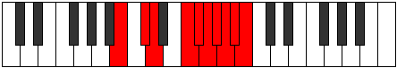

# Mode Gyptygic

## Links

- [Documentation](index.md)
- [Scales Index](Scales.md)
- [Modes Index](Modes.md)
- [Chords Index](Chords.md)

## Parent Scale

[Zothygic](ScaleZothygic.md)

## Number

[4045](https://ianring.com/musictheory/scales/4045)

## Perfection

- 6 Perfect notes
- 3 Perfect notes

## Perfection Profile

[true true true false true true false false true]

## Permutations

| Tonic | Notes | Signature | Illustration | Audio |
|-------|-------|-----------|--------------|-------|
| [C](ModeCNaturalGyptygic.md) | C, D, D#, **F#**, G, G#, **A**, **A#**, B, C | C |  | [midi](ModeCNaturalGyptygic.mid) [ogg](ModeCNaturalGyptygic.ogg) |
| [C#](ModeCSharpGyptygic.md) | C#, D#, E, **G**, G#, A, **A#**, **B**, C, C# | C |  | [midi](ModeCSharpGyptygic.mid) [ogg](ModeCSharpGyptygic.ogg) |
| [Db](ModeDFlatGyptygic.md) | Db, Eb, E, **G**, Ab, A, **Bb**, **B**, C, Db | C |  | [midi](ModeDFlatGyptygic.mid) [ogg](ModeDFlatGyptygic.ogg) |
| [D](ModeDNaturalGyptygic.md) | D, E, F, **G#**, A, A#, **B**, **C**, C#, D | C |  | [midi](ModeDNaturalGyptygic.mid) [ogg](ModeDNaturalGyptygic.ogg) |
| [D#](ModeDSharpGyptygic.md) | D#, F, F#, **A**, A#, B, **C**, **C#**, D, D# | C |  | [midi](ModeDSharpGyptygic.mid) [ogg](ModeDSharpGyptygic.ogg) |
| [Eb](ModeEFlatGyptygic.md) | Eb, F, Gb, **A**, Bb, B, **C**, **Db**, D, Eb | C |  | [midi](ModeEFlatGyptygic.mid) [ogg](ModeEFlatGyptygic.ogg) |
| [E](ModeENaturalGyptygic.md) | E, F#, G, **A#**, B, C, **C#**, **D**, D#, E | C |  | [midi](ModeENaturalGyptygic.mid) [ogg](ModeENaturalGyptygic.ogg) |
| [F](ModeFNaturalGyptygic.md) | F, G, G#, **B**, C, C#, **D**, **D#**, E, F | C |  | [midi](ModeFNaturalGyptygic.mid) [ogg](ModeFNaturalGyptygic.ogg) |
| [F#](ModeFSharpGyptygic.md) | F#, G#, A, **C**, C#, D, **D#**, **E**, F, F# | C |  | [midi](ModeFSharpGyptygic.mid) [ogg](ModeFSharpGyptygic.ogg) |
| [Gb](ModeGFlatGyptygic.md) | Gb, Ab, A, **C**, Db, D, **Eb**, **E**, F, Gb | C |  | [midi](ModeGFlatGyptygic.mid) [ogg](ModeGFlatGyptygic.ogg) |
| [G](ModeGNaturalGyptygic.md) | G, A, A#, **C#**, D, D#, **E**, **F**, F#, G | C |  | [midi](ModeGNaturalGyptygic.mid) [ogg](ModeGNaturalGyptygic.ogg) |
| [G#](ModeGSharpGyptygic.md) | G#, A#, B, **D**, D#, E, **F**, **F#**, G, G# | C |  | [midi](ModeGSharpGyptygic.mid) [ogg](ModeGSharpGyptygic.ogg) |
| [Ab](ModeAFlatGyptygic.md) | Ab, Bb, B, **D**, Eb, E, **F**, **Gb**, G, Ab | C |  | [midi](ModeAFlatGyptygic.mid) [ogg](ModeAFlatGyptygic.ogg) |
| [A](ModeANaturalGyptygic.md) | A, B, C, **D#**, E, F, **F#**, **G**, G#, A | C |  | [midi](ModeANaturalGyptygic.mid) [ogg](ModeANaturalGyptygic.ogg) |
| [A#](ModeASharpGyptygic.md) | A#, C, C#, **E**, F, F#, **G**, **G#**, A, A# | C |  | [midi](ModeASharpGyptygic.mid) [ogg](ModeASharpGyptygic.ogg) |
| [Bb](ModeBFlatGyptygic.md) | Bb, C, Db, **E**, F, Gb, **G**, **Ab**, A, Bb | C |  | [midi](ModeBFlatGyptygic.mid) [ogg](ModeBFlatGyptygic.ogg) |
| [B](ModeBNaturalGyptygic.md) | B, C#, D, **F**, F#, G, **G#**, **A**, A#, B | C |  | [midi](ModeBNaturalGyptygic.mid) [ogg](ModeBNaturalGyptygic.ogg) |
