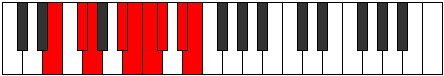

# Mode Gyptyllic

## Links

- [Documentation](README.md)
- [Scales Index](Scales.md)
- [Modes Index](Modes.md)
- [Chords Index](Chords.md)

## Parent Scale

[Aeolathyllic](ScaleAeolathyllic.md)

## Number

[3021](https://ianring.com/musictheory/scales/3021)

## Interval Pattern

2, 1, 3, 1, 1, 1, 2, 1

## Chord Pattern

i, vi⁰, vii⁰, viii

## Perfection

- 5 Perfect notes
- 3 Perfect notes

## Perfection Profile

[true true false false true true false true]

## Permutations

| Tonic | Notes | Signature | Illustration | Audio |
|-------|-------|-----------|--------------|-------|
| [C](ModeCNaturalGyptyllic.md) | C, D, **D#**, **F#**, G, G#, **A**, B, C | C |  | [midi](https://github.com/edipermadi/music/blob/main/docs/ModeCNaturalGyptyllic.mid?raw=true) |
| [C#](ModeCSharpGyptyllic.md) | C#, D#, **E**, **G**, G#, A, **A#**, C, C# | C |  | [midi](https://github.com/edipermadi/music/blob/main/docs/ModeCSharpGyptyllic.mid?raw=true) |
| [Db](ModeDFlatGyptyllic.md) | Db, Eb, **E**, **G**, Ab, A, **Bb**, C, Db | C |  | [midi](https://github.com/edipermadi/music/blob/main/docs/ModeDFlatGyptyllic.mid?raw=true) |
| [D](ModeDNaturalGyptyllic.md) | D, E, **F**, **G#**, A, A#, **B**, C#, D | C |  | [midi](https://github.com/edipermadi/music/blob/main/docs/ModeDNaturalGyptyllic.mid?raw=true) |
| [D#](ModeDSharpGyptyllic.md) | D#, F, **F#**, **A**, A#, B, **C**, D, D# | C |  | [midi](https://github.com/edipermadi/music/blob/main/docs/ModeDSharpGyptyllic.mid?raw=true) |
| [Eb](ModeEFlatGyptyllic.md) | Eb, F, **Gb**, **A**, Bb, B, **C**, D, Eb | C |  | [midi](https://github.com/edipermadi/music/blob/main/docs/ModeEFlatGyptyllic.mid?raw=true) |
| [E](ModeENaturalGyptyllic.md) | E, F#, **G**, **A#**, B, C, **C#**, D#, E | C |  | [midi](https://github.com/edipermadi/music/blob/main/docs/ModeENaturalGyptyllic.mid?raw=true) |
| [F](ModeFNaturalGyptyllic.md) | F, G, **G#**, **B**, C, C#, **D**, E, F | C |  | [midi](https://github.com/edipermadi/music/blob/main/docs/ModeFNaturalGyptyllic.mid?raw=true) |
| [F#](ModeFSharpGyptyllic.md) | F#, G#, **A**, **C**, C#, D, **D#**, F, F# | C |  | [midi](https://github.com/edipermadi/music/blob/main/docs/ModeFSharpGyptyllic.mid?raw=true) |
| [Gb](ModeGFlatGyptyllic.md) | Gb, Ab, **A**, **C**, Db, D, **Eb**, F, Gb | C |  | [midi](https://github.com/edipermadi/music/blob/main/docs/ModeGFlatGyptyllic.mid?raw=true) |
| [G](ModeGNaturalGyptyllic.md) | G, A, **A#**, **C#**, D, D#, **E**, F#, G | C |  | [midi](https://github.com/edipermadi/music/blob/main/docs/ModeGNaturalGyptyllic.mid?raw=true) |
| [G#](ModeGSharpGyptyllic.md) | G#, A#, **B**, **D**, D#, E, **F**, G, G# | C |  | [midi](https://github.com/edipermadi/music/blob/main/docs/ModeGSharpGyptyllic.mid?raw=true) |
| [Ab](ModeAFlatGyptyllic.md) | Ab, Bb, **B**, **D**, Eb, E, **F**, G, Ab | C |  | [midi](https://github.com/edipermadi/music/blob/main/docs/ModeAFlatGyptyllic.mid?raw=true) |
| [A](ModeANaturalGyptyllic.md) | A, B, **C**, **D#**, E, F, **F#**, G#, A | C |  | [midi](https://github.com/edipermadi/music/blob/main/docs/ModeANaturalGyptyllic.mid?raw=true) |
| [A#](ModeASharpGyptyllic.md) | A#, C, **C#**, **E**, F, F#, **G**, A, A# | C |  | [midi](https://github.com/edipermadi/music/blob/main/docs/ModeASharpGyptyllic.mid?raw=true) |
| [Bb](ModeBFlatGyptyllic.md) | Bb, C, **Db**, **E**, F, Gb, **G**, A, Bb | C |  | [midi](https://github.com/edipermadi/music/blob/main/docs/ModeBFlatGyptyllic.mid?raw=true) |
| [B](ModeBNaturalGyptyllic.md) | B, C#, **D**, **F**, F#, G, **G#**, A#, B | C |  | [midi](https://github.com/edipermadi/music/blob/main/docs/ModeBNaturalGyptyllic.mid?raw=true) |
