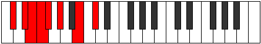

# Mode Gyrian

## Links

- [Documentation](README.md)
- [Scales Index](Scales.md)
- [Modes Index](Modes.md)
- [Chords Index](Chords.md)

## Parent Scale

[Soptian](ScaleSoptian.md)

## Number

[1213](https://ianring.com/musictheory/scales/1213)

## Interval Pattern

2, 1, 1, 1, 2, 3, 2

## Chord Pattern

## Perfection

- 5 Perfect notes
- 2 Perfect notes

## Perfection Profile

[true false true false true true true]

## Permutations

| Tonic | Notes | Signature | Illustration | Audio |
|-------|-------|-----------|--------------|-------|
| [C](ModeCNaturalGyrian.md) | C, **D**, Eb, **Fb**, Gbb, Abb, Bb, C | C |  | [midi](https://github.com/edipermadi/music/blob/main/docs/ModeCNaturalGyrian.mid?raw=true) |
| [C#](ModeCSharpGyrian.md) | C#, **D#**, E, **F**, Gb, Ab, B, C# | C |  | [midi](https://github.com/edipermadi/music/blob/main/docs/ModeCSharpGyrian.mid?raw=true) |
| [Db](ModeDFlatGyrian.md) | Db, **Eb**, Fb, **Gbb**, Abbb, Bbbb, Cb, Db | C |  | [midi](https://github.com/edipermadi/music/blob/main/docs/ModeDFlatGyrian.mid?raw=true) |
| [D](ModeDNaturalGyrian.md) | D, **E**, F, **Gb**, Abb, Bbb, C, D | C |  | [midi](https://github.com/edipermadi/music/blob/main/docs/ModeDNaturalGyrian.mid?raw=true) |
| [D#](ModeDSharpGyrian.md) | D#, **E#**, F#, **G**, Ab, Bb, C#, D# | C |  | [midi](https://github.com/edipermadi/music/blob/main/docs/ModeDSharpGyrian.mid?raw=true) |
| [Eb](ModeEFlatGyrian.md) | Eb, **F**, Gb, **Abb**, Bbbb, Cbb, Db, Eb | C |  | [midi](https://github.com/edipermadi/music/blob/main/docs/ModeEFlatGyrian.mid?raw=true) |
| [E](ModeENaturalGyrian.md) | E, **F#**, G, **Ab**, Bbb, Cb, D, E | C |  | [midi](https://github.com/edipermadi/music/blob/main/docs/ModeENaturalGyrian.mid?raw=true) |
| [F](ModeFNaturalGyrian.md) | F, **G**, Ab, **Bbb**, Cbb, Dbb, Eb, F | C |  | [midi](https://github.com/edipermadi/music/blob/main/docs/ModeFNaturalGyrian.mid?raw=true) |
| [F#](ModeFSharpGyrian.md) | F#, **G#**, A, **Bb**, Cb, Db, E, F# | C |  | [midi](https://github.com/edipermadi/music/blob/main/docs/ModeFSharpGyrian.mid?raw=true) |
| [Gb](ModeGFlatGyrian.md) | Gb, **Ab**, Bbb, **Cbb**, Dbbb, Ebbb, Fb, Gb | C |  | [midi](https://github.com/edipermadi/music/blob/main/docs/ModeGFlatGyrian.mid?raw=true) |
| [G](ModeGNaturalGyrian.md) | G, **A**, Bb, **Cb**, Dbb, Ebb, F, G | C |  | [midi](https://github.com/edipermadi/music/blob/main/docs/ModeGNaturalGyrian.mid?raw=true) |
| [G#](ModeGSharpGyrian.md) | G#, **A#**, B, **C**, Db, Eb, F#, G# | C |  | [midi](https://github.com/edipermadi/music/blob/main/docs/ModeGSharpGyrian.mid?raw=true) |
| [Ab](ModeAFlatGyrian.md) | Ab, **Bb**, Cb, **Dbb**, Ebbb, Fbb, Gb, Ab | C |  | [midi](https://github.com/edipermadi/music/blob/main/docs/ModeAFlatGyrian.mid?raw=true) |
| [A](ModeANaturalGyrian.md) | A, **B**, C, **Db**, Ebb, Fb, G, A | C |  | [midi](https://github.com/edipermadi/music/blob/main/docs/ModeANaturalGyrian.mid?raw=true) |
| [A#](ModeASharpGyrian.md) | A#, **B#**, C#, **D**, Eb, F, G#, A# | C |  | [midi](https://github.com/edipermadi/music/blob/main/docs/ModeASharpGyrian.mid?raw=true) |
| [Bb](ModeBFlatGyrian.md) | Bb, **C**, Db, **Ebb**, Fbb, Gbb, Ab, Bb | C |  | [midi](https://github.com/edipermadi/music/blob/main/docs/ModeBFlatGyrian.mid?raw=true) |
| [B](ModeBNaturalGyrian.md) | B, **C#**, D, **Eb**, Fb, Gb, A, B | C |  | [midi](https://github.com/edipermadi/music/blob/main/docs/ModeBNaturalGyrian.mid?raw=true) |
