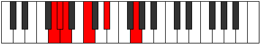
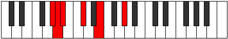

# Mode Gyritonic

## Links

- [Documentation](index.md)
- [Scales Index](Scales.md)
- [Modes Index](Modes.md)
- [Chords Index](Chords.md)

## Parent Scale

[Ionyptitonic](ScaleIonyptitonic.md)

## Number

[295](https://ianring.com/musictheory/scales/295)

## Perfection

- 2 Perfect notes
- 3 Perfect notes

## Perfection Profile

[false true false true false]

## Permutations

| Tonic | Notes | Signature | Illustration | Audio |
|-------|-------|-----------|--------------|-------|
| [C](ModeCNaturalGyritonic.md) | **C**, C#, **D**, F, **G#**, **C** | C |  | [midi](ModeCNaturalGyritonic.mid) [ogg](ModeCNaturalGyritonic.ogg) |
| [C#](ModeCSharpGyritonic.md) | **C#**, D, **D#**, F#, **A**, **C#** | C |  | [midi](ModeCSharpGyritonic.mid) [ogg](ModeCSharpGyritonic.ogg) |
| [Db](ModeDFlatGyritonic.md) | **Db**, D, **Eb**, Gb, **A**, **Db** | C |  | [midi](ModeDFlatGyritonic.mid) [ogg](ModeDFlatGyritonic.ogg) |
| [D](ModeDNaturalGyritonic.md) | **D**, D#, **E**, G, **A#**, **D** | C |  | [midi](ModeDNaturalGyritonic.mid) [ogg](ModeDNaturalGyritonic.ogg) |
| [D#](ModeDSharpGyritonic.md) | **D#**, E, **F**, G#, **B**, **D#** | C |  | [midi](ModeDSharpGyritonic.mid) [ogg](ModeDSharpGyritonic.ogg) |
| [Eb](ModeEFlatGyritonic.md) | **Eb**, E, **F**, Ab, **B**, **Eb** | C |  | [midi](ModeEFlatGyritonic.mid) [ogg](ModeEFlatGyritonic.ogg) |
| [E](ModeENaturalGyritonic.md) | **E**, F, **F#**, A, **C**, **E** | C |  | [midi](ModeENaturalGyritonic.mid) [ogg](ModeENaturalGyritonic.ogg) |
| [F](ModeFNaturalGyritonic.md) | **F**, F#, **G**, A#, **C#**, **F** | C |  | [midi](ModeFNaturalGyritonic.mid) [ogg](ModeFNaturalGyritonic.ogg) |
| [F#](ModeFSharpGyritonic.md) | **F#**, G, **G#**, B, **D**, **F#** | C |  | [midi](ModeFSharpGyritonic.mid) [ogg](ModeFSharpGyritonic.ogg) |
| [Gb](ModeGFlatGyritonic.md) | **Gb**, G, **Ab**, B, **D**, **Gb** | C |  | [midi](ModeGFlatGyritonic.mid) [ogg](ModeGFlatGyritonic.ogg) |
| [G](ModeGNaturalGyritonic.md) | **G**, G#, **A**, C, **D#**, **G** | C |  | [midi](ModeGNaturalGyritonic.mid) [ogg](ModeGNaturalGyritonic.ogg) |
| [G#](ModeGSharpGyritonic.md) | **G#**, A, **A#**, C#, **E**, **G#** | C |  | [midi](ModeGSharpGyritonic.mid) [ogg](ModeGSharpGyritonic.ogg) |
| [Ab](ModeAFlatGyritonic.md) | **Ab**, A, **Bb**, Db, **E**, **Ab** | C |  | [midi](ModeAFlatGyritonic.mid) [ogg](ModeAFlatGyritonic.ogg) |
| [A](ModeANaturalGyritonic.md) | **A**, A#, **B**, D, **F**, **A** | C |  | [midi](ModeANaturalGyritonic.mid) [ogg](ModeANaturalGyritonic.ogg) |
| [A#](ModeASharpGyritonic.md) | **A#**, B, **C**, D#, **F#**, **A#** | C |  | [midi](ModeASharpGyritonic.mid) [ogg](ModeASharpGyritonic.ogg) |
| [Bb](ModeBFlatGyritonic.md) | **Bb**, B, **C**, Eb, **Gb**, **Bb** | C |  | [midi](ModeBFlatGyritonic.mid) [ogg](ModeBFlatGyritonic.ogg) |
| [B](ModeBNaturalGyritonic.md) | **B**, C, **C#**, E, **G**, **B** | C |  | [midi](ModeBNaturalGyritonic.mid) [ogg](ModeBNaturalGyritonic.ogg) |
