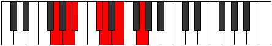

# Mode Gythimic

## Links

- [Documentation](index.md)
- [Scales Index](Scales.md)
- [Modes Index](Modes.md)
- [Chords Index](Chords.md)

## Parent Scale

[Bocrimic](ScaleBocrimic.md)

## Number

[717](https://ianring.com/musictheory/scales/717)

## Perfection

- 3 Perfect notes
- 3 Perfect notes

## Perfection Profile

[true true false false true false]

## Permutations

| Tonic | Notes | Signature | Illustration | Audio |
|-------|-------|-----------|--------------|-------|
| [C](ModeCNaturalGythimic.md) | C, D, **Eb**, **F#**, G, **A**, C | C |  | [midi](ModeCNaturalGythimic.mid) [ogg](ModeCNaturalGythimic.ogg) |
| [C#](ModeCSharpGythimic.md) | C#, D#, **E**, **F##**, G#, **A#**, C# | C |  | [midi](ModeCSharpGythimic.mid) [ogg](ModeCSharpGythimic.ogg) |
| [Db](ModeDFlatGythimic.md) | Db, Eb, **Fb**, **G**, Ab, **Bb**, Db | C |  | [midi](ModeDFlatGythimic.mid) [ogg](ModeDFlatGythimic.ogg) |
| [D](ModeDNaturalGythimic.md) | D, E, **F**, **G#**, A, **B**, D | C |  | [midi](ModeDNaturalGythimic.mid) [ogg](ModeDNaturalGythimic.ogg) |
| [D#](ModeDSharpGythimic.md) | D#, E#, **F#**, **G##**, A#, **B#**, D# | C |  | [midi](ModeDSharpGythimic.mid) [ogg](ModeDSharpGythimic.ogg) |
| [Eb](ModeEFlatGythimic.md) | Eb, F, **Gb**, **A**, Bb, **C**, Eb | C |  | [midi](ModeEFlatGythimic.mid) [ogg](ModeEFlatGythimic.ogg) |
| [E](ModeENaturalGythimic.md) | E, F#, **G**, **A#**, B, **C#**, E | C |  | [midi](ModeENaturalGythimic.mid) [ogg](ModeENaturalGythimic.ogg) |
| [F](ModeFNaturalGythimic.md) | F, G, **Ab**, **B**, C, **D**, F | C |  | [midi](ModeFNaturalGythimic.mid) [ogg](ModeFNaturalGythimic.ogg) |
| [F#](ModeFSharpGythimic.md) | F#, G#, **A**, **B#**, C#, **D#**, F# | C |  | [midi](ModeFSharpGythimic.mid) [ogg](ModeFSharpGythimic.ogg) |
| [Gb](ModeGFlatGythimic.md) | Gb, Ab, **Bbb**, **C**, Db, **Eb**, Gb | C |  | [midi](ModeGFlatGythimic.mid) [ogg](ModeGFlatGythimic.ogg) |
| [G](ModeGNaturalGythimic.md) | G, A, **Bb**, **C#**, D, **E**, G | C |  | [midi](ModeGNaturalGythimic.mid) [ogg](ModeGNaturalGythimic.ogg) |
| [G#](ModeGSharpGythimic.md) | G#, A#, **B**, **C##**, D#, **E#**, G# | C |  | [midi](ModeGSharpGythimic.mid) [ogg](ModeGSharpGythimic.ogg) |
| [Ab](ModeAFlatGythimic.md) | Ab, Bb, **Cb**, **D**, Eb, **F**, Ab | C |  | [midi](ModeAFlatGythimic.mid) [ogg](ModeAFlatGythimic.ogg) |
| [A](ModeANaturalGythimic.md) | A, B, **C**, **D#**, E, **F#**, A | C |  | [midi](ModeANaturalGythimic.mid) [ogg](ModeANaturalGythimic.ogg) |
| [A#](ModeASharpGythimic.md) | A#, B#, **C#**, **D##**, E#, **F##**, A# | C |  | [midi](ModeASharpGythimic.mid) [ogg](ModeASharpGythimic.ogg) |
| [Bb](ModeBFlatGythimic.md) | Bb, C, **Db**, **E**, F, **G**, Bb | C |  | [midi](ModeBFlatGythimic.mid) [ogg](ModeBFlatGythimic.ogg) |
| [B](ModeBNaturalGythimic.md) | B, C#, **D**, **E#**, F#, **G#**, B | C |  | [midi](ModeBNaturalGythimic.mid) [ogg](ModeBNaturalGythimic.ogg) |
