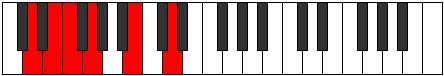
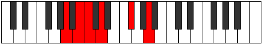

# Mode Gythitonic

## Links

- [Documentation](README.md)
- [Scales Index](Scales.md)
- [Modes Index](Modes.md)
- [Chords Index](Chords.md)

## Parent Scale

[Ionaditonic](ScaleIonaditonic.md)

## Number

[557](https://ianring.com/musictheory/scales/557)

## Luminosity

4

## Transposition

2, 1, 2, 4, 3

## Chord Pattern

## Perfection

- 2 Perfect notes
- 3 Perfect notes

## Perfection Profile

false, true, false, true, false

## Permutations

| Tonic | Notes | Signature | Illustration | Audio |
|-------|-------|-----------|--------------|-------|
| [C](ModeCNaturalGythitonic.md) | **C**, D, **D#**, F, **A**, **C** | C |  | [midi](https://github.com/edipermadi/music/blob/main/docs/ModeCNaturalGythitonic.mid?raw=true) |
| [C#](ModeCSharpGythitonic.md) | **C#**, D#, **E**, F#, **A#**, **C#** | C |  | [midi](https://github.com/edipermadi/music/blob/main/docs/ModeCSharpGythitonic.mid?raw=true) |
| [Db](ModeDFlatGythitonic.md) | **Db**, Eb, **E**, Gb, **Bb**, **Db** | C |  | [midi](https://github.com/edipermadi/music/blob/main/docs/ModeDFlatGythitonic.mid?raw=true) |
| [D](ModeDNaturalGythitonic.md) | **D**, E, **F**, G, **B**, **D** | C |  | [midi](https://github.com/edipermadi/music/blob/main/docs/ModeDNaturalGythitonic.mid?raw=true) |
| [D#](ModeDSharpGythitonic.md) | **D#**, F, **F#**, G#, **C**, **D#** | C |  | [midi](https://github.com/edipermadi/music/blob/main/docs/ModeDSharpGythitonic.mid?raw=true) |
| [Eb](ModeEFlatGythitonic.md) | **Eb**, F, **Gb**, Ab, **C**, **Eb** | C |  | [midi](https://github.com/edipermadi/music/blob/main/docs/ModeEFlatGythitonic.mid?raw=true) |
| [E](ModeENaturalGythitonic.md) | **E**, F#, **G**, A, **C#**, **E** | C |  | [midi](https://github.com/edipermadi/music/blob/main/docs/ModeENaturalGythitonic.mid?raw=true) |
| [F](ModeFNaturalGythitonic.md) | **F**, G, **G#**, A#, **D**, **F** | C |  | [midi](https://github.com/edipermadi/music/blob/main/docs/ModeFNaturalGythitonic.mid?raw=true) |
| [F#](ModeFSharpGythitonic.md) | **F#**, G#, **A**, B, **D#**, **F#** | C |  | [midi](https://github.com/edipermadi/music/blob/main/docs/ModeFSharpGythitonic.mid?raw=true) |
| [Gb](ModeGFlatGythitonic.md) | **Gb**, Ab, **A**, B, **Eb**, **Gb** | C |  | [midi](https://github.com/edipermadi/music/blob/main/docs/ModeGFlatGythitonic.mid?raw=true) |
| [G](ModeGNaturalGythitonic.md) | **G**, A, **A#**, C, **E**, **G** | C |  | [midi](https://github.com/edipermadi/music/blob/main/docs/ModeGNaturalGythitonic.mid?raw=true) |
| [G#](ModeGSharpGythitonic.md) | **G#**, A#, **B**, C#, **F**, **G#** | C |  | [midi](https://github.com/edipermadi/music/blob/main/docs/ModeGSharpGythitonic.mid?raw=true) |
| [Ab](ModeAFlatGythitonic.md) | **Ab**, Bb, **B**, Db, **F**, **Ab** | C |  | [midi](https://github.com/edipermadi/music/blob/main/docs/ModeAFlatGythitonic.mid?raw=true) |
| [A](ModeANaturalGythitonic.md) | **A**, B, **C**, D, **F#**, **A** | C |  | [midi](https://github.com/edipermadi/music/blob/main/docs/ModeANaturalGythitonic.mid?raw=true) |
| [A#](ModeASharpGythitonic.md) | **A#**, C, **C#**, D#, **G**, **A#** | C |  | [midi](https://github.com/edipermadi/music/blob/main/docs/ModeASharpGythitonic.mid?raw=true) |
| [Bb](ModeBFlatGythitonic.md) | **Bb**, C, **Db**, Eb, **G**, **Bb** | C |  | [midi](https://github.com/edipermadi/music/blob/main/docs/ModeBFlatGythitonic.mid?raw=true) |
| [B](ModeBNaturalGythitonic.md) | **B**, C#, **D**, E, **G#**, **B** | C |  | [midi](https://github.com/edipermadi/music/blob/main/docs/ModeBNaturalGythitonic.mid?raw=true) |
