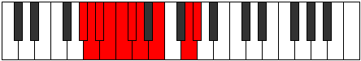

# Mode Gythygic

## Links

- [Documentation](index.md)
- [Scales Index](Scales.md)
- [Modes Index](Modes.md)
- [Chords Index](Chords.md)

## Parent Scale

[Aeolacrygic](ScaleAeolacrygic.md)

## Number

[2431](https://ianring.com/musictheory/scales/2431)

## Perfection

- 6 Perfect notes
- 3 Perfect notes

## Perfection Profile

[false true false false true true true true true]

## Permutations

| Tonic | Notes | Signature | Illustration | Audio |
|-------|-------|-----------|--------------|-------|
| [C](ModeCNaturalGythygic.md) | **C**, C#, **D**, **D#**, E, F, F#, G#, B, **C** | C |  | [midi](ModeCNaturalGythygic.mid) [ogg](ModeCNaturalGythygic.ogg) |
| [C#](ModeCSharpGythygic.md) | **C#**, D, **D#**, **E**, F, F#, G, A, C, **C#** | C |  | [midi](ModeCSharpGythygic.mid) [ogg](ModeCSharpGythygic.ogg) |
| [Db](ModeDFlatGythygic.md) | **Db**, D, **Eb**, **E**, F, Gb, G, A, C, **Db** | C |  | [midi](ModeDFlatGythygic.mid) [ogg](ModeDFlatGythygic.ogg) |
| [D](ModeDNaturalGythygic.md) | **D**, D#, **E**, **F**, F#, G, G#, A#, C#, **D** | C |  | [midi](ModeDNaturalGythygic.mid) [ogg](ModeDNaturalGythygic.ogg) |
| [D#](ModeDSharpGythygic.md) | **D#**, E, **F**, **F#**, G, G#, A, B, D, **D#** | C |  | [midi](ModeDSharpGythygic.mid) [ogg](ModeDSharpGythygic.ogg) |
| [Eb](ModeEFlatGythygic.md) | **Eb**, E, **F**, **Gb**, G, Ab, A, B, D, **Eb** | C |  | [midi](ModeEFlatGythygic.mid) [ogg](ModeEFlatGythygic.ogg) |
| [E](ModeENaturalGythygic.md) | **E**, F, **F#**, **G**, G#, A, A#, C, D#, **E** | C |  | [midi](ModeENaturalGythygic.mid) [ogg](ModeENaturalGythygic.ogg) |
| [F](ModeFNaturalGythygic.md) | **F**, F#, **G**, **G#**, A, A#, B, C#, E, **F** | C |  | [midi](ModeFNaturalGythygic.mid) [ogg](ModeFNaturalGythygic.ogg) |
| [F#](ModeFSharpGythygic.md) | **F#**, G, **G#**, **A**, A#, B, C, D, F, **F#** | C |  | [midi](ModeFSharpGythygic.mid) [ogg](ModeFSharpGythygic.ogg) |
| [Gb](ModeGFlatGythygic.md) | **Gb**, G, **Ab**, **A**, Bb, B, C, D, F, **Gb** | C |  | [midi](ModeGFlatGythygic.mid) [ogg](ModeGFlatGythygic.ogg) |
| [G](ModeGNaturalGythygic.md) | **G**, G#, **A**, **A#**, B, C, C#, D#, F#, **G** | C |  | [midi](ModeGNaturalGythygic.mid) [ogg](ModeGNaturalGythygic.ogg) |
| [G#](ModeGSharpGythygic.md) | **G#**, A, **A#**, **B**, C, C#, D, E, G, **G#** | C |  | [midi](ModeGSharpGythygic.mid) [ogg](ModeGSharpGythygic.ogg) |
| [Ab](ModeAFlatGythygic.md) | **Ab**, A, **Bb**, **B**, C, Db, D, E, G, **Ab** | C |  | [midi](ModeAFlatGythygic.mid) [ogg](ModeAFlatGythygic.ogg) |
| [A](ModeANaturalGythygic.md) | **A**, A#, **B**, **C**, C#, D, D#, F, G#, **A** | C |  | [midi](ModeANaturalGythygic.mid) [ogg](ModeANaturalGythygic.ogg) |
| [A#](ModeASharpGythygic.md) | **A#**, B, **C**, **C#**, D, D#, E, F#, A, **A#** | C |  | [midi](ModeASharpGythygic.mid) [ogg](ModeASharpGythygic.ogg) |
| [Bb](ModeBFlatGythygic.md) | **Bb**, B, **C**, **Db**, D, Eb, E, Gb, A, **Bb** | C |  | [midi](ModeBFlatGythygic.mid) [ogg](ModeBFlatGythygic.ogg) |
| [B](ModeBNaturalGythygic.md) | **B**, C, **C#**, **D**, D#, E, F, G, A#, **B** | C |  | [midi](ModeBNaturalGythygic.mid) [ogg](ModeBNaturalGythygic.ogg) |
