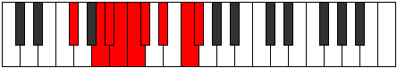

# Mode Gythyllic

## Links

- [Documentation](index.md)
- [Scales Index](Scales.md)
- [Modes Index](Modes.md)
- [Chords Index](Chords.md)

## Parent Scale

[Gythyllic](ScaleGythyllic.md)

## Number

[2809](https://ianring.com/musictheory/scales/2809)

## Perfection

- 5 Perfect notes
- 3 Perfect notes

## Perfection Profile

[true false true true false false true true]

## Permutations

| Tonic | Notes | Signature | Illustration | Audio |
|-------|-------|-----------|--------------|-------|
| [C](ModeCNaturalGythyllic.md) | C, **D#**, E, F, **F#**, **G**, A, B, C | C |  | [midi](ModeCNaturalGythyllic.mid) [ogg](ModeCNaturalGythyllic.ogg) |
| [C#](ModeCSharpGythyllic.md) | C#, **E**, F, F#, **G**, **G#**, A#, C, C# | C |  | [midi](ModeCSharpGythyllic.mid) [ogg](ModeCSharpGythyllic.ogg) |
| [Db](ModeDFlatGythyllic.md) | Db, **E**, F, Gb, **G**, **Ab**, Bb, C, Db | C |  | [midi](ModeDFlatGythyllic.mid) [ogg](ModeDFlatGythyllic.ogg) |
| [D](ModeDNaturalGythyllic.md) | D, **F**, F#, G, **G#**, **A**, B, C#, D | C |  | [midi](ModeDNaturalGythyllic.mid) [ogg](ModeDNaturalGythyllic.ogg) |
| [D#](ModeDSharpGythyllic.md) | D#, **F#**, G, G#, **A**, **A#**, C, D, D# | C |  | [midi](ModeDSharpGythyllic.mid) [ogg](ModeDSharpGythyllic.ogg) |
| [Eb](ModeEFlatGythyllic.md) | Eb, **Gb**, G, Ab, **A**, **Bb**, C, D, Eb | C |  | [midi](ModeEFlatGythyllic.mid) [ogg](ModeEFlatGythyllic.ogg) |
| [E](ModeENaturalGythyllic.md) | E, **G**, G#, A, **A#**, **B**, C#, D#, E | C |  | [midi](ModeENaturalGythyllic.mid) [ogg](ModeENaturalGythyllic.ogg) |
| [F](ModeFNaturalGythyllic.md) | F, **G#**, A, A#, **B**, **C**, D, E, F | C |  | [midi](ModeFNaturalGythyllic.mid) [ogg](ModeFNaturalGythyllic.ogg) |
| [F#](ModeFSharpGythyllic.md) | F#, **A**, A#, B, **C**, **C#**, D#, F, F# | C |  | [midi](ModeFSharpGythyllic.mid) [ogg](ModeFSharpGythyllic.ogg) |
| [Gb](ModeGFlatGythyllic.md) | Gb, **A**, Bb, B, **C**, **Db**, Eb, F, Gb | C |  | [midi](ModeGFlatGythyllic.mid) [ogg](ModeGFlatGythyllic.ogg) |
| [G](ModeGNaturalGythyllic.md) | G, **A#**, B, C, **C#**, **D**, E, F#, G | C |  | [midi](ModeGNaturalGythyllic.mid) [ogg](ModeGNaturalGythyllic.ogg) |
| [G#](ModeGSharpGythyllic.md) | G#, **B**, C, C#, **D**, **D#**, F, G, G# | C |  | [midi](ModeGSharpGythyllic.mid) [ogg](ModeGSharpGythyllic.ogg) |
| [Ab](ModeAFlatGythyllic.md) | Ab, **B**, C, Db, **D**, **Eb**, F, G, Ab | C |  | [midi](ModeAFlatGythyllic.mid) [ogg](ModeAFlatGythyllic.ogg) |
| [A](ModeANaturalGythyllic.md) | A, **C**, C#, D, **D#**, **E**, F#, G#, A | C |  | [midi](ModeANaturalGythyllic.mid) [ogg](ModeANaturalGythyllic.ogg) |
| [A#](ModeASharpGythyllic.md) | A#, **C#**, D, D#, **E**, **F**, G, A, A# | C |  | [midi](ModeASharpGythyllic.mid) [ogg](ModeASharpGythyllic.ogg) |
| [Bb](ModeBFlatGythyllic.md) | Bb, **Db**, D, Eb, **E**, **F**, G, A, Bb | C |  | [midi](ModeBFlatGythyllic.mid) [ogg](ModeBFlatGythyllic.ogg) |
| [B](ModeBNaturalGythyllic.md) | B, **D**, D#, E, **F**, **F#**, G#, A#, B | C |  | [midi](ModeBNaturalGythyllic.mid) [ogg](ModeBNaturalGythyllic.ogg) |
