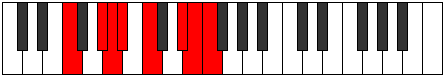
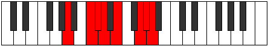

# Mode Ionacrian

## Links

- [Documentation](index.md)
- [Scales Index](Scales.md)
- [Modes Index](Modes.md)
- [Chords Index](Chords.md)

## Parent Scale

[Epogian](ScaleEpogian.md)

## Number

[3257](https://ianring.com/musictheory/scales/3257)

## Perfection

- 5 Perfect notes
- 2 Perfect notes

## Perfection Profile

[true true true true false true false]

## Permutations

| Tonic | Notes | Signature | Illustration | Audio |
|-------|-------|-----------|--------------|-------|
| [C](ModeCNaturalIonacrian.md) | C, D#, E, F, **G**, A#, **B**, C | C |  | [midi](ModeCNaturalIonacrian.mid) [ogg](ModeCNaturalIonacrian.ogg) |
| [C#](ModeCSharpIonacrian.md) | C#, D##, E#, F#, **G#**, A##, **B#**, C# | C |  | [midi](ModeCSharpIonacrian.mid) [ogg](ModeCSharpIonacrian.ogg) |
| [Db](ModeDFlatIonacrian.md) | Db, E, F, Gb, **Ab**, B, **C**, Db | C |  | [midi](ModeDFlatIonacrian.mid) [ogg](ModeDFlatIonacrian.ogg) |
| [D](ModeDNaturalIonacrian.md) | D, E#, F#, G, **A**, B#, **C#**, D | C |  | [midi](ModeDNaturalIonacrian.mid) [ogg](ModeDNaturalIonacrian.ogg) |
| [D#](ModeDSharpIonacrian.md) | D#, E##, F##, G#, **A#**, B##, **C##**, D# | C |  | [midi](ModeDSharpIonacrian.mid) [ogg](ModeDSharpIonacrian.ogg) |
| [Eb](ModeEFlatIonacrian.md) | Eb, F#, G, Ab, **Bb**, C#, **D**, Eb | C |  | [midi](ModeEFlatIonacrian.mid) [ogg](ModeEFlatIonacrian.ogg) |
| [E](ModeENaturalIonacrian.md) | E, F##, G#, A, **B**, C##, **D#**, E | C |  | [midi](ModeENaturalIonacrian.mid) [ogg](ModeENaturalIonacrian.ogg) |
| [F](ModeFNaturalIonacrian.md) | F, G#, A, Bb, **C**, D#, **E**, F | C |  | [midi](ModeFNaturalIonacrian.mid) [ogg](ModeFNaturalIonacrian.ogg) |
| [F#](ModeFSharpIonacrian.md) | F#, G##, A#, B, **C#**, D##, **E#**, F# | C |  | [midi](ModeFSharpIonacrian.mid) [ogg](ModeFSharpIonacrian.ogg) |
| [Gb](ModeGFlatIonacrian.md) | Gb, A, Bb, Cb, **Db**, E, **F**, Gb | C |  | [midi](ModeGFlatIonacrian.mid) [ogg](ModeGFlatIonacrian.ogg) |
| [G](ModeGNaturalIonacrian.md) | G, A#, B, C, **D**, E#, **F#**, G | C |  | [midi](ModeGNaturalIonacrian.mid) [ogg](ModeGNaturalIonacrian.ogg) |
| [G#](ModeGSharpIonacrian.md) | G#, A##, B#, C#, **D#**, E##, **F##**, G# | C |  | [midi](ModeGSharpIonacrian.mid) [ogg](ModeGSharpIonacrian.ogg) |
| [Ab](ModeAFlatIonacrian.md) | Ab, B, C, Db, **Eb**, F#, **G**, Ab | C |  | [midi](ModeAFlatIonacrian.mid) [ogg](ModeAFlatIonacrian.ogg) |
| [A](ModeANaturalIonacrian.md) | A, B#, C#, D, **E**, F##, **G#**, A | C |  | [midi](ModeANaturalIonacrian.mid) [ogg](ModeANaturalIonacrian.ogg) |
| [A#](ModeASharpIonacrian.md) | A#, B##, C##, D#, **E#**, F###, **G##**, A# | C |  | [midi](ModeASharpIonacrian.mid) [ogg](ModeASharpIonacrian.ogg) |
| [Bb](ModeBFlatIonacrian.md) | Bb, C#, D, Eb, **F**, G#, **A**, Bb | C |  | [midi](ModeBFlatIonacrian.mid) [ogg](ModeBFlatIonacrian.ogg) |
| [B](ModeBNaturalIonacrian.md) | B, C##, D#, E, **F#**, G##, **A#**, B | C |  | [midi](ModeBNaturalIonacrian.mid) [ogg](ModeBNaturalIonacrian.ogg) |
