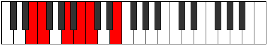

# Mode Ionacritonic

## Links

- [Documentation](index.md)
- [Scales Index](Scales.md)
- [Modes Index](Modes.md)
- [Chords Index](Chords.md)

## Parent Scale

[Zolitonic](ScaleZolitonic.md)

## Number

[419](https://ianring.com/musictheory/scales/419)

## Interval Pattern

1, 4, 2, 1, 4

## Chord Pattern

## Perfection

- 3 Perfect notes
- 2 Perfect notes

## Perfection Profile

[true true true false false]

## Permutations

| Tonic | Notes | Signature | Illustration | Audio |
|-------|-------|-----------|--------------|-------|
| [C](ModeCNaturalIonacritonic.md) | C, C#, F, **G**, **G#**, C | C |  | [midi](https://github.com/edipermadi/music/blob/main/docs/ModeCNaturalIonacritonic.mid?raw=true) |
| [C#](ModeCSharpIonacritonic.md) | C#, D, F#, **G#**, **A**, C# | C |  | [midi](https://github.com/edipermadi/music/blob/main/docs/ModeCSharpIonacritonic.mid?raw=true) |
| [Db](ModeDFlatIonacritonic.md) | Db, D, Gb, **Ab**, **A**, Db | C |  | [midi](https://github.com/edipermadi/music/blob/main/docs/ModeDFlatIonacritonic.mid?raw=true) |
| [D](ModeDNaturalIonacritonic.md) | D, D#, G, **A**, **A#**, D | C |  | [midi](https://github.com/edipermadi/music/blob/main/docs/ModeDNaturalIonacritonic.mid?raw=true) |
| [D#](ModeDSharpIonacritonic.md) | D#, E, G#, **A#**, **B**, D# | C |  | [midi](https://github.com/edipermadi/music/blob/main/docs/ModeDSharpIonacritonic.mid?raw=true) |
| [Eb](ModeEFlatIonacritonic.md) | Eb, E, Ab, **Bb**, **B**, Eb | C |  | [midi](https://github.com/edipermadi/music/blob/main/docs/ModeEFlatIonacritonic.mid?raw=true) |
| [E](ModeENaturalIonacritonic.md) | E, F, A, **B**, **C**, E | C |  | [midi](https://github.com/edipermadi/music/blob/main/docs/ModeENaturalIonacritonic.mid?raw=true) |
| [F](ModeFNaturalIonacritonic.md) | F, F#, A#, **C**, **C#**, F | C |  | [midi](https://github.com/edipermadi/music/blob/main/docs/ModeFNaturalIonacritonic.mid?raw=true) |
| [F#](ModeFSharpIonacritonic.md) | F#, G, B, **C#**, **D**, F# | C |  | [midi](https://github.com/edipermadi/music/blob/main/docs/ModeFSharpIonacritonic.mid?raw=true) |
| [Gb](ModeGFlatIonacritonic.md) | Gb, G, B, **Db**, **D**, Gb | C |  | [midi](https://github.com/edipermadi/music/blob/main/docs/ModeGFlatIonacritonic.mid?raw=true) |
| [G](ModeGNaturalIonacritonic.md) | G, G#, C, **D**, **D#**, G | C |  | [midi](https://github.com/edipermadi/music/blob/main/docs/ModeGNaturalIonacritonic.mid?raw=true) |
| [G#](ModeGSharpIonacritonic.md) | G#, A, C#, **D#**, **E**, G# | C |  | [midi](https://github.com/edipermadi/music/blob/main/docs/ModeGSharpIonacritonic.mid?raw=true) |
| [Ab](ModeAFlatIonacritonic.md) | Ab, A, Db, **Eb**, **E**, Ab | C |  | [midi](https://github.com/edipermadi/music/blob/main/docs/ModeAFlatIonacritonic.mid?raw=true) |
| [A](ModeANaturalIonacritonic.md) | A, A#, D, **E**, **F**, A | C |  | [midi](https://github.com/edipermadi/music/blob/main/docs/ModeANaturalIonacritonic.mid?raw=true) |
| [A#](ModeASharpIonacritonic.md) | A#, B, D#, **F**, **F#**, A# | C |  | [midi](https://github.com/edipermadi/music/blob/main/docs/ModeASharpIonacritonic.mid?raw=true) |
| [Bb](ModeBFlatIonacritonic.md) | Bb, B, Eb, **F**, **Gb**, Bb | C |  | [midi](https://github.com/edipermadi/music/blob/main/docs/ModeBFlatIonacritonic.mid?raw=true) |
| [B](ModeBNaturalIonacritonic.md) | B, C, E, **F#**, **G**, B | C |  | [midi](https://github.com/edipermadi/music/blob/main/docs/ModeBNaturalIonacritonic.mid?raw=true) |
