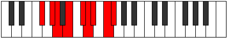

# Mode Ionacryllic

## Links

- [Documentation](index.md)
- [Scales Index](Scales.md)
- [Modes Index](Modes.md)
- [Chords Index](Chords.md)

## Parent Scale

[Dalyllic](ScaleDalyllic.md)

## Number

[2989](https://ianring.com/musictheory/scales/2989)

## Perfection

- 5 Perfect notes
- 3 Perfect notes

## Perfection Profile

[true true false true true true false false]

## Permutations

| Tonic | Notes | Signature | Illustration | Audio |
|-------|-------|-----------|--------------|-------|
| [C](ModeCNaturalIonacryllic.md) | C, D, **D#**, F, G, G#, **A**, **B**, C | C |  | [midi](ModeCNaturalIonacryllic.mid) [ogg](ModeCNaturalIonacryllic.ogg) |
| [C#](ModeCSharpIonacryllic.md) | C#, D#, **E**, F#, G#, A, **A#**, **C**, C# | C |  | [midi](ModeCSharpIonacryllic.mid) [ogg](ModeCSharpIonacryllic.ogg) |
| [Db](ModeDFlatIonacryllic.md) | Db, Eb, **E**, Gb, Ab, A, **Bb**, **C**, Db | C |  | [midi](ModeDFlatIonacryllic.mid) [ogg](ModeDFlatIonacryllic.ogg) |
| [D](ModeDNaturalIonacryllic.md) | D, E, **F**, G, A, A#, **B**, **C#**, D | C |  | [midi](ModeDNaturalIonacryllic.mid) [ogg](ModeDNaturalIonacryllic.ogg) |
| [D#](ModeDSharpIonacryllic.md) | D#, F, **F#**, G#, A#, B, **C**, **D**, D# | C |  | [midi](ModeDSharpIonacryllic.mid) [ogg](ModeDSharpIonacryllic.ogg) |
| [Eb](ModeEFlatIonacryllic.md) | Eb, F, **Gb**, Ab, Bb, B, **C**, **D**, Eb | C |  | [midi](ModeEFlatIonacryllic.mid) [ogg](ModeEFlatIonacryllic.ogg) |
| [E](ModeENaturalIonacryllic.md) | E, F#, **G**, A, B, C, **C#**, **D#**, E | C |  | [midi](ModeENaturalIonacryllic.mid) [ogg](ModeENaturalIonacryllic.ogg) |
| [F](ModeFNaturalIonacryllic.md) | F, G, **G#**, A#, C, C#, **D**, **E**, F | C |  | [midi](ModeFNaturalIonacryllic.mid) [ogg](ModeFNaturalIonacryllic.ogg) |
| [F#](ModeFSharpIonacryllic.md) | F#, G#, **A**, B, C#, D, **D#**, **F**, F# | C |  | [midi](ModeFSharpIonacryllic.mid) [ogg](ModeFSharpIonacryllic.ogg) |
| [Gb](ModeGFlatIonacryllic.md) | Gb, Ab, **A**, B, Db, D, **Eb**, **F**, Gb | C |  | [midi](ModeGFlatIonacryllic.mid) [ogg](ModeGFlatIonacryllic.ogg) |
| [G](ModeGNaturalIonacryllic.md) | G, A, **A#**, C, D, D#, **E**, **F#**, G | C |  | [midi](ModeGNaturalIonacryllic.mid) [ogg](ModeGNaturalIonacryllic.ogg) |
| [G#](ModeGSharpIonacryllic.md) | G#, A#, **B**, C#, D#, E, **F**, **G**, G# | C |  | [midi](ModeGSharpIonacryllic.mid) [ogg](ModeGSharpIonacryllic.ogg) |
| [Ab](ModeAFlatIonacryllic.md) | Ab, Bb, **B**, Db, Eb, E, **F**, **G**, Ab | C |  | [midi](ModeAFlatIonacryllic.mid) [ogg](ModeAFlatIonacryllic.ogg) |
| [A](ModeANaturalIonacryllic.md) | A, B, **C**, D, E, F, **F#**, **G#**, A | C |  | [midi](ModeANaturalIonacryllic.mid) [ogg](ModeANaturalIonacryllic.ogg) |
| [A#](ModeASharpIonacryllic.md) | A#, C, **C#**, D#, F, F#, **G**, **A**, A# | C |  | [midi](ModeASharpIonacryllic.mid) [ogg](ModeASharpIonacryllic.ogg) |
| [Bb](ModeBFlatIonacryllic.md) | Bb, C, **Db**, Eb, F, Gb, **G**, **A**, Bb | C |  | [midi](ModeBFlatIonacryllic.mid) [ogg](ModeBFlatIonacryllic.ogg) |
| [B](ModeBNaturalIonacryllic.md) | B, C#, **D**, E, F#, G, **G#**, **A#**, B | C |  | [midi](ModeBNaturalIonacryllic.mid) [ogg](ModeBNaturalIonacryllic.ogg) |
