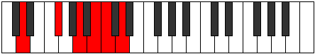
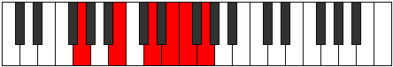

# Mode Ionaditonic

## Links

- [Documentation](index.md)
- [Scales Index](Scales.md)
- [Modes Index](Modes.md)
- [Chords Index](Chords.md)

## Parent Scale

[Ionaditonic](ScaleIonaditonic.md)

## Number

[1681](https://ianring.com/musictheory/scales/1681)

## Perfection

- 2 Perfect notes
- 3 Perfect notes

## Perfection Profile

[true false false true false]

## Permutations

| Tonic | Notes | Signature | Illustration | Audio |
|-------|-------|-----------|--------------|-------|
| [C](ModeCNaturalIonaditonic.md) | C, **E**, **G**, A, **A#**, C | C |  | [midi](ModeCNaturalIonaditonic.mid) [ogg](ModeCNaturalIonaditonic.ogg) |
| [C#](ModeCSharpIonaditonic.md) | C#, **F**, **G#**, A#, **B**, C# | C |  | [midi](ModeCSharpIonaditonic.mid) [ogg](ModeCSharpIonaditonic.ogg) |
| [Db](ModeDFlatIonaditonic.md) | Db, **F**, **Ab**, Bb, **B**, Db | C |  | [midi](ModeDFlatIonaditonic.mid) [ogg](ModeDFlatIonaditonic.ogg) |
| [D](ModeDNaturalIonaditonic.md) | D, **F#**, **A**, B, **C**, D | C |  | [midi](ModeDNaturalIonaditonic.mid) [ogg](ModeDNaturalIonaditonic.ogg) |
| [D#](ModeDSharpIonaditonic.md) | D#, **G**, **A#**, C, **C#**, D# | C |  | [midi](ModeDSharpIonaditonic.mid) [ogg](ModeDSharpIonaditonic.ogg) |
| [Eb](ModeEFlatIonaditonic.md) | Eb, **G**, **Bb**, C, **Db**, Eb | C |  | [midi](ModeEFlatIonaditonic.mid) [ogg](ModeEFlatIonaditonic.ogg) |
| [E](ModeENaturalIonaditonic.md) | E, **G#**, **B**, C#, **D**, E | C |  | [midi](ModeENaturalIonaditonic.mid) [ogg](ModeENaturalIonaditonic.ogg) |
| [F](ModeFNaturalIonaditonic.md) | F, **A**, **C**, D, **D#**, F | C |  | [midi](ModeFNaturalIonaditonic.mid) [ogg](ModeFNaturalIonaditonic.ogg) |
| [F#](ModeFSharpIonaditonic.md) | F#, **A#**, **C#**, D#, **E**, F# | C |  | [midi](ModeFSharpIonaditonic.mid) [ogg](ModeFSharpIonaditonic.ogg) |
| [Gb](ModeGFlatIonaditonic.md) | Gb, **Bb**, **Db**, Eb, **E**, Gb | C |  | [midi](ModeGFlatIonaditonic.mid) [ogg](ModeGFlatIonaditonic.ogg) |
| [G](ModeGNaturalIonaditonic.md) | G, **B**, **D**, E, **F**, G | C |  | [midi](ModeGNaturalIonaditonic.mid) [ogg](ModeGNaturalIonaditonic.ogg) |
| [G#](ModeGSharpIonaditonic.md) | G#, **C**, **D#**, F, **F#**, G# | C |  | [midi](ModeGSharpIonaditonic.mid) [ogg](ModeGSharpIonaditonic.ogg) |
| [Ab](ModeAFlatIonaditonic.md) | Ab, **C**, **Eb**, F, **Gb**, Ab | C |  | [midi](ModeAFlatIonaditonic.mid) [ogg](ModeAFlatIonaditonic.ogg) |
| [A](ModeANaturalIonaditonic.md) | A, **C#**, **E**, F#, **G**, A | C |  | [midi](ModeANaturalIonaditonic.mid) [ogg](ModeANaturalIonaditonic.ogg) |
| [A#](ModeASharpIonaditonic.md) | A#, **D**, **F**, G, **G#**, A# | C |  | [midi](ModeASharpIonaditonic.mid) [ogg](ModeASharpIonaditonic.ogg) |
| [Bb](ModeBFlatIonaditonic.md) | Bb, **D**, **F**, G, **Ab**, Bb | C |  | [midi](ModeBFlatIonaditonic.mid) [ogg](ModeBFlatIonaditonic.ogg) |
| [B](ModeBNaturalIonaditonic.md) | B, **D#**, **F#**, G#, **A**, B | C |  | [midi](ModeBNaturalIonaditonic.mid) [ogg](ModeBNaturalIonaditonic.ogg) |
