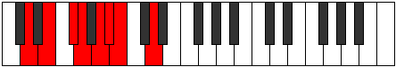

# Mode Ionagian

## Links

- [Documentation](README.md)
- [Scales Index](Scales.md)
- [Modes Index](Modes.md)
- [Chords Index](Chords.md)

## Parent Scale

[Phrolian](ScalePhrolian.md)

## Number

[949](https://ianring.com/musictheory/scales/949)

## Transposition

2, 2, 1, 2, 1, 1, 3

## Chord Pattern

I, ii⁰, iv, VI⁺, VI⁺

## Perfection

- 5 Perfect notes
- 2 Perfect notes

## Perfection Profile

[true true false true true false true]

## Permutations

| Tonic | Notes | Signature | Illustration | Audio |
|-------|-------|-----------|--------------|-------|
| [C](ModeCNaturalIonagian.md) | C, D, **E**, F, G, **Ab**, Bbb, C | C |  | [midi](https://github.com/edipermadi/music/blob/main/docs/ModeCNaturalIonagian.mid?raw=true) |
| [C#](ModeCSharpIonagian.md) | C#, D#, **E#**, F#, G#, **A**, Bb, C# | C |  | [midi](https://github.com/edipermadi/music/blob/main/docs/ModeCSharpIonagian.mid?raw=true) |
| [Db](ModeDFlatIonagian.md) | Db, Eb, **F**, Gb, Ab, **Bbb**, Cbb, Db | C |  | [midi](https://github.com/edipermadi/music/blob/main/docs/ModeDFlatIonagian.mid?raw=true) |
| [D](ModeDNaturalIonagian.md) | D, E, **F#**, G, A, **Bb**, Cb, D | C |  | [midi](https://github.com/edipermadi/music/blob/main/docs/ModeDNaturalIonagian.mid?raw=true) |
| [D#](ModeDSharpIonagian.md) | D#, E#, **F##**, G#, A#, **B**, C, D# | C |  | [midi](https://github.com/edipermadi/music/blob/main/docs/ModeDSharpIonagian.mid?raw=true) |
| [Eb](ModeEFlatIonagian.md) | Eb, F, **G**, Ab, Bb, **Cb**, Dbb, Eb | C |  | [midi](https://github.com/edipermadi/music/blob/main/docs/ModeEFlatIonagian.mid?raw=true) |
| [E](ModeENaturalIonagian.md) | E, F#, **G#**, A, B, **C**, Db, E | C |  | [midi](https://github.com/edipermadi/music/blob/main/docs/ModeENaturalIonagian.mid?raw=true) |
| [F](ModeFNaturalIonagian.md) | F, G, **A**, Bb, C, **Db**, Ebb, F | C |  | [midi](https://github.com/edipermadi/music/blob/main/docs/ModeFNaturalIonagian.mid?raw=true) |
| [F#](ModeFSharpIonagian.md) | F#, G#, **A#**, B, C#, **D**, Eb, F# | C |  | [midi](https://github.com/edipermadi/music/blob/main/docs/ModeFSharpIonagian.mid?raw=true) |
| [Gb](ModeGFlatIonagian.md) | Gb, Ab, **Bb**, Cb, Db, **Ebb**, Fbb, Gb | C |  | [midi](https://github.com/edipermadi/music/blob/main/docs/ModeGFlatIonagian.mid?raw=true) |
| [G](ModeGNaturalIonagian.md) | G, A, **B**, C, D, **Eb**, Fb, G | C |  | [midi](https://github.com/edipermadi/music/blob/main/docs/ModeGNaturalIonagian.mid?raw=true) |
| [G#](ModeGSharpIonagian.md) | G#, A#, **B#**, C#, D#, **E**, F, G# | C |  | [midi](https://github.com/edipermadi/music/blob/main/docs/ModeGSharpIonagian.mid?raw=true) |
| [Ab](ModeAFlatIonagian.md) | Ab, Bb, **C**, Db, Eb, **Fb**, Gbb, Ab | C |  | [midi](https://github.com/edipermadi/music/blob/main/docs/ModeAFlatIonagian.mid?raw=true) |
| [A](ModeANaturalIonagian.md) | A, B, **C#**, D, E, **F**, Gb, A | C |  | [midi](https://github.com/edipermadi/music/blob/main/docs/ModeANaturalIonagian.mid?raw=true) |
| [A#](ModeASharpIonagian.md) | A#, B#, **C##**, D#, E#, **F#**, G, A# | C |  | [midi](https://github.com/edipermadi/music/blob/main/docs/ModeASharpIonagian.mid?raw=true) |
| [Bb](ModeBFlatIonagian.md) | Bb, C, **D**, Eb, F, **Gb**, Abb, Bb | C |  | [midi](https://github.com/edipermadi/music/blob/main/docs/ModeBFlatIonagian.mid?raw=true) |
| [B](ModeBNaturalIonagian.md) | B, C#, **D#**, E, F#, **G**, Ab, B | C |  | [midi](https://github.com/edipermadi/music/blob/main/docs/ModeBNaturalIonagian.mid?raw=true) |
