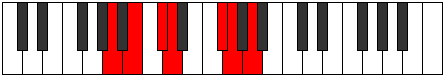
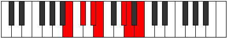

# Mode Ionagimic

## Links

- [Documentation](index.md)
- [Scales Index](Scales.md)
- [Modes Index](Modes.md)
- [Chords Index](Chords.md)

## Parent Scale

[Bylimic](ScaleBylimic.md)

## Number

[1589](https://ianring.com/musictheory/scales/1589)

## Interval Pattern

2, 2, 1, 4, 1, 2

## Chord Pattern

v, VI

## Perfection

- 4 Perfect notes
- 2 Perfect notes

## Perfection Profile

[false true false true true true]

## Permutations

| Tonic | Notes | Signature | Illustration | Audio |
|-------|-------|-----------|--------------|-------|
| [C](ModeCNaturalIonagimic.md) | **C**, D, **E**, F, G##, A#, **C** | C |  | [midi](https://github.com/edipermadi/music/blob/main/docs/ModeCNaturalIonagimic.mid?raw=true) |
| [C#](ModeCSharpIonagimic.md) | **C#**, D#, **E#**, F#, G###, A##, **C#** | C |  | [midi](https://github.com/edipermadi/music/blob/main/docs/ModeCSharpIonagimic.mid?raw=true) |
| [Db](ModeDFlatIonagimic.md) | **Db**, Eb, **F**, Gb, A#, B, **Db** | C |  | [midi](https://github.com/edipermadi/music/blob/main/docs/ModeDFlatIonagimic.mid?raw=true) |
| [D](ModeDNaturalIonagimic.md) | **D**, E, **F#**, G, A##, B#, **D** | C |  | [midi](https://github.com/edipermadi/music/blob/main/docs/ModeDNaturalIonagimic.mid?raw=true) |
| [D#](ModeDSharpIonagimic.md) | **D#**, E#, **F##**, G#, A###, B##, **D#** | C |  | [midi](https://github.com/edipermadi/music/blob/main/docs/ModeDSharpIonagimic.mid?raw=true) |
| [Eb](ModeEFlatIonagimic.md) | **Eb**, F, **G**, Ab, B#, C#, **Eb** | C |  | [midi](https://github.com/edipermadi/music/blob/main/docs/ModeEFlatIonagimic.mid?raw=true) |
| [E](ModeENaturalIonagimic.md) | **E**, F#, **G#**, A, B##, C##, **E** | C |  | [midi](https://github.com/edipermadi/music/blob/main/docs/ModeENaturalIonagimic.mid?raw=true) |
| [F](ModeFNaturalIonagimic.md) | **F**, G, **A**, Bb, C##, D#, **F** | C |  | [midi](https://github.com/edipermadi/music/blob/main/docs/ModeFNaturalIonagimic.mid?raw=true) |
| [F#](ModeFSharpIonagimic.md) | **F#**, G#, **A#**, B, C###, D##, **F#** | C |  | [midi](https://github.com/edipermadi/music/blob/main/docs/ModeFSharpIonagimic.mid?raw=true) |
| [Gb](ModeGFlatIonagimic.md) | **Gb**, Ab, **Bb**, Cb, D#, E, **Gb** | C |  | [midi](https://github.com/edipermadi/music/blob/main/docs/ModeGFlatIonagimic.mid?raw=true) |
| [G](ModeGNaturalIonagimic.md) | **G**, A, **B**, C, D##, E#, **G** | C |  | [midi](https://github.com/edipermadi/music/blob/main/docs/ModeGNaturalIonagimic.mid?raw=true) |
| [G#](ModeGSharpIonagimic.md) | **G#**, A#, **B#**, C#, D###, E##, **G#** | C |  | [midi](https://github.com/edipermadi/music/blob/main/docs/ModeGSharpIonagimic.mid?raw=true) |
| [Ab](ModeAFlatIonagimic.md) | **Ab**, Bb, **C**, Db, E#, F#, **Ab** | C |  | [midi](https://github.com/edipermadi/music/blob/main/docs/ModeAFlatIonagimic.mid?raw=true) |
| [A](ModeANaturalIonagimic.md) | **A**, B, **C#**, D, E##, F##, **A** | C |  | [midi](https://github.com/edipermadi/music/blob/main/docs/ModeANaturalIonagimic.mid?raw=true) |
| [A#](ModeASharpIonagimic.md) | **A#**, B#, **C##**, D#, E###, F###, **A#** | C |  | [midi](https://github.com/edipermadi/music/blob/main/docs/ModeASharpIonagimic.mid?raw=true) |
| [Bb](ModeBFlatIonagimic.md) | **Bb**, C, **D**, Eb, F##, G#, **Bb** | C |  | [midi](https://github.com/edipermadi/music/blob/main/docs/ModeBFlatIonagimic.mid?raw=true) |
| [B](ModeBNaturalIonagimic.md) | **B**, C#, **D#**, E, F###, G##, **B** | C |  | [midi](https://github.com/edipermadi/music/blob/main/docs/ModeBNaturalIonagimic.mid?raw=true) |
