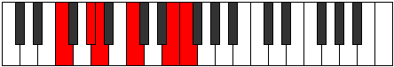
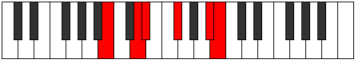

# Mode Ionagitonic

## Links

- [Documentation](index.md)
- [Scales Index](Scales.md)
- [Modes Index](Modes.md)
- [Chords Index](Chords.md)

## Parent Scale

[Zothitonic](ScaleZothitonic.md)

## Number

[2201](https://ianring.com/musictheory/scales/2201)

## Perfection

- 2 Perfect notes
- 3 Perfect notes

## Perfection Profile

[true false true false false]

## Permutations

| Tonic | Notes | Signature | Illustration | Audio |
|-------|-------|-----------|--------------|-------|
| [C](ModeCNaturalIonagitonic.md) | C, **D#**, E, **G**, **B**, C | C |  | [midi](ModeCNaturalIonagitonic.mid) [ogg](ModeCNaturalIonagitonic.ogg) |
| [C#](ModeCSharpIonagitonic.md) | C#, **E**, F, **G#**, **C**, C# | C |  | [midi](ModeCSharpIonagitonic.mid) [ogg](ModeCSharpIonagitonic.ogg) |
| [Db](ModeDFlatIonagitonic.md) | Db, **E**, F, **Ab**, **C**, Db | C |  | [midi](ModeDFlatIonagitonic.mid) [ogg](ModeDFlatIonagitonic.ogg) |
| [D](ModeDNaturalIonagitonic.md) | D, **F**, F#, **A**, **C#**, D | C |  | [midi](ModeDNaturalIonagitonic.mid) [ogg](ModeDNaturalIonagitonic.ogg) |
| [D#](ModeDSharpIonagitonic.md) | D#, **F#**, G, **A#**, **D**, D# | C |  | [midi](ModeDSharpIonagitonic.mid) [ogg](ModeDSharpIonagitonic.ogg) |
| [Eb](ModeEFlatIonagitonic.md) | Eb, **Gb**, G, **Bb**, **D**, Eb | C |  | [midi](ModeEFlatIonagitonic.mid) [ogg](ModeEFlatIonagitonic.ogg) |
| [E](ModeENaturalIonagitonic.md) | E, **G**, G#, **B**, **D#**, E | C |  | [midi](ModeENaturalIonagitonic.mid) [ogg](ModeENaturalIonagitonic.ogg) |
| [F](ModeFNaturalIonagitonic.md) | F, **G#**, A, **C**, **E**, F | C |  | [midi](ModeFNaturalIonagitonic.mid) [ogg](ModeFNaturalIonagitonic.ogg) |
| [F#](ModeFSharpIonagitonic.md) | F#, **A**, A#, **C#**, **F**, F# | C |  | [midi](ModeFSharpIonagitonic.mid) [ogg](ModeFSharpIonagitonic.ogg) |
| [Gb](ModeGFlatIonagitonic.md) | Gb, **A**, Bb, **Db**, **F**, Gb | C |  | [midi](ModeGFlatIonagitonic.mid) [ogg](ModeGFlatIonagitonic.ogg) |
| [G](ModeGNaturalIonagitonic.md) | G, **A#**, B, **D**, **F#**, G | C |  | [midi](ModeGNaturalIonagitonic.mid) [ogg](ModeGNaturalIonagitonic.ogg) |
| [G#](ModeGSharpIonagitonic.md) | G#, **B**, C, **D#**, **G**, G# | C |  | [midi](ModeGSharpIonagitonic.mid) [ogg](ModeGSharpIonagitonic.ogg) |
| [Ab](ModeAFlatIonagitonic.md) | Ab, **B**, C, **Eb**, **G**, Ab | C |  | [midi](ModeAFlatIonagitonic.mid) [ogg](ModeAFlatIonagitonic.ogg) |
| [A](ModeANaturalIonagitonic.md) | A, **C**, C#, **E**, **G#**, A | C |  | [midi](ModeANaturalIonagitonic.mid) [ogg](ModeANaturalIonagitonic.ogg) |
| [A#](ModeASharpIonagitonic.md) | A#, **C#**, D, **F**, **A**, A# | C |  | [midi](ModeASharpIonagitonic.mid) [ogg](ModeASharpIonagitonic.ogg) |
| [Bb](ModeBFlatIonagitonic.md) | Bb, **Db**, D, **F**, **A**, Bb | C |  | [midi](ModeBFlatIonagitonic.mid) [ogg](ModeBFlatIonagitonic.ogg) |
| [B](ModeBNaturalIonagitonic.md) | B, **D**, D#, **F#**, **A#**, B | C |  | [midi](ModeBNaturalIonagitonic.mid) [ogg](ModeBNaturalIonagitonic.ogg) |
