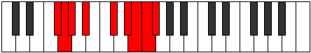

# Mode Ionagyllic

## Links

- [Documentation](README.md)
- [Scales Index](Scales.md)
- [Modes Index](Modes.md)
- [Chords Index](Chords.md)

## Parent Scale

[Mixolydyllic](ScaleMixolydyllic.md)

## Number

[3735](https://ianring.com/musictheory/scales/3735)

## Luminosity

8

## Transposition

1, 1, 2, 3, 2, 1, 1, 1

## Chord Pattern

## Perfection

- 5 Perfect notes
- 3 Perfect notes

## Perfection Profile

true, false, true, true, true, true, false, false

## Permutations

| Tonic | Notes | Signature | Illustration | Audio |
|-------|-------|-----------|--------------|-------|
| [C](ModeCNaturalIonagyllic.md) | C, **C#**, D, E, G, A, **A#**, **B**, C | C |  | [midi](https://github.com/edipermadi/music/blob/main/docs/ModeCNaturalIonagyllic.mid?raw=true) |
| [C#](ModeCSharpIonagyllic.md) | C#, **D**, D#, F, G#, A#, **B**, **C**, C# | C |  | [midi](https://github.com/edipermadi/music/blob/main/docs/ModeCSharpIonagyllic.mid?raw=true) |
| [Db](ModeDFlatIonagyllic.md) | Db, **D**, Eb, F, Ab, Bb, **B**, **C**, Db | C |  | [midi](https://github.com/edipermadi/music/blob/main/docs/ModeDFlatIonagyllic.mid?raw=true) |
| [D](ModeDNaturalIonagyllic.md) | D, **D#**, E, F#, A, B, **C**, **C#**, D | C |  | [midi](https://github.com/edipermadi/music/blob/main/docs/ModeDNaturalIonagyllic.mid?raw=true) |
| [D#](ModeDSharpIonagyllic.md) | D#, **E**, F, G, A#, C, **C#**, **D**, D# | C |  | [midi](https://github.com/edipermadi/music/blob/main/docs/ModeDSharpIonagyllic.mid?raw=true) |
| [Eb](ModeEFlatIonagyllic.md) | Eb, **E**, F, G, Bb, C, **Db**, **D**, Eb | C |  | [midi](https://github.com/edipermadi/music/blob/main/docs/ModeEFlatIonagyllic.mid?raw=true) |
| [E](ModeENaturalIonagyllic.md) | E, **F**, F#, G#, B, C#, **D**, **D#**, E | C |  | [midi](https://github.com/edipermadi/music/blob/main/docs/ModeENaturalIonagyllic.mid?raw=true) |
| [F](ModeFNaturalIonagyllic.md) | F, **F#**, G, A, C, D, **D#**, **E**, F | C |  | [midi](https://github.com/edipermadi/music/blob/main/docs/ModeFNaturalIonagyllic.mid?raw=true) |
| [F#](ModeFSharpIonagyllic.md) | F#, **G**, G#, A#, C#, D#, **E**, **F**, F# | C |  | [midi](https://github.com/edipermadi/music/blob/main/docs/ModeFSharpIonagyllic.mid?raw=true) |
| [Gb](ModeGFlatIonagyllic.md) | Gb, **G**, Ab, Bb, Db, Eb, **E**, **F**, Gb | C |  | [midi](https://github.com/edipermadi/music/blob/main/docs/ModeGFlatIonagyllic.mid?raw=true) |
| [G](ModeGNaturalIonagyllic.md) | G, **G#**, A, B, D, E, **F**, **F#**, G | C |  | [midi](https://github.com/edipermadi/music/blob/main/docs/ModeGNaturalIonagyllic.mid?raw=true) |
| [G#](ModeGSharpIonagyllic.md) | G#, **A**, A#, C, D#, F, **F#**, **G**, G# | C |  | [midi](https://github.com/edipermadi/music/blob/main/docs/ModeGSharpIonagyllic.mid?raw=true) |
| [Ab](ModeAFlatIonagyllic.md) | Ab, **A**, Bb, C, Eb, F, **Gb**, **G**, Ab | C |  | [midi](https://github.com/edipermadi/music/blob/main/docs/ModeAFlatIonagyllic.mid?raw=true) |
| [A](ModeANaturalIonagyllic.md) | A, **A#**, B, C#, E, F#, **G**, **G#**, A | C |  | [midi](https://github.com/edipermadi/music/blob/main/docs/ModeANaturalIonagyllic.mid?raw=true) |
| [A#](ModeASharpIonagyllic.md) | A#, **B**, C, D, F, G, **G#**, **A**, A# | C |  | [midi](https://github.com/edipermadi/music/blob/main/docs/ModeASharpIonagyllic.mid?raw=true) |
| [Bb](ModeBFlatIonagyllic.md) | Bb, **B**, C, D, F, G, **Ab**, **A**, Bb | C |  | [midi](https://github.com/edipermadi/music/blob/main/docs/ModeBFlatIonagyllic.mid?raw=true) |
| [B](ModeBNaturalIonagyllic.md) | B, **C**, C#, D#, F#, G#, **A**, **A#**, B | C |  | [midi](https://github.com/edipermadi/music/blob/main/docs/ModeBNaturalIonagyllic.mid?raw=true) |
